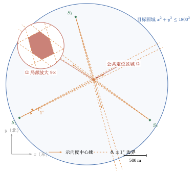
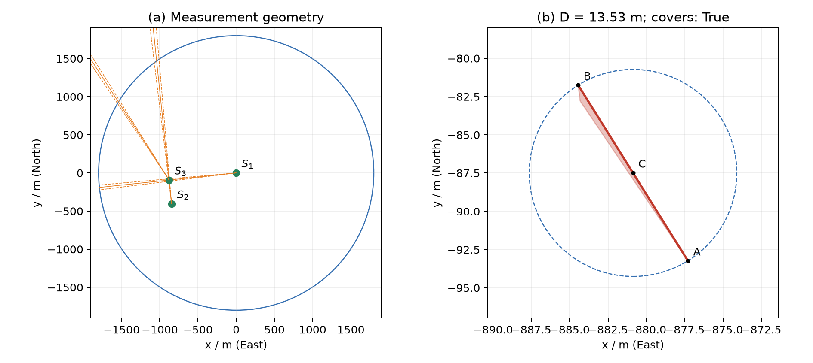
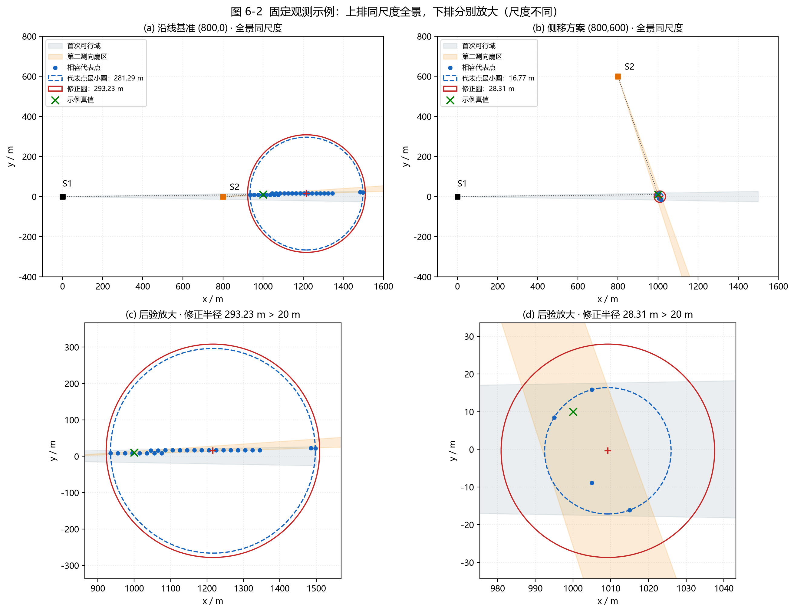
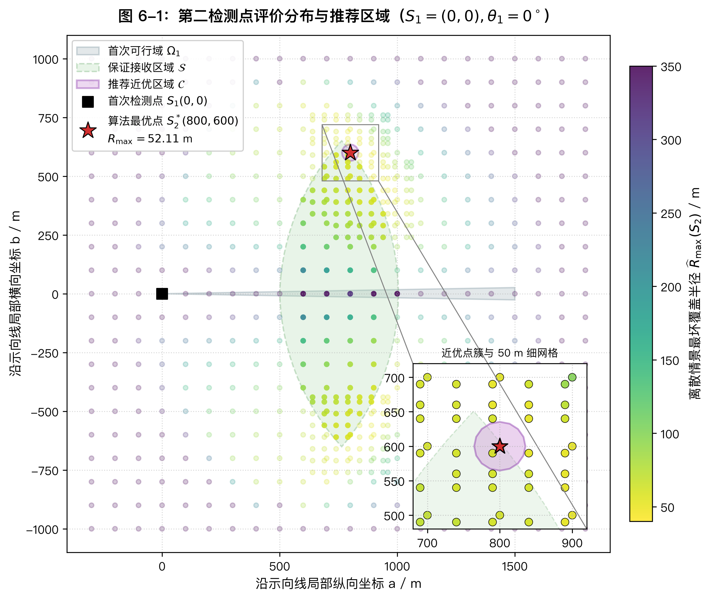
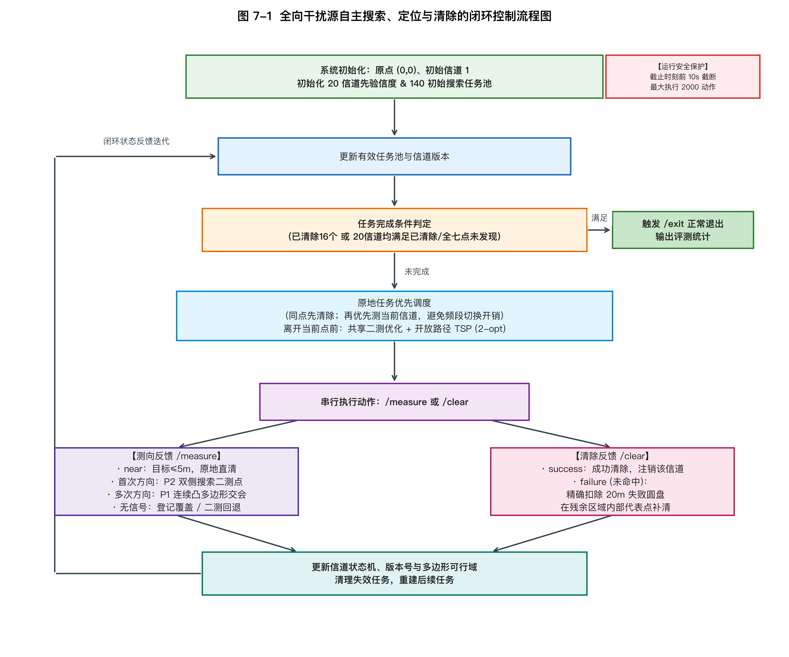
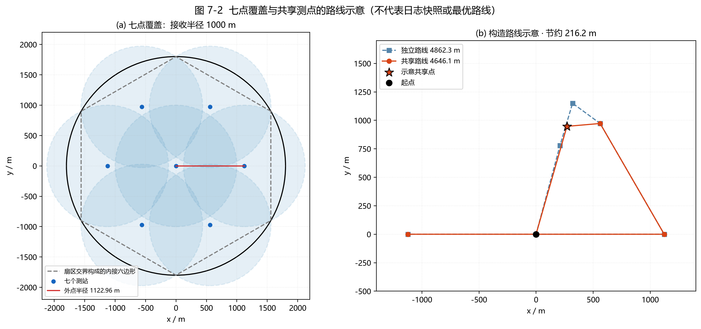
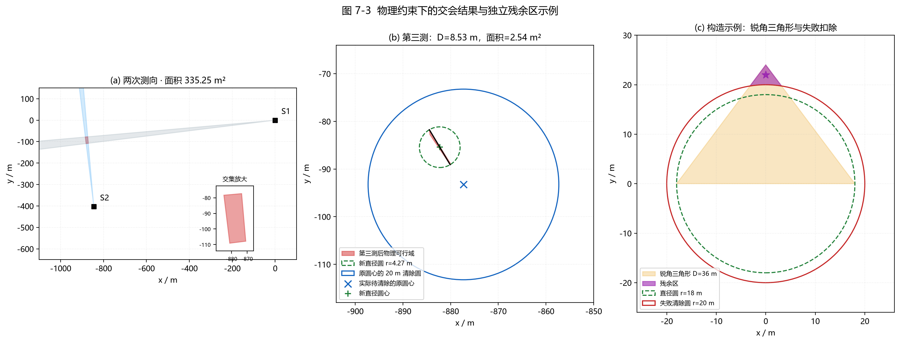
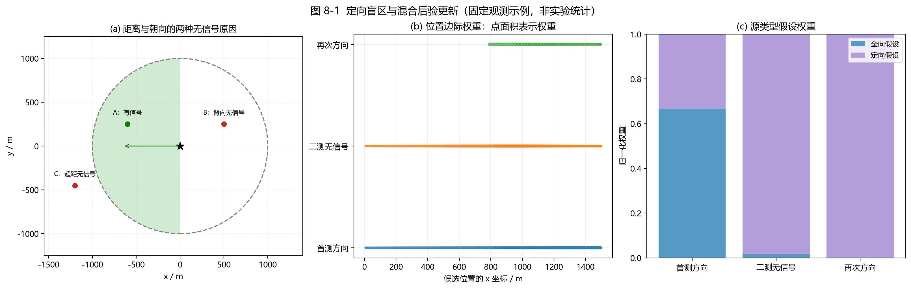
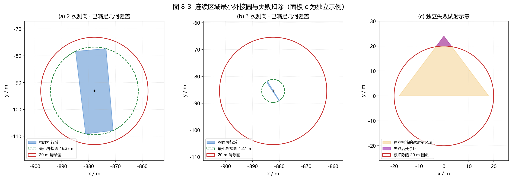

# 面向混合无线电干扰源的几何交会定位与动态协同清除优化

<div align="center"><b>BINGYI LI &emsp; ZHIYI ZHANG &emsp; JIAHENG WU</b></div>

<br>

<div align="center"><b>摘&emsp;要</b></div>

针对半径为 $1800\,\mathrm{m}$ 的目标圆域内多频段无线电干扰源自动搜索、定位与清除问题，考虑接收半径未知、测向误差有界、近场测向饱和以及定向源背向盲区等约束，本文构建由连续几何定位、离散状态评价、滚动路径规划和事件驱动控制组成的求解框架。

针对问题一，将 $\pm1^\circ$ 示向误差表示为闭扇区约束，并与目标圆域增量求交，得到数值定位区域 $\widehat\Omega$；在其凸包顶点中枚举最远点对以计算区域直径 $D$，再用顶点距离或等价的泰勒斯圆点积判据检验直径圆的覆盖性。等边三角形反例说明，以区域直径为直径的圆不一定覆盖整个区域。主算例中，三次测向后的定位区域面积依次为 $56543.26$、$335.25$ 和 $2.97\,\mathrm{m}^2$，最终直径为 $13.53\,\mathrm{m}$；对应半径为 $6.76\,\mathrm{m}$ 的直径圆覆盖数值候选区域，因此在本章模型与数值精度下满足 $20\,\mathrm{m}$ 清除视距要求。

针对问题二，沿首次示向建立局部正交标架，在示向线两侧搜索第二检测点；基于最小接收半径 $1000\,\mathrm{m}$ 构造保守保证接收区，并以中心间距 $20\,\mathrm{m}$ 的六边形晶格离散首次可行域，同时扩展接收半径状态。算法前向枚举近距、示向和无信号观测：对近距情景取 $5\,\mathrm{m}$ 定位尺度，对其余情景计算后验代表点最小外接圆并叠加保留单元最大偏移；随后按离散情景最坏修正半径、加权可清除比例及时间代理等指标进行字典序排序，并采用粗细两级网格搜索。基准算例得到第二检测点 $(800,600)\,\mathrm{m}$，离散情景最坏修正半径由沿线方案的 $316.922\,\mathrm{m}$ 降至 $52.113\,\mathrm{m}$；东侧边界算例得到 $(1490,-340)\,\mathrm{m}$，相应指标为 $25.824\,\mathrm{m}$，加权可清除情景比例为 $62.12\%$。这些指标用于离散候选评价，不作为连续物理状态空间的严格最坏上界。

针对问题三，构造由中心点和偏置半径 $\rho\approx1122.956\,\mathrm{m}$ 的六个外点组成的七点布局，并解析证明其在最小接收半径 $1000\,\mathrm{m}$ 下覆盖整个目标圆域。以七点与 20 个频道组成 140 项初始任务池，通过同点批处理、当前频道优先、动态任务剪枝、连续几何交会和反馈清除形成闭环；采用开放路径 2-opt 滚动规划及跨频道共享二测减少移动距离。在候选区域保留真实位置、几何运算精确且控制过程未受外部截止条件中断等假设下，进一步给出全向源有限步清除与退出证明。固定种子 42、含 12 个全向源的消融演练中，默认双侧共享方案清除 12/12 个目标，移动路程为 $11229.7\,\mathrm{m}$，虚拟总时间为 $2847.95\,\mathrm{s}$；相较单侧独立方案，二者分别降低 $21.9\%$ 和 $19.0\%$。

针对问题四，建立位置、接收半径、源类型和辐射朝向的联合离散状态 $h=(z,r,\tau,\phi)$，以确定性观测相容条件进行状态剪枝与权重归一化，刻画无信号观测中“超出接收距离”与“处于背向盲区”的歧义。算法采用中心站、8 个外圈站和 8 个内圈站组成的 17 站巡检布局，并给出半圆定向辐射发现完备性的凸包判定条件；首次示向后结合混合状态评价和 $25\%$、$50\%$、$75\%$ 轴向加权分位点探针选取后续测点。获得两处异地方向观测后，控制器转入连续几何阶段，以数值可行区域的最小外接圆检验 $20\,\mathrm{m}$ 覆盖条件，并利用失败清除圆盘的多边形布尔扣除更新后续搜索区域。在种子 2026091223—2026091228 的 6 组混合源演练中，共清除 79/79 个目标，单源平均虚拟时间为 $564.59\,\mathrm{s}$，六次运行的程序执行时间平均为 $38.88\,\mathrm{s}$。

**关键词**：无线电测向；几何交会定位；保证接收区；滚动路径规划；混合辐射源


<div style="page-break-after: always;"></div>

# 符号说明

为保证后文数学推导的严密性、几何交会模型的连贯性以及全篇符号表述的一致性，本章将贯穿全文的核心数学物理符号进行系统梳理与集中界定。

关于全篇符号的收录原则与学术边界说明如下：
1. **通用性与收录范围**：本章集中收录全篇通用的全局物理常数、多测点几何交会状态变量、自适应选点与动态调度决策变量，以及系统综合评价指标。
2. **首次出现即定义原则**：正文中各章节因特定算法推导、临时坐标代换或辅助证明引入的局部中间变量，在各章节首次出现处即时明确其数学界定与物理内涵，不在此作冗余罗列。
3. **分块结构与三要素齐备**：为便于评阅与检索，本章将核心符号划分为四个有机功能模块，各分块三线表均齐备**符号**、**物理与数学含义阐述**和**国际标准单位**三项核心要素。

<br>

<div align="center"><b>表 0-1 全局物理常数与环境先验参数</b></div>

| 符号 | 物理与数学含义阐述 | 国际标准单位 |
| :---: | :--- | :---: |
| $R_T$ | 目标监控圆形区域边界物理半径（固定常量值 $1800\,\mathrm{m}$） | $\mathrm{m}$ |
| $B_0$ | 目标监控圆形区域二维闭圆盘域，$B_0 = \{z \in \mathbb{R}^2 : \|z\|_2 \le R_T\}$ | 无量纲（平面区域） |
| $O$ | 监控圆域几何中心（平面直角坐标系原点 $(0,0)^\top$） | $\mathrm{m}$ |
| $r_{\min}, r_{\max}$ | 干扰源有效信号辐射/接收物理半径取值区间的下确界与上确界（$1000\,\mathrm{m}, 1500\,\mathrm{m}$） | $\mathrm{m}$ |
| $r$ | 特定干扰源客观具有的有效信号传播物理半径，先验未知但满足 $r \in [r_{\min}, r_{\max}]$ | $\mathrm{m}$ |
| $r_{\rm near}$ | 无线电测向接收机强信号近场饱和盲区物理半径（固定常量值 $5\,\mathrm{m}$） | $\mathrm{m}$ |
| $r_{\rm clear}$ | 移动机器人光学探测精确定位与激光清除装置的有效物理作业半径（固定常量值 $20\,\mathrm{m}$） | $\mathrm{m}$ |
| $\varepsilon$ | 单通道无线电测向仪示向测角误差的绝对值理论上限（$\pm 1^\circ = \pi/180\,\mathrm{rad}$） | $^\circ$ 或 $\mathrm{rad}$ |
| $v$ | 机器人在二维平面内沿直线机动的额定匀速巡航速度（固定常量值 $5\,\mathrm{m/s}$） | $\mathrm{m/s}$ |
| $t_{\rm sw}$ | 测向接收机在不同通信频段之间执行电子调谐切换的固定时间代价（$1\,\mathrm{s}$） | $\mathrm{s}$ |
| $t_{\rm meas}$ | 在指定测点执行单次无线电测向信号采集与方位解算的固定操作耗时（$5\,\mathrm{s}$） | $\mathrm{s}$ |
| $t_{\rm clear\_succ}$ | 光学精确定位并成功实施激光清除的总耗时（$5\,\mathrm{s}$，含 $3\,\mathrm{s}$ 光学确认与 $2\,\mathrm{s}$ 激光作用） | $\mathrm{s}$ |
| $t_{\rm clear\_fail}$ | 执行激光清除但未命中目标时的无效操作时间代价（$3\,\mathrm{s}$） | $\mathrm{s}$ |
| $K$ | 监控区域内客观存在的真实静止干扰源总数目（先验未知，满足 $10 \le K \le 16$） | 无量纲（整数） |
| $\mathcal{C}_{\rm all}$ | 系统支持的全通信频道离散标号集合，$\mathcal{C}_{\rm all} = \{1, 2, \ldots, 20\}$ | 无量纲（离散集合） |
| $\tau$ | 干扰源电磁辐射类型标识，$\tau \in \{O, D\}$（$O$ 表示全向源，$D$ 表示 $180^\circ$ 辐射半圆定向源） | 无量纲（离散标签） |
| $\phi$ | 定向干扰源天线主瓣发射物理朝向角，$\phi \in [0, 2\pi)$ | $\mathrm{rad}$ 或 $^\circ$ |
| $\Delta\Theta_{\rm dir}$ | 定向干扰源主瓣有效辐射角域全跨度（平角半平面圆域 $180^\circ = \pi\,\mathrm{rad}$） | $\mathrm{rad}$ 或 $^\circ$ |
| $R_{\rm base}$ | 问题三全域覆盖七站巡检拓扑中 6 个外围检测点的公称偏置半径（$R_{\rm base} \approx 1122.96\,\mathrm{m}$） | $\mathrm{m}$ |
| $R_{\rm out}$ | 问题四混合源十七站巡检拓扑中外圈 8 个八边形顶点站点的轨道半径（$R_{\rm out} \approx 1948.31\,\mathrm{m}$） | $\mathrm{m}$ |
| $R_{\rm in}$ | 问题四混合源十七站巡检拓扑中内圈 8 个内偏站点的轨道半径（$R_{\rm in} \approx 938.06\,\mathrm{m}$） | $\mathrm{m}$ |
| $\epsilon_{\rm tol}$ | 几何布尔求交与多边形拓扑分析中的浮点数值计算容差阈值（默认取 $10^{-8}\,\mathrm{m}$） | $\mathrm{m}$ |

<br>

<div align="center"><b>表 0-2 几何交会与空间状态推断核心变量</b></div>

| 符号 | 物理与数学含义阐述 | 国际标准单位 |
| :---: | :--- | :---: |
| $z$ | 干扰源在平面直角坐标系下的真实二维空间坐标向量，$z = (x, y)^\top \in B_0$ | $\mathrm{m}$ |
| $S_i$ | 机器人第 $i$ 次测向采样的二维空间位置坐标，$S_i = (x_i, y_i)^\top$ | $\mathrm{m}$ |
| $\theta_i$ | 机器人在测点 $S_i$ 处测向仪输出的实际示向度观测读数 | $^\circ$ 或 $\mathrm{rad}$ |
| $\varphi_i$ | 测点 $S_i$ 指向目标真实位置 $z$ 的客观几何真实方位角，$\varphi_i = \arg(z - S_i)$ | $^\circ$ 或 $\mathrm{rad}$ |
| $\boldsymbol{u}_i^-, \boldsymbol{u}_i^+$ | 测点 $S_i$ 示向开扇区两侧边界射线的单位方向向量 | 无量纲（单位向量） |
| $W_i$ | 测点 $S_i$ 单次测向在示向误差上界 $\varepsilon$ 约束下的二维开扇区空间可行域 | 无量纲（平面点集） |
| $\Omega_i$（或 $\Omega$） | 综合前 $i$ 次测向与监控圆域约束后的目标凸多边形空间可行域，$\Omega_i = B_0 \cap \bigcap_{k=1}^i W_k$ | 无量纲（平面点集） |
| $D$ | 凸多边形定位区域 $\Omega$ 的最大空间欧氏直径，$D = \operatorname{diam}(\Omega) = \sup_{P,Q \in \Omega}\|P - Q\|_2$ | $\mathrm{m}$ |
| $A, B$ | 凸多边形定位区域 $\Omega$ 中欧氏距离达到空间直径 $D$ 的一对极值凸包顶点坐标 | $\mathrm{m}$ |
| $\mathcal{C}_{\rm diam}$ | 以最远点对 $A, B$ 为直径端点构造的空间闭合直径圆盘，$\mathcal{C}_{\rm diam} = \{P : \|P - c_{\rm diam}\|_2 \le D/2\}$ | 无量纲（平面圆盘） |
| $c_{\rm diam}$ | 区域直径圆 $\mathcal{C}_{\rm diam}$ 的圆心空间坐标，$c_{\rm diam} = (A + B)/2$ | $\mathrm{m}$ |
| $r_{\rm diam}$ | 区域直径圆物理半径，严格满足 $r_{\rm diam} = D / 2$ | $\mathrm{m}$ |
| $C_k$ | 空间正六边形晶格剖分下的第 $k$ 个有效裁剪多边形网格单胞 | 无量纲（多边形区域） |
| $z_k$ | 六边形网格单胞 $C_k$ 内部选取的代表点空间坐标 | $\mathrm{m}$ |
| $\delta_k$ | 网格单胞 $C_k$ 内代表点 $z_k$ 到该单胞几何边界的最大空间截断误差，$\delta_k = \max_{P \in \partial C_k}\|P - z_k\|_2$ | $\mathrm{m}$ |
| $w_k$ | 网格单胞 $C_k$ 的空间几何面积归一化先验分布权重 | 无量纲 |
| $s_{ij}$ | 问题二中目标代表点与相容接收半径构成的离散联合假设状态二元组，$s_{ij} = (z_i, r_{ij})$ | 无量纲（复合状态） |
| $h$ | 问题四中目标全维度离散联合假设状态四元组，$h = (z, r, \tau, \phi)$ | 无量纲（复合状态） |
| $V_h(S)$ | 空间测点 $S$ 对联合状态 $h$ 的射频信号几何可见性布尔示性函数（取值 0 或 1） | 无量纲（布尔指示） |
| $\mathcal{Z}_o$ | 在具体观测响应 $o$ 下满足物理相容保留准则的后验离散目标代表点集 | 无量纲（空间点集） |
| $\rho_o$ | 后验相容候选点集 $\mathcal{Z}_o$ 由 Welzl 算法解得的最小覆盖圆（最小外接圆）几何半径 | $\mathrm{m}$ |
| $c_o$ | 后验相容候选点集 $\mathcal{Z}_o$ 对应最小覆盖圆的圆心空间坐标 | $\mathrm{m}$ |
| $\widehat{R}_o$ | 叠加网格单胞边界最大截断误差修正后的保守后验覆盖半径，$\widehat{R}_o = \rho_o + \max_{k \in I_o} \delta_k$ | $\mathrm{m}$ |
| $w(h)$ | 联合假设状态 $h$ 经多轮观测序列相容剪枝与增量滤波后的归一化后验权重 | 无量纲 |

<br>

<div align="center"><b>表 0-3 测点决策、协同调度与控制变量</b></div>

| 符号 | 物理与数学含义阐述 | 国际标准单位 |
| :---: | :--- | :---: |
| $\boldsymbol{e}_{\parallel}, \boldsymbol{e}_{\perp}$ | 以首次测点 $S_1$ 为原点、沿示向视线方向与垂直向左方向的随动局部正交标架基底单位向量 | 无量纲（单位向量） |
| $a, b$ | 候选第二检测点在随动局部正交标架下的纵向推进位移与横向侧移位移坐标 | $\mathrm{m}$ |
| $\mathcal{S}$ | 针对最不利目标位置与最小接收半径构建的保守保证接收空间可行域，$\mathcal{S} = \bigcap_{z \in \Omega_1} B(z, r_{\min})$ | 无量纲（平面区域） |
| $\mathcal{Q}$ | 第二检测点优化决策空间中的离散候选采样位置点集 | 无量纲（离散点集） |
| $S_2^*$ | 经多目标准则综合评价后确定的全局最优第二检测点空间坐标 | $\mathrm{m}$ |
| $o$ | 机器人在指定测点执行检测时获取的离散物理观测类别（$o \in \{\text{near}, \text{direction}(\theta), \text{no\_signal}\}$） | 无量纲（离散类别） |
| $\theta_2^{\rm bin}$ | 测向示向读数在前向观测情景模拟中经分箱聚类后的离散代表角 | $^\circ$ 或 $\mathrm{rad}$ |
| $\Delta\theta$ | 示向角聚类分箱的离散角步长（固定值 $0.25^\circ$） | $^\circ$ 或 $\mathrm{rad}$ |
| $\varepsilon_{\rm eff}$ | 综合仪器测角误差、分箱离散余量与空间网格尺度的有效示向容差上界 | $^\circ$ 或 $\mathrm{rad}$ |
| $\mathcal{T}_{\rm pool}$ | 全局动态协同任务池，存储待探测与待清除任务元组的集合 | 无量纲（任务集合） |
| $\Pi$ | 开放路径动态旅行商问题（Open-loop TSP）解出的多任务优化空间访问序列 | 无量纲（有序排列） |
| $\nu_c$ | 第 $c$ 个通信频道的信道状态信度（Channel Belief）版本序列号 | 无量纲（非负整数） |
| $\mathcal{V}_c$ | 第 $c$ 个通信频道在基准巡检拓扑中已完成扫描覆盖的互异测点集合 | 无量纲（测点集合） |
| $\lambda_{\rm share}$ | 跨频道共享第二检测点决策时允许的几何覆盖精度损失容忍系数 | 无量纲 |
| $\eta_{\rm probe}$ | 定向源背向盲区探针回退机制中沿首测示向视线轴选取的纵深分位比例参数（$\eta \in \{0.25, 0.50, 0.75\}$） | 无量纲 |
| $S_{\rm probe}$ | 沿首测示向轴执行探针探测机动的指定空间坐标点 | $\mathrm{m}$ |

<br>

<div align="center"><b>表 0-4 系统综合评价与运行性能指标</b></div>

| 符号 | 物理与数学含义阐述 | 国际标准单位 |
| :---: | :--- | :---: |
| $R_{\max}(S)$ | 候选检测点 $S$ 在遍历全观测情景下保守后验覆盖半径的最大值（最坏覆盖半径） | $\mathrm{m}$ |
| $p_c(S)$ | 候选检测点在前向模拟中后验覆盖半径满足 $\widehat{R}_o \le r_{\rm clear}$ 的加权可清除情景比例 | 无量纲（比例值） |
| $p_s(S)$ | 候选检测点在遍历所有先验联合状态时的有效射频信号可达加权概率（接收率） | 无量纲（比例值） |
| $L$ | 机器人在全作业流程中沿折线机动行驶的实际累计空间物理总路程 | $\mathrm{m}$ |
| $N_{\rm sw}$ | 机器人在连续测向作业之间执行通信频道调谐切换的累计总次数 | 无量纲（整数） |
| $N_{\rm meas}$ | 系统在全流程作业中执行无线电测向采样的累计总次数 | 无量纲（整数） |
| $N_{\rm clear}$ | 系统执行光学精准瞄准与激光清除动作的累计尝试总次数 | 无量纲（整数） |
| $N_{\rm succ}$ | 系统成功命中并物理摧毁场内真实干扰源的累计总数目 | 无量纲（整数） |
| $T$ | 机器人完成全域任务消耗的累计总虚拟时间（按赛题计费模型核算） | $\mathrm{s}$ |
| $\bar{t}_{\rm clear}$ | 成功清除单个干扰源所消耗的平均等效虚拟时间，$\bar{t}_{\rm clear} = T / N_{\rm succ}$ | $\mathrm{s}$ |
| $\eta_{\rm succ}$ | 监控区域内真实干扰源的完备物理清除率，$\eta_{\rm succ} = N_{\rm succ} / K \times 100\%$ | $\%$ 或无量纲 |
| $t_{\rm wall}$ | 计算机中央处理器执行优化求解、前向积分与动态调度算法所消耗的客观实际壁钟时间 | $\mathrm{s}$ |

<br>

## 表后补充说明与量纲约定

### 1. 空间参考坐标系与方位角基准
本文建立的全局平面直角坐标系以圆形监控区域的几何中心 $O$ 为坐标原点 $(0,0)^\top$。坐标轴指向规定为：$x$ 轴正方向指向**正东（East）**，$y$ 轴正方向指向**正北（North）**，空间几何位移与坐标距离的基本计量基准均为米（$\mathrm{m}$）。

方位角以正东方向（$+x$ 轴）为零度角基准（$0\,\mathrm{rad} / 0^\circ$），沿**逆时针方向（Counter-Clockwise, CCW）**旋转为正方向，角位移计量区间约定在连续圆周周期 $[0, 2\pi)$ 或 $[0^\circ, 360^\circ)$ 内。

### 2. 角度规整算子 $\operatorname{wrap}(\cdot)$
在处理测向示向度、几何视线方位与天线朝向角时，为了严格消除圆周边界 $0^\circ$ 与 $360^\circ$（或 $-\pi$ 与 $\pi$）处的跳变不连续性，定义角度模差规整算子 $\operatorname{wrap}: \mathbb{R} \to [-\pi, \pi)$（在角度制下映射至 $[-180^\circ, 180^\circ)$）：
$$
\operatorname{wrap}(\alpha) = (\alpha + \pi) \bmod 2\pi - \pi \quad \left(\text{角度制表示为: } \operatorname{wrap}(\alpha^\circ) = (\alpha^\circ + 180^\circ) \bmod 360^\circ - 180^\circ\right),
$$
式中 $\bmod$ 为标准浮点取模算子。任意两个空间方向角 $\alpha_1, \alpha_2$ 之间的测地线夹角严格由 $|\operatorname{wrap}(\alpha_1 - \alpha_2)|$ 唯一确定。

### 3. 关键角度变量的严格消歧约定
为避免不同物理概念在符号使用中的歧义混淆，对全篇出现的角度变量确立如下专用界定：
* **测点观测角 $\theta$**：专指测向仪器在特定测点 $S$ 处输出的射频信号到达角（Angle of Arrival, AoA）读数，其物理几何方向为“**自测点指向干扰源**”的视线入向；
* **几何真实方位角 $\varphi$**：专指目标与测点在几何空间中的真值位移向量极角，满足 $\varphi = \arg(z - S)$；
* **定向源发射物理朝向 $\phi$**：专指定向辐射源主瓣中心线的空间法向矢量物理指向。定向源的发射角域必须基于“**自干扰源指向测点**”的空间向量 $S - z$ 与 $\phi$ 进行判定，二者与测点观测角 $\theta$ 在几何方向上相差 $180^\circ$。

### 4. 拓扑、集合与几何算子约定
* **集合欧氏空间直径 $\operatorname{diam}(\cdot)$**：定义平面紧集 $\Omega \subset \mathbb{R}^2$ 的空间直径为该区域内任意两点欧氏距离的上确界：
  $$
  \operatorname{diam}(\Omega) \triangleq \sup_{P, Q \in \Omega} \|P - Q\|_2.
  $$
* **凸包算子 $\operatorname{Conv}(\cdot)$**：表示包含点集 $\Omega$ 的最小凸闭集，有 $\operatorname{diam}(\operatorname{Conv}(\Omega)) = \operatorname{diam}(\Omega)$；
* **拓扑边界算子 $\partial$**：$\partial C_k$ 表示几何多边形单胞 $C_k$ 的闭合边界多边形折线；
* **欧氏闭圆盘 $B(x, R)$**：表示平面上以点 $x \in \mathbb{R}^2$ 为圆心、以 $R > 0$ 为半径的闭圆盘，$B(x, R) \triangleq \{y \in \mathbb{R}^2 : \|y - x\|_2 \le R\}$；
* **二维有向叉积算子 $\times$**：对平面向量 $\boldsymbol{a} = (a_x, a_y)^\top$ 与 $\boldsymbol{b} = (b_x, b_y)^\top$，定义标量外积 $\boldsymbol{a} \times \boldsymbol{b} \triangleq a_x b_y - a_y b_x$，其正负严格判别点在射线的左侧或右侧半平面。

### 5. 全篇专用几何符号的消歧对照
针对前序各题推导中易产生交叠的符号，全篇统一执行如下消歧准则：
1. **圆盘与集合**：$\mathcal{C}_{\rm diam}$ 专指由定位区域最远点对构成的直径圆盘；$\mathcal{Q}$ 专指第二检测点的离散空间候选采样点集；$\mathcal{C}_{\rm all}$ 专指通信系统的 20 个离散频道全集；
2. **中心与网格**：$c_{\rm diam}$ 专指直径圆的空间圆心二维坐标；$C_k$ 专指空间 Voronoi 六边形网格剖分的第 $k$ 个单胞区域；
3. **特征半径**：$\rho_o$ 专指后验目标点集经 Welzl 算法求得的最小覆盖圆半径；$R_{\rm base} \approx 1122.96\,\mathrm{m}$ 专指问题三七点覆盖几何构型的外圈检测点偏置半径；
4. **辐射类型与容差**：$\tau \in \{O, D\}$ 专指干扰源全向或定向辐射模式的离散类别；$\epsilon_{\rm tol}$ 专指计算几何布尔运算中的浮点微小容差阈值，彻底废除旧文本中用 $\tau$ 指代数值容差的混淆表达；
5. **特征阈值**：监控区域半径统一表述为 $R_T = 1800\,\mathrm{m}$；测向强信号饱和盲区半径统一表述为 $r_{\rm near} = 5\,\mathrm{m}$；光学视距定位与激光清除有效半径统一表述为 $r_{\rm clear} = 20\,\mathrm{m}$。

### 6. 量纲与计量单位遵从约定
全篇所有物理量与性能指标按照国际单位制（SI）及其书写规范统一表示[10]：
* 几何长度、位移偏差、拓扑半径与移动路程统一采用米（$\mathrm{m}$）；
* 物理耗时、仿真虚拟时间及客观壁钟时间统一采用秒（$\mathrm{s}$）；
* 机器人平面巡航速度统一采用米每秒（$\mathrm{m/s}$）；
* 平面角在理论分析、极坐标积分与三角函数推导中采用弧度（$\mathrm{rad}$），在测向仪工程示向度读数及扇区分割描述中采用度（$^\circ$），其数值换算满足 $1^\circ = \frac{\pi}{180}\,\mathrm{rad}$；
* 状态元组、离散网格标签、指示函数及加权置信度权重等明确标注为无量纲（Dimensionless）。


<div style="page-break-after: always;"></div>

# 1 问题一：交会定位区域的构建与直径计算

单次示向测量只能约束干扰源所在的方向区间，无法唯一确定其位置。本章将有界示向误差转化为平面几何约束，通过不同检测位置的观测构建公共定位区域，并计算该区域的最大空间跨度。在此基础上，进一步判断以区域直径为直径构造的圆能否覆盖全部候选位置，为后续精确定位与清除提供依据。

## 1.1 示向误差几何模型

以目标圆域中心 $O$ 为原点建立平面直角坐标系，$x$ 轴正向向东，$y$ 轴正向向北，坐标单位为米。方位角以正东方向为零度，逆时针为正。设第 $i$ 个检测点为 $S_i=(x_i,y_i)$，同一频道的示向读数为 $\theta_i$。由于测向误差上界为 $\varepsilon=1^\circ$，真实方位角 $\varphi_i$ 满足

$$
\theta_i-\varepsilon\leq\varphi_i\leq\theta_i+\varepsilon.
$$

上述区间按圆周角理解；跨越 $0^\circ$ 时，应将角度连续展开或采用模 $360^\circ$ 的等价判定。定义两条边界射线的单位方向向量

$$
\boldsymbol u_i^-=
\begin{pmatrix}
\cos(\theta_i-\varepsilon)\\
\sin(\theta_i-\varepsilon)
\end{pmatrix},\qquad
\boldsymbol u_i^+=
\begin{pmatrix}
\cos(\theta_i+\varepsilon)\\
\sin(\theta_i+\varepsilon)
\end{pmatrix}.
$$

其中三角函数计算时将角度转换为弧度。记二维叉积为 $\boldsymbol a\times\boldsymbol b=a_xb_y-a_yb_x$，则一次测向对应的可行扇区为

$$
W_i=\left\{P:\boldsymbol u_i^-\times(P-S_i)\geq0,
\quad\boldsymbol u_i^+\times(P-S_i)\leq0\right\}.
$$

因此，可行位置位于两条边界射线之间，而非仅在示向中心线上。由于同一地点的测量误差在一段时间内保持不变，本模型不通过同点重复测量求平均来消除误差，而是利用不同位置的几何交会缩小候选范围。

本章遵循问题一程序的默认设定，仅使用示向角和目标圆域约束，不叠加有效接收半径及 $5\,\mathrm m$ 近场盲区。因而这里得到的是该建模口径下的候选区域；与完整物理约束下的候选集合应作区分。

## 1.2 交会定位区域构建

已知干扰源位于半径为 $1800\,\mathrm m$ 的目标圆域内，即

$$
B_0=\{(x,y):x^2+y^2\leq1800^2\}.
$$

同一干扰源的位置必须同时满足全部测向约束，故公共定位区域为

$$
\boxed{\Omega=B_0\cap\bigcap_{i=1}^{m}W_i}.
$$

采用增量求交方式，令 $\Omega_0=B_0$，依次计算

$$
\Omega_i=\Omega_{i-1}\cap W_i,\qquad i=1,2,\ldots,m.
$$

由集合交运算可知 $\Omega_i\subseteq\Omega_{i-1}$，故新增观测不会扩大定位区域。但区域缩小程度取决于各检测点的空间构型，不能保证每次观测均带来严格收缩。

数值实现采用 Shapely 进行几何布尔运算[1]。目标圆每象限离散为 64 段，形成 256 边形；扇区外圆弧默认采用 65 个采样点。因此，程序输出是连续几何区域的多边形近似，记为 $\widehat\Omega$。为将无限扇区转化为有限几何对象，设置截断距离

$$
L_i=\|S_i-O\|+1800+1.
$$

对于任意 $P\in B_0$，由三角不等式得 $\|P-S_i\|\leq1800+\|S_i-O\|<L_i$，故理想扇区的截断不排除目标圆域内的点。折线离散仍存在近似误差，不能将其等同于解析圆弧运算。若某次交集为空，或面积不超过 $10^{-8}\,\mathrm{m}^2$，程序报告公共区域为空或退化；其中退化情形不必然意味着观测矛盾，也可能是交集维数降低。



[图 1-1：多点示向误差扇区及交会定位区域示意图（PDF 矢量版）](figures/intersection.pdf)

> **区域构建算法：** 输入同一频道测向数据与误差上界；初始化 $\widehat\Omega\leftarrow\widehat B_0$；依检测顺序构造扇区多边形并更新 $\widehat\Omega\leftarrow\widehat\Omega\cap\widehat W_i$；若交集为空或面积不超过阈值则报告异常，否则输出最终定位多边形。

## 1.3 定位区域直径计算

区域直径刻画任意两种候选位置之间可能出现的最大距离，定义为

$$
D=\operatorname{diam}(\Omega)=\max_{P,Q\in\Omega}\|P-Q\|_2.
$$

设 $H=\operatorname{Conv}(\Omega)$。任取凸包内两点 $X=\sum_i\alpha_iP_i$、$Y=\sum_j\beta_jQ_j$，其中 $P_i,Q_j\in\Omega$，系数非负且分别求和为 1，则

$$
\|X-Y\|_2
=\left\|\sum_{i,j}\alpha_i\beta_j(P_i-Q_j)\right\|_2
\leq\sum_{i,j}\alpha_i\beta_j\|P_i-Q_j\|_2
\leq D.
$$

结合 $\Omega\subseteq H$，可得 $\operatorname{diam}(H)=\operatorname{diam}(\Omega)$。对于数值多边形，其凸包中的任一点均为凸包顶点的凸组合，同理可知最远点对能够在凸包顶点中取得。这一“先求凸包、再在凸包边界上搜索最远点对”的处理属于计算几何中的经典直径问题[2]。

设数值凸包顶点为 $P_1,\ldots,P_h$，则计算

$$
(A,B)\in\operatorname*{arg\,max}_{1\leq i<j\leq h}\|P_i-P_j\|_2,
\qquad \widehat D=\|A-B\|_2.
$$

后文算例中的直径均指计算得到的 $\widehat D$，为简洁仍记作 $D$。当前程序采用凸包顶点两两枚举，共比较 $h(h-1)/2$ 组距离，直径搜索的时间复杂度为 $O(h^2)$，存储顶点所需额外空间为 $O(h)$。这不等同于寻找多边形最长边，因为最远点对可能是两个不相邻顶点。

本章默认约束的交集本身为凸集，凸包操作主要用于统一几何处理流程与提取候选极点。图 1-2 以不规则凸多边形说明枚举过程，不引入虚构实验数值。


> **直径搜索算法：** 求定位多边形的凸包并提取 $h$ 个顶点；初始化 $D=0$；对 $i=1,\ldots,h-1$ 以及 $j=i+1,\ldots,h$，计算 $d_{ij}=\|P_i-P_j\|_2$；当 $d_{ij}>D$ 时更新 $D$ 及端点 $A=P_i,B=P_j$；最终返回 $D,A,B$。

## 1.4 直径圆覆盖性分析

由直径端点构造圆盘

$$
\mathcal C=\{P:\|P-C\|_2\leq D/2\},\qquad C=(A+B)/2.
$$

端点 $A,B$ 必然位于圆周上，但这不能证明其他候选点也在圆内。对定位多边形的全部边界顶点 $P_k$ 检查

$$
\|P_k-C\|_2\leq D/2+\tau,
\qquad \tau=\max(10^{-9}\,\mathrm m,10^{-10}D).
$$

圆盘是凸集，若所有顶点均在圆盘内，其凸组合也在圆盘内，因而整个多边形被覆盖；反之，只要一个顶点位于圆外，即可否定覆盖性。在忽略数值容差时，由恒等式

$$
(P_k-A)\cdot(P_k-B)=\|P_k-C\|_2^2-D^2/4
$$

可得等价的泰勒斯圆判据 $(P_k-A)\cdot(P_k-B)\leq0$。加入距离容差后，点积判据的右端相应变为 $D\tau+\tau^2$。这里的容差用于控制浮点舍入影响，不代表圆弧离散误差的上界。

**直径圆并不一定覆盖整个定位区域。** 以边长为 $D$ 的等边三角形为例，其区域直径也为 $D$。选择任一边 $AB$ 构造直径圆，第三个顶点 $P$ 到边中点的距离为

$$
\|P-C\|_2=\frac{\sqrt3}{2}D>\frac D2,
$$

故 $P$ 位于圆外。相较之下，矩形以对角线为直径构造的圆能够覆盖整个矩形。该反例否定的是一般性的必然覆盖命题；程序对每个具体区域仍需独立判断，而不能始终返回否定结果。直径圆也不应直接称为最小覆盖圆。


## 1.5 算例与结果分析

选取仓库运行日志 `P3_run_log.jsonl` 中频道 4 的前三个不同检测位置，记录位于日志第 5、77、79 行。三条记录均为已接受且返回示向度的测量响应，属于同一运行中同一频道的观测。此处仅作为日志算例展示几何算法，不将其视为独立正式评测结论。表中输入坐标保留八位小数以便复核，实际计算使用原始日志精度。

**表 1-1 主算例测向输入数据**

| 检测点 | $x_i/\mathrm m$ | $y_i/\mathrm m$ | $\theta_i/(^\circ)$ | 误差范围 |
|---|---:|---:|---:|---:|
| $S_1$ | 0.00000000 | 0.00000000 | 186.06 | $\pm1^\circ$ |
| $S_2$ | -845.15139195 | -403.18365019 | 95.97 | $\pm1^\circ$ |
| $S_3$ | -877.29411572 | -93.23217920 | 122.92 | $\pm1^\circ$ |

数据来源：仓库 `P3_run_log.jsonl`，频道 4，按顺序选取前三个不同检测位置；计算使用日志原始精度。

**表 1-2 主算例计算结果**

| 指标 | 数值 |
|---|---:|
| 定位区域面积 / $\mathrm{m}^2$ | 2.97 |
| 边界顶点数 | 3 |
| 直径 $D$ / $\mathrm m$ | 13.53 |
| 端点 $A$ / $\mathrm m$ | $(-877.29,-93.23)$ |
| 端点 $B$ / $\mathrm m$ | $(-884.45,-81.75)$ |
| 圆心 $C$ / $\mathrm m$ | $(-880.87,-87.49)$ |
| 半径 $D/2$ / $\mathrm m$ | 6.76 |
| 直径圆是否覆盖 | 是 |

依次加入三次观测后，候选区域面积分别为 $56543.26\,\mathrm{m}^2$、$335.25\,\mathrm{m}^2$ 和 $2.97\,\mathrm{m}^2$。可见，不同位置的测向约束交会后，狭长扇区逐渐收缩为小范围候选区域。最终区域有三个边界顶点，直径为 $D=13.53\,\mathrm m$，表示最不利方向上的最大空间不确定尺度。



本算例的全部顶点通过覆盖判据检验，直径圆能够覆盖数值定位区域，其半径为 $6.76\,\mathrm m$，小于清除半径 $20\,\mathrm m$。因此，在本章几何模型和数值精度下，以圆心 $C$ 为清除位置满足覆盖要求。一般情况下，不能仅凭 $D\leq40\,\mathrm m$ 就作出相同判断，还必须确认候选区域被相应圆覆盖。

值得注意的是，本算例中端点 $A$ 与第三检测位置重合，这是默认模型保留扇区顶点、未剔除近场盲区的结果，并非断言干扰源位于检测点。本章未开展圆弧离散精度敏感性实验，因此不对默认离散参数的收敛精度作额外结论。

## 1.6 问题一结论

通过将 $\pm1^\circ$ 示向误差转化为扇区约束，并与目标圆域进行增量求交，得到同一干扰源的定位可行区域；随后对数值区域的凸包顶点进行两两距离比较，获得区域直径及一组端点。多点观测能够把单次观测形成的狭长扇区逐步收缩为有限候选区域。

区域直径刻画最大空间不确定性，但以该直径构造的圆并不必然覆盖全部候选位置。以直径端点中点为圆心、以 $D/2$ 为半径时，仍须检验全部边界顶点。上述区域、直径端点、圆心与覆盖结论可作为后续检测点选择和清除策略的几何基础。


<div style="page-break-after: always;"></div>

# 2 问题二：第二检测点的优化选择

单次示向测量只能将未知干扰源约束在以检测点为顶点的狭长角带扇区内，无法唯一确定其空间坐标，亦无法获知该干扰源固定但先验未知的有效信号接收半径。为了实现对干扰源的高精度定位并为后续物理清除创造条件，必须通过移动设备选择第二个检测点。

第二检测点的优化决策面临多重物理机制的相互制约：在几何交会层面，第二次检测视线与初次视线的交角越接近正交，两组示向角带交会出的后验区域几何跨度越小；在信号可达性层面，若横向侧移幅度过大或纵深推进过远，一旦干扰源的有效接收半径处于较低水平，第二检测点将面临无法接收到信号的风险；在任务时间层面，追求极端交角往往要求机器狗行进更远距离，带来显著的机动耗时增加；在清除闭环层面，若离散评价中的后验修正半径能够收缩至清除视距（$20\,\mathrm m$）以内，则可将该情景标记为可清除候选，并在后续连续几何校验通过后实施清除。

本章围绕上述核心决策矛盾，建立“初次可行域约束 $\to$ 空间六边形网格剖分与接收半径联合状态扩展 $\to$ 离散情景前向观测模拟 $\to$ 基于最小覆盖圆与单元偏移修正的候选点评价 $\to$ 两级网格搜索与近优区域提取”的优化方法体系，为第二检测点的选择提供兼顾几何精度与信号可达性的决策依据。

## 2.1 首次观测约束与第二检测点可行域

### 2.1.1 首次观测几何模型与先验不确定性

以半径为 $R_T = 1800\,\mathrm m$ 的圆形目标区域中心 $O(0,0)$ 为原点建立平面直角坐标系，$x$ 轴正向向东，$y$ 轴正向向北，方位角以正东方向为零度并按逆时针方向计量。

设首次检测位置为 $S_1 = (x_1, y_1)$，测得该频道的示向读数为 $\theta_1$。系统中存在两类本质未知的物理状态：
1. **目标真实空间位置** $z = (x, y)^\top \in \mathbb{R}^2$；
2. **目标有效信号接收半径** $r \in [r_{\min}, r_{\max}] = [1000, 1500]\,\mathrm m$，其对特定干扰源为固定常数，但对搜索方先验未知。

测向设备的最大测角误差上界为 $\varepsilon = 1^\circ$。由于首次检测已成功获取有效示向度，根据题目物理规则，干扰源与 $S_1$ 的欧氏距离必然严格大于强信号近场盲区半径 $d_{\text{near}} = 5\,\mathrm m$，且必然不大于该干扰源的有效接收半径 $r$。由于 $r \le 1500\,\mathrm m$，目标到首次检测点的距离上限确定为 $1500\,\mathrm m$。必须指出，虽然 $r \ge 1000\,\mathrm m$，但这绝不意味着目标距首次检测点必须大于 $1000\,\mathrm m$；干扰源完全可能处于 $5\,\mathrm m < \|z - S_1\| < 1000\,\mathrm m$ 的近距范围内。

已知目标必位于目标圆域 $B_0 = \{z \in \mathbb{R}^2 : \|z\| \le R_T\}$ 内。复用第 1 章的示向误差几何模型，首次观测对应的物理可行空间为
$$
\Omega_1 = \left\{ z \in \mathbb{R}^2 : \|z\| \le 1800,\ 5 < \|z - S_1\| \le 1500,\ |\operatorname{wrap}(\arg(z - S_1) - \theta_1)| \le 1^\circ \right\},
$$
其中 $\operatorname{wrap}(\phi) = (\phi + 180^\circ) \bmod 360^\circ - 180^\circ$ 为角度规整算子。集合 $\Omega_1$ 是目标圆域、最大接收边界圆盘、盲区开圆盘及角带扇区的交集，构成了后续所有推断的先验空间可行域。

### 2.1.2 沿示向线局部正交标架与双侧搜索

为了将机器狗的机动方向解耦为“沿初次视线的纵深推进”与“垂直初次视线的横向侧移”，以 $S_1$ 为原点建立随动局部正交标架：
$$
\boldsymbol{e}_{\parallel} = \begin{pmatrix} \cos\theta_1 \\ \sin\theta_1 \end{pmatrix}, \qquad \boldsymbol{e}_{\perp} = \begin{pmatrix} -\sin\theta_1 \\ \cos\theta_1 \end{pmatrix}.
$$
任意第二检测候选点 $S_2$ 均可由局部标量坐标 $(a, b)$ 唯一线性表示：
$$
S_2 = S_1 + a \boldsymbol{e}_{\parallel} + b \boldsymbol{e}_{\perp}.
$$
其中 $a$ 为沿示向线的纵向位移，$b$ 为沿左法向的横向位移。

在无界理想平面中，由于几何对称性，$b$ 与 $-b$ 对应的交角大小相同；但在实际约束下，场地外边界 $B_0$ 会对扇形区域实施非对称截断，导致首次可行域 $\Omega_1$ 在示向线两侧的面积与几何形态通常不对称。因此，搜索模型必须保留对 $b$ 的双侧对称搜索机制（$b \in [-b_{\max}, b_{\max}]$），不可预先假定单侧等价。

此外，题目明确指出“在同一地点重复测量误差固定不变”，因此在同一点位重复测向无法利用统计独立性消除误差，无法缩小可行区域。算法在候选点生成中严格排除 $S_2 = S_1$（即 $a=b=0$）。

### 2.1.3 保守保证接收区域构建

若要求第二检测点无论真实目标位于 $\Omega_1$ 内的何处、其有效接收半径取何值，均必然能够接收到信号，则 $S_2$ 到 $\Omega_1$ 内任意点的距离均不得超过最小可能接收半径 $r_{\min} = 1000\,\mathrm m$。据此构造保证接收区域：
$$
\mathcal{S} = \bigcap_{z \in \Omega_1} B(z, 1000) = \left\{ S_2 \in \mathbb{R}^2 : \max_{z \in \Omega_1} \|S_2 - z\| \le 1000 \right\}.
$$

关于集合 $\mathcal{S}$ 的性质需明确以下学术边界：
1. **充分性与保守性**：$\mathcal{S}$ 属于保证信号接收的充分条件，它是针对最不利目标位置与最不利接收半径（$1000\,\mathrm m$）的保守交集，而非利用首次观测后能够收到信号的最大可能区域。若目标恰好处于较近距离或其实际 $r > 1000\,\mathrm m$，则机器狗处于 $\mathcal{S}$ 外部同样可能获得信号。
2. **凸分析简化**：在凸几何意义下，紧集与圆盘的交集等价于该紧集凸包极点与圆盘的交集。数值实现中，利用 Shapely[1] 提取可行域凸包 $\operatorname{Conv}(\Omega_1)$ 的离散多边形顶点，依次作半径为 $1000\,\mathrm m$ 的圆盘求交，获得 $\mathcal{S}$ 的高精度多边形数值逼近。
3. **机动空间界限**：目标圆域 $B_0$ 的 $1800\,\mathrm m$ 半径仅是对干扰源分布的约束，赛题并未将机器狗的运动轨迹限制在目标圆域内部。机器狗完全可以根据战术交会需要移动至目标圆域外侧，因此候选点搜索空间不能未经说明就强行施加 $B_0$ 裁剪。

### 2.1.4 侧移量与交会几何的物理权衡

沿示向线推进（$b=0$）与横向侧移（$b \ne 0$）对定位精度的影响存在本质差异：
* 若 $S_2$ 严格位于初次示向线上（$b=0$），两次测向视线共线，交会角退化为 $0^\circ$ 或 $180^\circ$。新观测无法在横向维度提供任何角分辨力，定位区域只能依赖近场盲区边界和接收半径上限发生微小的纵向截断，定位区域跨度依然保持在数百米量级；
* 若适度增加横向侧移（$b \ne 0$ 且 $S_2 \in \mathcal{S}$），两视线构成显著交角，两次角带交叉截出的多边形空间跨度急剧缩小，后验不确定区域可由宏观扇区迅速压缩为一个紧凑区域；
* 若横向侧移过大（$|b|$ 过大以至 $S_2 \notin \mathcal{S}$），候选点脱离了保证接收区，在目标接收半径偏小的情形下产生无信号响应（`no_signal`），不仅无法测得方向，还会导致机器狗白白浪费大量机动时间。

因此，优化第二检测点的本质是在“增大基线交角以提升精度”与“保持在保证接收区内以规避脱靶风险”之间寻求兼顾。

## 2.2 联合状态离散与观测更新

### 2.2.1 空间六边形 Voronoi 网格剖分

为实现连续可行域上的高精度后验推断与数值积分，采用正六边形 Voronoi 晶格单元剖分连续可行域 $\Omega_1$。Voronoi 图及其对偶 Delaunay 三角剖分是空间离散与位置优化中的经典工具[3]；正六边形晶格具有六重旋转对称性，本文据此选用该网格以减弱由坐标轴方向造成的离散偏向。

以中心间距 $d_g = 20\,\mathrm m$ 构建三角网格基底，生成对应的正六边形单元。各单元多边形与连续可行域 $\Omega_1$ 进行几何求交，滤除交集面积小于 $10^{-9}\,\mathrm m^2$ 的退化单元，得到 $N_{\text{cell}}$ 个互不相交的有效裁剪多边形单元 $\{C_i\}_{i=1}^{N_{\text{cell}}}$。

在每个单元 $C_i$ 内部提取代表点 $z_i \in C_i$，并赋予归一化面积权重：
$$
w_i = \frac{\operatorname{Area}(C_i)}{\sum_{j=1}^{N_{\text{cell}}} \operatorname{Area}(C_j)}.
$$

为了补偿连续几何单元离散为单点代表点所引入的空间截断误差，遍历每个裁剪单元 $C_i$ 边界上的所有折线离散顶点，计算代表点至单元边界的最大欧氏距离：
$$
\delta_i = \max_{P \in \partial C_i} \|P - z_i\|_2.
$$

需严格说明的是，对于不受边界裁剪的完整正六边形单元，中心到外接顶点的外接圆半径为 $d_g / \sqrt{3} \approx 11.55\,\mathrm m$；但由于 $\Omega_1$ 边界的切割，边缘部分单元发生多边形畸变且内部代表点发生偏移，其实际最大距离 $\delta_i$ 必须通过几何边界精确提取，不可直接宣称所有单元的离散误差均不超过 $11.55\,\mathrm m$。

### 2.2.2 接收半径条件相容与联合状态空间扩展

对于任意空间代表点 $z_i$，其与首次检测点的空间跨度为 $d_{1,i} = \|z_i - S_1\|$。由于首次检测已确定测得有效示向角，物理规律要求目标接收半径必须大于等于传播距离：
$$
r \ge r_{\text{lower}}(z_i) = \max\left(r_{\min},\ d_{1,i}\right).
$$

在相容闭区间 $[r_{\text{lower}}(z_i), r_{\max}]$ 内，结合设定的 $K_r = 5$ 个等间距基础采样值，并严格纳入相容区间的下确界端点 $r_{\text{lower}}(z_i)$ 与上确界 $r_{\max} = 1500\,\mathrm m$，得到该空间位置所对应的离散相容接收半径集合 $\{r_{ij}\}_{j=1}^{M_i}$。

定义离散联合状态为元组 $s_{ij} = (z_i, r_{ij})$。在同一空间单元内部，各相容半径样本平分该空间单元的面积权重，即
$$
w(s_{ij}) = \frac{w_i}{M_i}, \qquad \sum_{i=1}^{N_{\text{cell}}} \sum_{j=1}^{M_i} w(s_{ij}) = 1.
$$
所有合法二元组构成了覆盖位置与接收能力全维度的先验联合状态集合 $\mathcal{S}_{\text{prior}}$。

### 2.2.3 三类物理观测模型与向量化相容更新

当机器狗机动至候选检测位置 $S_2$ 执行第二次检测时，由处于联合状态 $s = (z, r)$ 的真实目标所激发的物理响应 $o$ 严格归纳为三类互斥情形：
$$
o = \begin{cases}
\text{near}, & \text{若 } \|z - S_2\| \le 5\,\mathrm m, \\
\text{direction}(\theta_2), & \text{若 } 5\,\mathrm m < \|z - S_2\| \le r, \\
\text{no\_signal}, & \text{若 } \|z - S_2\| > r.
\end{cases}
$$

当观测为 `direction` 时，测向仪输出叠加了随机误差 $\varepsilon_2 \in [-1^\circ, 1^\circ]$ 的示向度读数：
$$
\theta_2 = \left( \arg(z - S_2) + \varepsilon_2 \right) \bmod 360^\circ.
$$

必须强调，`no_signal` 绝非应当废弃的无效观测，它提供了确定性的排他约束：目标到 $S_2$ 的距离必然严格大于其有效接收半径 $r$。在后验推断中，该事件能够直接剪枝剔除所有满足 $\|z_i - S_2\| \le r_{ij}$ 的不相容状态，在收敛目标可行域方面同样具有明确的几何贡献。

为了对连续测角误差与观测读数进行数值枚举，选取典型误差样本集 $\varepsilon_2 \in \{-1^\circ, 0^\circ, 1^\circ\}$。对于有方向观测，按照角分箱宽度 $\Delta\theta = 0.25^\circ$ 对示向角进行分箱聚类：
$$
\theta_2^{\text{bin}} = \operatorname{round}\left( \frac{\theta_2}{\Delta\theta} \right) \cdot \Delta\theta \bmod 360^\circ.
$$
聚合相同特征的观测事件，计算其对应的情景发生权重。

给定候选点 $S_2$ 与某一具体观测事件 $o$，利用向量化数组操作计算全体联合状态的相容性布尔掩码：
* 若 $o = \text{near}$，相容判据为 $\|z_i - S_2\| \le 5\,\mathrm m$；
* 若 $o = \text{no\_signal}$，相容判据为 $\|z_i - S_2\| > r_{ij}$；
* 若 $o = \text{direction}(\theta_2^{\text{bin}})$，相容判据为
  $$
  5 < \|z_i - S_2\| \le r_{ij} \quad \text{且} \quad \left|\operatorname{wrap}\left(\arg(z_i - S_2) - \theta_2^{\text{bin}}\right)\right| \le 1^\circ + \frac{\Delta\theta}{2} = 1.125^\circ.
  $$
  其中引入 $\Delta\theta/2$ 的半宽容差，用于完全吸收分箱聚类产生的舍入误差，防止离散截断错误排除相容真值。

筛选出的相容联合状态子集记为 $\mathcal{S}_{\text{post}}(o)$。将其投影到不重复的空间目标代表点，提取相容目标代表点集合 $\mathcal{Z}_o = \{z_k\}_{k \in I_o}$ 及其单元离散误差集合 $\{\delta_k\}_{k \in I_o}$。

### 2.2.4 学术边界说明

空间面积权重、等间距半径采样以及等权误差样本是用于离散计算的评估度量，赛题并未给定干扰源空间位置的先验概率密度、接收半径的分布律或测向误差的统计分布。因此，后文计算出的综合比例均严格界定为“加权情景比例”，不应直接称作客观物理世界中的实际概率；本章更新本质上是相容约束集合的剪枝更新，而非完整贝叶斯后验推断。

## 2.3 基于离散情景修正半径的选点评价

### 2.3.1 最小覆盖圆与离散空间误差修正

对于任意后验相容目标点集 $\mathcal{Z}_o = \{z_k\}_{k \in I_o}$：
1. 若观测为 `near`，目标已被锁定在以 $S_2$ 为中心、半径 $5\,\mathrm m$ 的邻域内，最小覆盖圆直接取圆心 $c_o = S_2$，半径取 $\rho_o = 5\,\mathrm m$；
2. 若观测为其他情形，采用计算几何中的 Welzl 随机增量算法求解点集 $\mathcal{Z}_o$ 的最小覆盖圆（Minimum Enclosing Circle）[4]。该算法在随机输入次序下具有期望 $O(|\mathcal{Z}_o|)$ 时间复杂度，输出圆心 $c_o$ 与样本覆盖半径 $\rho_o$。

对于 `near` 观测，题设已直接给出目标到检测点的距离不超过 $5\,\mathrm m$，因此不再叠加网格单元误差。对于 `direction` 与 `no_signal` 观测，为补偿将保留单元离散为代表点所产生的空间偏移，定义离散情景修正半径为
$$
\widehat{R}_o =
\begin{cases}
5\,\mathrm m, & o=\mathrm{near},\\[2mm]
\rho_o+\displaystyle\max_{k\in I_o}\delta_k,
& o\in\{\mathrm{direction},\mathrm{no\_signal}\}.
\end{cases}
$$

对非 `near` 观测，由欧氏空间三角不等式可知，对于代表点已通过相容性筛选的保留单元 $C_k$，其中任意连续点 $P\in C_k$ 均满足
$$
\|P - c_o\| \le \|P - z_k\| + \|z_k - c_o\| \le \delta_k + \rho_o \le \widehat{R}_o.
$$
因此，以 $c_o$ 为圆心、以 $\widehat{R}_o$ 为半径的闭圆盘能够覆盖**已保留代表点所对应的单元并集** $\bigcup_{k\in I_o}C_k$。

需要说明这一修正的适用边界：程序首先用单元代表点判断距离、接收半径和示向角是否与观测相容，再对保留下来的单元增加空间偏移量。若某个单元的代表点不满足相容判据，而单元边缘仍与连续观测约束存在交集，该单元可能不会进入 $I_o$。此外，接收半径和测角误差也采用有限样本枚举。因此，$\widehat{R}_o$ 是针对当前网格、半径样本、误差样本及观测分箱得到的**离散情景修正尺度**；上述包含关系只对保留单元成立，不能解释为对全部连续物理相容状态的严格最坏上界。

这一处理逻辑与第 1 章形成衔接：第 1 章已严格证明，区域最远点对构成的直径圆并不必然覆盖整个多边形（例如等边三角形的反例）；问题二因而采用代表点最小外接圆及单元偏移修正评价离散后验，而不直接以直径圆作为覆盖尺度。

### 2.3.2 选点综合评价指标体系

对每个候选检测点 $S_2$，在遍历当前离散模型枚举出的观测情景后，计算以下指标：

1. **主评价指标（离散情景最坏修正半径）**：
   $$
   R_{\max}(S_2) = \max_{o \in \mathcal{O}(S_2)} \widehat{R}_o(S_2).
   $$
   该指标取有限离散情景中的最大修正尺度，用于比较候选检测点的鲁棒性。这里的“最坏”限于当前位置网格、接收半径样本、测角误差样本和观测分箱，不代表连续状态空间上的严格最大值。

2. **清除视距判据与加权可清除情景比例**：
   赛题规定，简易光学探测仪在距离干扰源 $d \le 20\,\mathrm m$ 时可实施精确定位并启动激光清除。
   若某个离散情景满足 $\widehat{R}_o(S_2)\le20\,\mathrm m$，则当前模型中该情景保留的代表点及其对应单元均被 $20\,\mathrm m$ 圆覆盖，可将其记为离散评价下的可清除情景。该判据不单独构成对全部连续物理相容位置的严格清除保证。据此定义加权可清除情景比例为
   $$
   p_c(S_2) = \sum_{o \in \mathcal{O}(S_2)} w(o) \cdot \mathbb{I}(\widehat{R}_o(S_2) \le 20\,\mathrm m).
   $$

3. **信号可达权重（接收率）**：
   $$
   p_s(S_2) = \sum_{o \ne \text{no\_signal}} w(o).
   $$

4. **辅助评价指标**：
   * 加权平均覆盖半径：$\bar{R}(S_2) = \sum_o w(o) \widehat{R}_o(S_2)$；
   * 90% 分位数覆盖半径：$R_{0.90}(S_2)$；
   * 两阶段时间代理指标：
     $$
     T_{\text{agent}}(S_2) = \frac{\|S_2 - S_1\|}{v} + t_{\text{detect}} + \sum_{o \in \mathcal{O}(S_2)} w(o) \left[ \frac{\|c_o - S_2\|}{v} + \mathbb{I}(\widehat{R}_o \le 20)(t_{\text{loc}} + t_{\text{clear}}) \right].
     $$
     其中速度 $v = 5\,\mathrm m/\mathrm s$，测向耗时 $t_{\text{detect}} = 5\,\mathrm s$，光学定位耗时 $t_{\text{loc}} = 3\,\mathrm s$，激光清除耗时 $t_{\text{clear}} = 2\,\mathrm s$。

需再次申明，对于不可清除情景（$\widehat{R}_o > 20\,\mathrm m$），机器狗抵达 $c_o$ 后必须执行第三次及后续测向机动，该过程属于问题三的多阶段动态规划，未在此处计入。因此 $T_{\text{agent}}$ 仅作为前两步机动与清除预期耗时的局部代理指标，不能称为全任务期望完成时间。

### 2.3.3 接收率修正与字典序排序准则

为抑制脱离信号覆盖的极端选点，定义接收率修正目标函数：
$$
J(S_2) = \frac{R_{\max}(S_2)}{\left[\max(p_s(S_2), 0.05)\right]^\alpha}, \qquad (\alpha = 1).
$$
候选点的全局优劣按照鲁棒优先的多级字典序进行综合判定：
$$
\operatorname{SortKey}(S_2) = \Big( \mathbb{I}(S_2 \notin \mathcal{S}),\ J(S_2),\ -p_c(S_2),\ R_{0.90}(S_2),\ \bar{R}(S_2),\ T_{\text{agent}}(S_2) \Big).
$$

排序规则首先保证候选点位于保证接收区域 $\mathcal{S}$ 内部；在保证接收区内部，由于 $p_s(S_2) = 1$，修正函数 $J(S_2)$ 自然退化为离散情景最坏修正半径 $R_{\max}(S_2)$。随后依次按照该半径最小、加权可清除比例最高、高分位与平均半径更小、时间成本更低的顺序完成全序比较。

### 2.3.4 第二次观测区域收缩图文对照分析

为直观展现选点策略对后验定位区域收缩的影响，选定基准观测情景：设干扰源真实位置位于 $z = (1000.0, 10.0)$，有效接收半径 $r = 1200\,\mathrm m$，第二次测角误差取 $\varepsilon_2 = 0^\circ$。对“沿示向线基准点 $S_2(800, 0)$”与“优化第二检测点 $S_2^*(800, 600)$”实施对照模拟，生成图 2-2。需注意，此处单一情景仅作为几何机理展示，不能代替前述完整的离散情景评价。



图中上排采用相同坐标范围，展示测点、真值与完整覆盖圆；下排分别放大后验区域，采用不同坐标尺度，以标注的半径数值比较精度。两个方案的修正半径均大于 20 米，尚不能据此保证一次清除。

对图 2-2 的对比分析表明：
1. **沿示向线基准点（图 2-2(a)）**：在此示例中，两条真实测向视线的交角约为 $2.29^\circ$，角带交会条件较差，后验仍呈狭长分布。相容目标代表点多达 26 个，最小覆盖圆半径为 $\rho_o = 281.29\,\mathrm m$，加上局部单元误差 $\max\delta_i = 11.94\,\mathrm m$ 后，离散情景修正半径为 $\widehat{R}_o = 293.23\,\mathrm m$。该尺度远超 $20\,\mathrm m$ 清除阈值，表明沿线推进无法摆脱长条形狭长角带的不确定性。
2. **优化第二检测点（图 2-2(b)）**：机器狗侧移至 $(800, 600)$，两条真实测向视线形成约 $71.85^\circ$ 的锐交角；$36.87^\circ$ 则是机动向量 $(800,600)$ 与横轴的夹角，两者不同。两组扇区的非共线截交使得后验相容代表点骤减至 4 个，代表点最小覆盖圆半径收敛至 $\rho_o = 16.77\,\mathrm m$；加入保留单元的最大偏移 $\max\delta_i = 11.55\,\mathrm m$ 后，离散情景修正半径为 $\widehat{R}_o = 28.31\,\mathrm m$，仍未达到 $20\,\mathrm m$ 判据。空间后验尺度相较基准点显著缩小，展现了适度侧移带来的交会增益。

## 2.4 粗细网格求解与近优候选区域

### 2.4.1 两级自适应粗细网格搜索算法

连续平面空间上的候选点优化属于非凸全局寻优问题。针对计算资源与求解精度的平衡，设计两级自适应网格搜索算法：
1. **第一级粗网格全局普查**：在局部坐标系 $(a, b)$ 内，以步长 $\Delta_{\text{coarse}} = 100\,\mathrm m$ 构建覆盖搜索窗口的粗网格点阵，执行全部已枚举情景的后验仿真与指标初评；
2. **第二级细网格局部精化**：提取粗网格评估排名前 $K = 4$ 的优质种子点，在以每个种子点为中心、半宽 $W_{\text{refine}} = 160\,\mathrm m$ 的正方形邻域内，以细网格步长 $\Delta_{\text{fine}} = 50\,\mathrm m$ 进行网格加密采样与离散情景重评；
3. **合并去重与全局重排**：将两级网格产生的所有候选点按全局坐标合并去重，统一调用字典序准则重排，提取排名第一的候选点作为当前求解的最优检测点 $S_2^*$。

必须明确说明，该算法属于离散空间与局部加密下的近似优化方法，最终输出解应规范表述为“当前搜索与离散精度下的最优候选点”，不宣称连续全局最优或已具备严格收敛性证明。

```text
算法 2-1：第二检测点粗细网格两级优化求解算法
输入：首次检测点 S_1，示向度 θ_1，配置参数 (d_g=20 m, Δ_coarse=100 m, Δ_fine=50 m, K=4)
输出：最优第二检测点 S_2^*，推荐候选区域 C
1. 构建首次连续可行域 Ω_1 与保证接收区域 S
2. 以 d_g 正六边形网格剖分 Ω_1，提取单元代表点及离散误差，扩展为联合状态空间 S_prior
3. 在局部坐标 (a, b) 中以 Δ_coarse 生成粗网格点阵，枚举情景评估各候选点性能
4. 选取粗网格前 K=4 个种子点，在半宽 160 m 窗口内以 Δ_fine 进行细网格加密采样并评估
5. 合并全部候选点并去重，按字典序准则 SortKey 排序，取 S 内部最优解为 S_2^*
6. 依据近优容差筛选满足条件的近优点集 Q，以每个点作半径 Δ_fine/√2 的圆盘
7. 对全体圆盘执行几何并运算，输出推荐连续区域 C = ⋃_{q∈Q} B(q, Δ_fine/√2)
```

### 2.4.2 近优候选区域的形态学提取与学术边界

在实际任务部署中，单一孤立的最优点容易受到局部地形障碍、突发威胁或机动限制的干扰，指挥决策往往需要具备一定几何跨度的推荐候选区域。

基于算法求得的最优点 $q^* = S_2^*$，按照以下阈值条件筛选近优候选点集合 $\mathcal{Q}$：
$$
\mathcal{Q} = \left\{ q \in \mathcal{S} : J(q) \le 1.05 J(q^*) + 2\,\mathrm m, \quad p_c(q) \ge p_c(q^*) - 0.02 \right\}.
$$
在此必须明确：式中最后一个条件代表“可清除比例相较最优点的绝对降幅不超过 2 个百分点”，绝不能混淆表述为达到最优值的 98%。

以每个入选近优点 $q \in \mathcal{Q}$ 为中心，作半径等于细网格单胞对角线半长 $r_b = \Delta_{\text{fine}} / \sqrt{2} \approx 35.36\,\mathrm m$ 的圆盘。该操作可视为以圆盘为结构元素的集合形态学膨胀[5]；随后通过连续几何求并生成推荐候选区域：
$$
\mathcal{C} = \bigcup_{q \in \mathcal{Q}} B\left(q, \frac{\Delta_{\text{fine}}}{\sqrt{2}}\right).
$$

关于推荐区域 $\mathcal{C}$ 需明确以下学术边界：
$\mathcal{C}$ 用于表达围绕近优点簇的平滑几何邻域。算法并未对连续区域 $\mathcal{C}$ 内部的每一个连续无限点进行重新仿真评价，亦未将圆盘并集的外轮廓再次强制截断于 $\mathcal{S}$ 内部；因此不能断言 $\mathcal{C}$ 内的每一个连续点均严格满足保证接收与近优阈值。若后续战术执行需要在 $\mathcal{C}$ 内部选取非网格实际点，应调用评测模型对其进行独立验证。

### 2.4.3 第二检测点评价分布图文解析

图 2-1 展示了在基准输入条件 $S_1 = (0,0),\ \theta_1 = 0^\circ$ 下，全域候选点的离散情景最坏修正半径分布、保证接收区边界以及推荐区域。



结合图 2-1 的空间分布特征进行深入分析：
1. **可行域与保证接收区**：灰色带状区域为首次可行域 $\Omega_1$，呈顶角 $2^\circ$、向东延伸的狭长扇区；虚线包络的浅绿色区域为保证接收区 $\mathcal{S}$，在 $a \in [500.4, 1005.0]\,\mathrm m$ 范围内形成一个最大横向跨度达 $\pm 650.7\,\mathrm m$ 的凸状走廊，明确了不脱离信号的安全机动边界；
2. **最坏修正半径的空间演化**：色条反映离散情景指标 $R_{\max}(S_2)$。在靠近示向线中心轴（$b=0$）的区域，该指标普遍在 $200\sim350\,\mathrm m$ 以上（呈现深蓝紫色），表明纵向交会的定位性能处于劣势；随着侧移量 $|b|$ 逐渐增大，指标迅速下降（过渡至黄色），定位精度显著改善；
3. **最优点与推荐区域定位**：在保证接收区 $\mathcal{S}$ 内部，当前离散搜索得到的最优检测点为红星标记处 $S_2^* = (800.0, 600.0)$，对应离散情景最坏修正半径 $R_{\max} = 52.113\,\mathrm m$。紫色轮廓勾勒出围绕近优点簇的推荐区域 $\mathcal{C}$（面积为 $3826.8\,\mathrm m^2$）。右下角局部放大框展示了 $50\,\mathrm m$ 细网格的离散取样点及其指标响应。

## 2.5 结果对比与选点结论

### 2.5.1 主算例选点策略综合对比

为了量化不同决策逻辑在几何精度、信号保证和机动耗时上的差异，在基准算例（$S_1 = (0,0),\ \theta_1 = 0^\circ$）下，选取四个具有明确物理代表性的策略点进行统一复核评测，对比结果如表 2-1 所示。

**表 2-1 主算例选点策略对比表**

| 选点策略 | 局部坐标 $(a, b) / \mathrm m$ | 全局坐标 $(x, y) / \mathrm m$ | 是否保证接收 | 离散情景最坏修正半径 $R_{\max} / \mathrm m$ | 加权可清除情景比例 $p_c$ | 从首次点移动距离 / $\mathrm m$ | 预计总时间 $T_{\text{agent}} / \mathrm s$ |
|---|---:|---:|:---:|---:|---:|---:|---:|
| 沿示向线基准点 | $(800.0, 0.0)$ | $(800.0, 0.0)$ | 是 | 316.922 | 7.40% | 800.0 | 239.5 |
| 保证接收区内中度侧移点 | $(800.0, 300.0)$ | $(800.0, 300.0)$ | 是 | 79.486 | 14.23% | 854.4 | 273.3 |
| **算法优化点** | **(800.0, 600.0)** | **(800.0, 600.0)** | **是** | **52.113** | **3.18%** | **1000.0** | **348.7** |
| 保证接收区外过度侧移点 | $(800.0, 800.0)$ | $(800.0, 800.0)$ | 否 | 104.506 | 0.19% | 1131.4 | 410.1 |

注：各策略点均通过相同的离散情景后验评价模型进行复评；主算例输入为 $S_1 = (0,0),\ \theta_1 = 0^\circ$；对称点 $(800.0, -600.0)$ 的各项指标与优化点完全一致。表中 $R_{\max}$ 和 $p_c$ 均受网格与样本精度限制。

### 2.5.2 策略对比与物理机制深度剖析

表 2-1 揭示了第二检测点决策背后的多目标博弈规律：

1. **沿示向线基准点（$b=0$）的局限性**：虽然该策略移动距离最短（$800\,\mathrm m$）、总时间最省（$239.5\,\mathrm s$），且位于保证接收区内部，但在离散评价中其最坏修正半径高达 $316.922\,\mathrm m$。这意味着其在所枚举不利情景下获得的新几何信息较少，不利于后续收敛。
2. **中度侧移点（$b=300\,\mathrm m$）的特征**：当机器狗横向侧移 $300\,\mathrm m$ 后，移动距离仅增加 $54.4\,\mathrm m$（约 $6.8\%$），离散情景最坏修正半径从 $316.922\,\mathrm m$ 降至 $79.486\,\mathrm m$（降幅达 $74.9\%$），且加权可清除情景比例提升至 $14.23\%$。这说明横向基线有助于削弱狭长角带的不确定性。
3. **算法优化点（$b=600\,\mathrm m$）的综合优势**：在继续增大侧移至保证接收区临界边缘时，交会几何进一步收紧，当前搜索精度下的最优指标为 $52.113\,\mathrm m$，相较沿线基准点改善 $83.6\%$。虽然其加权可清除情景比例（$3.18\%$）低于中度侧移点，但按本文的字典序准则，它优先降低了所枚举情景中的最大修正尺度。
4. **过度侧移点（$b=800\,\mathrm m$）的失效机理**：过度追求交角会导致脱离保证接收区（处于 $\mathcal{S}$ 外部）。此时信号接收率下降至 $99.64\%$，在出现无信号的离散情景中后验支撑扩散，使得最坏修正半径增至 $104.506\,\mathrm m$，同时带来更长的行进距离（$1131.4\,\mathrm m$）与更高的机动耗时（$410.1\,\mathrm s$）。
5. **清除视距达标结论**：主算例优化点的离散情景最坏修正半径为 $52.113\,\mathrm m>20\,\mathrm m$，因此即使按当前离散评价也不能保证两次测向后一次性清除；部分情景仍需要第三次检测。即使某个离散情景满足 $R_{\max}\le20\,\mathrm m$，实际清除前仍应由后续连续几何模型复核。

### 2.5.3 场地边界裁剪算例检验

为验证模型与算法在非对称、受场地外边界截断场景下的适应性，构造边界裁剪算例：设首次检测点位于目标区域东侧边界附近 $S_1 = (1000.0, 0.0)$，示向角 $\theta_1 = 0^\circ$。

在此算例中，首次测向扇区在向东延伸仅 $800\,\mathrm m$ 后即与 $R_T = 1800\,\mathrm m$ 的目标圆域边界相交，纵深范围由默认的 $1500\,\mathrm m$ 压缩为 $800\,\mathrm m$，首次可行域面积锐减至 $11168.413\,\mathrm m^2$。

调用本章优化算法求解，得到如下关键结论：
* 保证接收区域面积相应扩大为 $1576750.696\,\mathrm m^2$；
* 最优第二检测点定位在局部坐标 $(a^*, b^*) = (490.0, -340.0)\,\mathrm m$，对应全局坐标为 $(1490.0, -340.0)$；
* 该点位于保证接收区内部，离散情景最坏修正半径为 $25.824\,\mathrm m$；
* 离散模型下加权可清除情景比例高达 $62.12\%$；
* 从首次检测点移动至第二检测点的距离仅为 $596.4\,\mathrm m$，两阶段预计总时间仅为 $205.3\,\mathrm s$。

边界算例表明，当先验可行域因地理边界限制而缩短纵深时，当前离散模型给出的修正尺度明显减小，加权可清除情景比例提升至六成以上。该结果说明方法能够响应场地边界造成的先验变化，但不构成连续状态空间上的严格鲁棒性证明。

### 2.5.4 本章总结

本章针对问题二给出了第二检测点的优化决策模型与候选区域提取方案。通过构建沿示向线局部标架，将候选点搜索与先验可行域空间特性解耦；采用六边形网格剖分与未知接收半径联合状态扩展，实现三类物理观测的离散情景仿真；利用 Welzl 最小外接圆与保留单元偏移修正，建立以离散情景最坏修正半径为主指标的字典序评价体系；最终通过粗细两级网格搜索，求得当前离散精度下的最优检测点及近优候选区域，为后续连续几何复核与多阶段路径规划提供候选决策。


<div style="page-break-after: always;"></div>

# 3 问题三：全向干扰源的自动搜索、定位与清除

前两章分别解决了多测向线交会定位的凸多边形计算（第 1 章）以及单次示向后第二检测点的优化选择（第 2 章）。本章将上述单目标几何与选点方法扩展至全局多目标动态作业场景，建立一套面向未知数目、多频段全向干扰源的自主搜索、精确定位与协同清除闭环控制系统。

机器狗从圆形区域中心出发，面对干扰源数量未知（$10 \le K \le 16$）、空间分布未知、有效辐射半径未知（$1000\,\mathrm{m} \le r \le 1500\,\mathrm{m}$）以及测向存在 $\pm 1^\circ$ 误差的复杂环境。首要任务目标是确保场内所有真实干扰源的完备清除，在此前提下通过协同规划最小化任务总虚拟时间。本章通过七点几何覆盖建立全域感知基底，利用双侧搜索与连续交会实现多频段快速收敛，引入跨频道共享二测与开放路径动态旅行商（TSP）规划大幅削减机动冗余，并依托严格的有限状态机与容错分支机制实现物理清除闭环。

---

## 3.1 总体框架与任务完成判据

### 3.1.1 任务目标与决策约束

设半径为 $R = 1800\,\mathrm{m}$ 的圆形目标圆域为 $B_0 = \{z \in \mathbb{R}^2 : \|z\| \le R\}$。场内分布有未知数量的静止全向干扰源，数量 $K$ 满足 $10 \le K \le 16$。系统支持 20 个互异通信频道，每个干扰源独占一个频道，且每个频道的有效接收半径 $r$ 是属于区间 $[1000, 1500]\,\mathrm{m}$ 的固定常数。

机器狗配备单通道测向机、光学精确定位设备与激光清除装置，初始时刻位于坐标原点 $S_0(0,0)$，测向机默认处于频道 1。系统的作业流程受到以下核心物理规则制约：
1. **清除完备性优先原则**：由于真实目标总数 $K$ 先验未知，机器狗绝不能以“已清除 10 个目标”作为终止条件，而必须在全域维度证明未被清除的其余频道确实不存在目标；
2. **作业时间代价**：机器狗匀速直线行进速度为 $v = 5\,\mathrm{m/s}$；测向机频段切换耗时 $t_{\rm sw} = 1\,\mathrm{s}$；执行一次测向耗时 $t_{\rm meas} = 5\,\mathrm{s}$；实施一次清除动作若未命中耗时 $t_{\rm clear\_fail} = 3\,\mathrm{s}$，若命中成功则耗时 $t_{\rm clear\_succ} = 5\,\mathrm{s}$；
3. **清除与观测解耦**：光学清除有效半径为 $r_{\rm clear} = 20\,\mathrm{m}$，近场强信号饱和半径为 $r_{\rm near} = 5\,\mathrm{m}$。清除操作仅依赖空间物理距离，不改变测向机当前的驻留频道。

### 3.1.2 闭环分层感知与控制架构

针对多频段并发探测与时空交织的决策难题，系统采用“全域覆盖建池 $\to$ 局部自适应定位 $\to$ 跨频道协同调度 $\to$ 动作反馈自愈”的分层闭环架构：

1. **宏观搜索层（七点覆盖）**：基于最不利接收半径 $r_0 = 1000\,\mathrm{m}$ 构建覆盖目标圆域的 7 个空间基准测点，生成覆盖全部 20 个频道的初始搜索任务池；
2. **局部定位层（P2 与 P1 几何接管）**：某频道一旦在搜索中截获首个有效方向，立即调用第 2 章双侧搜索算法生成第二检测点；获得两次及以上方向后，调用第 1 章连续多边形交会算法更新可行域与区域直径；
3. **全局调度层（动态开放 TSP 与共享二测）**：将分散在场内的各频道待执行任务按空间坐标合并，以机器狗当前位置为起点求解开放路径 TSP；在离开当前点前，触发跨频道共享二测点优化，以略微牺牲单目标几何精度换取大幅空间路径合并；
4. **底层执行与状态反馈层**：串行执行动作指令并解析模拟器反馈。对无信号、有效方位、近距饱和、清除成功与失败等各类响应实施状态机原子转移，动态清理失效任务并重建后续任务。

对 20 个通信频道分别维护独立的信道状态信度（Channel Belief），其核心属性包括：历史观测序列、已扫描覆盖站点集合、是否发现信号、当前连续多边形可行域 $\Omega$、区域直径 $D$、是否已清除以及状态版本号 $\nu$。任何新观测反馈均使对应频道的版本号递增（$\nu \leftarrow \nu + 1$），任务规划器据此自动淘汰历史过期任务，杜绝状态不一致导致的无效机动。

### 3.1.3 虚拟时间核算体系

根据官方赛题与物理模型，机器狗在虚拟空间中推进的累计总虚拟时间 $T$ 严格定义为：
$$
T = \frac{L}{5} + N_{\rm sw} + 5N_{\rm meas} + 3N_{\rm clear} + 2N_{\rm succ}.
$$
式中各项具有明确的物理意义：
- $L$ 为机器狗在二维平面移动的实际累计折线路程（$\mathrm{m}$），折算位移时间为 $L/5$ 秒；
- $N_{\rm sw}$ 为相邻两次测向之间发生频道切换的累计次数（初始频道为 1）；清除动作不改变频段，故清除前后不累加 $N_{\rm sw}$；
- $N_{\rm meas}$ 为执行测向动作的总次数（包含常规搜索测向、第二点测向与圆心补测），每次固定耗时 $5\,\mathrm{s}$；
- $N_{\rm clear}$ 为执行清除动作的总尝试次数（包含成功清除与未命中清除），每次尝试至少消耗基础时间 $3\,\mathrm{s}$；
- $N_{\rm succ}$ 为成功清除目标的次数。赛题规定清除成功耗时 $5\,\mathrm{s}$、失败耗时 $3\,\mathrm{s}$，公式通过 $3N_{\rm clear} + 2N_{\rm succ}$ 精确统一了成功（$3+2=5\,\mathrm{s}$）与失败（$3\,\mathrm{s}$）的计费逻辑。

### 3.1.4 未知源数下的任务完备退出判据

在目标真实总数未知的情形下，控制系统必须具备自我闭合的完备性数学证明。算法设计了两项互斥的退出判据分支，满足任一分支即刻触发正常退出（`/exit`）：

$$
\text{Exit Condition} = \mathcal{E}_{\rm upper} \;\lor\; \mathcal{E}_{\rm certified},
$$
1. **容量上限饱和退出 $\mathcal{E}_{\rm upper}$**：
   $$
   N_{\rm succ} = 16.
   $$
   当成功清除数量达到题设允许的最大干扰源上限（16 个）时，场内已不可能存在其余干扰源，系统即刻终止。
2. **全频道完备扫描证明 $\mathcal{E}_{\rm certified}$**：
   $$
   \forall c \in \{1, 2, \ldots, 20\}, \quad \Big( \text{cleared}_c = \text{True} \Big) \;\lor\; \Big( \text{detected}_c = \text{False} \;\land\; |\mathcal{V}_c| = 7 \Big).
   $$
   即对全部 20 个频道中的每一个频道，要么该频道的干扰源已经被成功定位并物理清除，要么该频道在七点全域覆盖网络中的全部 7 个空间测点上均已完成扫描且**从未检测到任何有效射频信号**。

判据 $\mathcal{E}_{\rm certified}$ 是处理未知目标数目问题的理论基石：由于后文将严格证明七点布局能够 $100\%$ 保证截获圆域内任意位置、任意合法接收半径的全向辐射源，因此当某频道在全部 7 个点上均返回无信号时，可从拓扑上严格判定该频道在场内必然不存在干扰源。这一判据彻底摆脱了对目标先验数量的依赖。



> **图 3-1 架构说明：**
> 流程图系统展示了从原点初始化、有效任务池更新、双退出判据判定、原地批次调度、开放路径 TSP 求解，到测量/清除反馈分类处理的完整拓扑结构。侧边突出展示了面向竞赛环境的 10 秒现实时间截止保护与 2000 次最大安全动作约束。

---

## 3.2 七点覆盖搜索与按点频道扫描

### 3.2.1 最小接收半径与七点覆盖构型

为确保全域搜索不遗漏任何潜在目标，必须基于干扰源信号传播的物理下确界进行几何构型设计。题设干扰源有效接收半径 $r \in [1000, 1500]\,\mathrm{m}$，故最不利情形为 $r_0 = 1000\,\mathrm{m}$。若一组测点在 $r_0 = 1000\,\mathrm{m}$ 的检测半径下能够实现对目标圆域 $B_0$ 的完全几何覆盖，则对任意 $r \ge r_0$ 均必然实现覆盖。

在半径 $R = 1800\,\mathrm{m}$ 的目标圆域内部，设计包含 1 个几何中心点与 6 个外围对称点的**七点覆盖几何构型**：
$$
S_0 = (0, 0), \qquad S_{k+1} = \rho \begin{pmatrix} \cos\left(\frac{k\pi}{3}\right) \\ \sin\left(\frac{k\pi}{3}\right) \end{pmatrix}, \quad k = 0, 1, \ldots, 5.
$$
外点偏置半径 $\rho$ 并非经验赋值，而是以内接正六边形边长为弦时接收圆的几何内偏圆心距：
$$
\rho = R\cos\left(\frac{\pi}{6}\right) - \sqrt{r_0^2 - \left(\frac{R}{2}\right)^2} = 900\sqrt{3} - \sqrt{1000^2 - 900^2} = 900\sqrt{3} - \sqrt{190000} \approx 1122.956\,\mathrm{m}.
$$

必须强调，该布局的外围检测点分布在半径约 $1122.956\,\mathrm{m}$ 的圆周上，既非外切半径 $1800\,\mathrm{m}$，亦非单圆半径 $1000\,\mathrm{m}$；七点构型是结合正六边形对称性构造出的充分几何覆盖解，不宣称其点数达到数学意义上的全局最少。

### 3.2.2 全域覆盖性的严格几何推导

对任意目标点 $P(x, y) \in B_0$，其极坐标表示为 $(t, \alpha)$，其中径向距离 $t \in [0, R]$，极角 $\alpha \in [0, 2\pi)$。证明目标点必落入至少一个检测圆内，即证明 $\min_{j=0,\ldots,6} \|P - S_j\|_2 \le r_0$。

**证明：**
1. **内圈目标覆盖（$t \in [0, 1000]\,\mathrm{m}$）**：
   中心测点 $S_0(0,0)$ 的检测范围为以原点为中心、半径为 $r_0 = 1000\,\mathrm{m}$ 的闭圆盘 $B(S_0, 1000)$。对于任意满足 $t \le 1000\,\mathrm{m}$ 的目标点 $P$，其距中心点距离 $\|P - S_0\|_2 = t \le 1000\,\mathrm{m} = r_0$。因此中心点保证了半径 $1000\,\mathrm{m}$ 内圈区域的无缝全覆盖。
2. **外圈目标覆盖（$t \in [1000, 1800]\,\mathrm{m}$）**：
   将外圈圆环按极角均匀划分为 6 个张角为 $60^\circ$ 的对称扇形区间 $\mathcal{W}_k = [\frac{k\pi}{3} - \frac{\pi}{6}, \frac{k\pi}{3} + \frac{\pi}{6}]$（$k=0,\ldots,5$）。对于任意极角 $\alpha$，必存在某个外点 $S_{k+1}$（极角为 $\alpha_k = \frac{k\pi}{3}$），使得极角差 $\phi = \alpha - \alpha_k$ 满足：
   $$
   |\phi| \le \frac{\pi}{6} = 30^\circ.
   $$
   计算该目标点 $P$ 到外测点 $S_{k+1}$ 的欧氏距离平方：
   $$
   d^2(t, \phi) = t^2 + \rho^2 - 2t\rho\cos\phi.
   $$
   由于 $\cos\phi$ 在 $|\phi| \le 30^\circ$ 上单调递减，其极小值在最坏夹角 $|\phi| = 30^\circ$ 处取得（$\cos 30^\circ = \sqrt{3}/2$），故对于固定径向距离 $t$：
   $$
   d^2(t, \phi) \le d^2(t, 30^\circ) = t^2 - \sqrt{3}\rho t + \rho^2 \equiv f(t).
   $$
   考察一元二次函数 $f(t)$ 在闭区间 $t \in [1000, 1800]$ 上的极值。由于二次项系数大于零，该函数为严格凸函数，其最大值必然在区间的两个端点 $t=1000$ 或 $t=1800$ 处取得：
   - **在外边界端点 $t = 1800\,\mathrm{m}$ 处**：
     将 $\rho = R\frac{\sqrt{3}}{2} - \sqrt{r_0^2 - (R/2)^2}$ 代入，注意 $R = 1800\,\mathrm{m}$：
     $$
     f(R) = R^2 - \sqrt{3}\rho R + \rho^2 = \left(R\frac{\sqrt{3}}{2} - \rho\right)^2 + \left(\frac{R}{2}\right)^2.
     $$
     由 $\rho$ 的定义式可知 $R\frac{\sqrt{3}}{2} - \rho = \sqrt{r_0^2 - (R/2)^2}$，代入即得：
     $$
     f(1800) = \left(\sqrt{r_0^2 - (R/2)^2}\right)^2 + \left(\frac{R}{2}\right)^2 = r_0^2 - \left(\frac{R}{2}\right)^2 + \left(\frac{R}{2}\right)^2 = r_0^2 = 1000^2.
     $$
     这表明在外边界两相邻扇区交界处（内接正六边形顶点），目标到对应测点的距离恰好等于 $1000\,\mathrm{m}$；
   - **在内交界端点 $t = 1000\,\mathrm{m}$ 处**：
     将数值代入计算：
     $$
     f(1000) = 1000^2 - 1000\sqrt{3}(1122.956) + 1122.956^2 \approx 10^6 - 1.9450 \times 10^6 + 1.2610 \times 10^6 = 316035 < 1000^2.
     $$
     对应空间距离仅为 $\sqrt{316035} \approx 562.17\,\mathrm{m} < 1000\,\mathrm{m}$。

综上所述，在整个目标圆域 $B_0$ 内，函数 $d(t, \phi)$ 的理论上界恒满足 $d \le r_0 = 1000\,\mathrm{m}$。全域覆盖性获严格解析证明。



> **图 3-2 几何与路径说明：**
> - **(a) 七点覆盖几何布局**：黑色实线为半径 $1800\,\mathrm{m}$ 的目标圆边界，7 个浅蓝色半透明圆盘为半径 $1000\,\mathrm{m}$ 的有效接收圆，灰色虚线为内接正六边形。图形直观印证了在外边界顶点与内圈接缝处均无任何几何盲区。
> - **(b) 共享二测路线示意**：使用固定构造的任务节点展示两条开放路线，独立路线长 $4862.3\,\mathrm m$，共享路线长 $4646.1\,\mathrm m$，差值为 $216.2\,\mathrm m$。该图解释合并测点的路径收益，不是演练日志中的任务快照，也不表示这两条路线已达到 TSP 最优。

### 3.2.3 初始 140 任务池与按点频道扫描机制

在任务启动阶段，7 个覆盖测点与 20 个通信频道笛卡尔积组合，生成 $7 \times 20 = 140$ 个初始覆盖搜索任务。这 140 个任务虽然逻辑独立，但在空间上严格聚集于 7 个几何测点。

为最大限度降低频繁切频与空间移动带来的时间惩罚，系统设计**按点集中批次处理机制**：
1. **原地清除最高优先级**：当机器狗抵达某点时，若任务池中存在当前位置的清除任务（如前序观测判定满足清除条件或近距饱和），优先执行清除动作。清除动作不改变频道，避免破坏测向机的频段连续性；
2. **当前频道惯性测量**：若机器狗测向机当前已处于频道 $c$，且当前位置存在该频道未执行的测量任务，立即优先执行该任务，实现 $\Delta N_{\rm sw} = 0$ 的零切换开销；
3. **同点频道顺序批处理**：随后，依次轮询驻留在当前点位的其余有效测量任务，完成一个频道的测量后单调递增切至下一频道。

机器狗在当前点位将所有属于该坐标的有效任务彻底执行完毕后，才会调用路径规划模块向下一个空间位置转移。

### 3.2.4 动态任务剪枝与无信号的几何语义

系统任务池是动态演进的响应式集合：
- **信号捕获剪枝**：一旦某频道在某个覆盖点上检测到有效示向度（`direction`），表明该目标已被成功截获，系统立即从任务池中检索并**彻底删除该频道剩余未访问的所有覆盖搜索任务**，同时无缝插入由第 2 章算法计算出的第二检测点定位任务；
- **清除注销剪枝**：一旦某频道清除成功，注销该频道并移除其名下所有任务；
- **无信号的客观语义**：在单点上返回 `no_signal` 仅能说明该目标未处于该测点的当前接收圆内，绝不意味着该频道不存在。无信号观测仅用于登记该频道的覆盖站点进度（将其加入 $\mathcal{V}_c$）或用于二测回退机制，算法不在连续几何多边形上直接抠除无信号大圆盘，从而杜绝由于有限离散误差引入的不可逆几何误剪。

---

## 3.3 交会定位与分支清除策略

### 3.3.1 首次示向向二次检测的过渡

当某频道在覆盖测点 $S_1$ 首次获得有效示向 $\theta_1$ 时，系统将其移交第 2 章建立的“联合离散状态建模与最坏后验覆盖评价”求解器。

求解器在垂直于示向线的局部坐标系内执行双侧空间离散网格搜索，输出：
1. **最优第二检测点** $S_2^*$：在离散情景最坏外接圆半径修正值 $J(S_2)$ 最小的准则下产生，兼具交会几何张角与信号保证；
2. **首次连续可行域** $\Omega_1$：由目标圆域 $B_0$、示向误差角带扇区（$\theta_1 \pm 1^\circ$）以及有效距离截断（$5\,\mathrm{m} < d \le 1500\,\mathrm{m}$）求交构成；
3. **保守保证接收回退点** $S_{2, \rm fallback}$：若推荐的第二检测点在执行中因极端扰动返回 `no_signal`，算法立即调用回退点执行保底测量。

### 3.3.2 多次示向的连续几何交会

当某频道积累获得 $m \ge 2$ 次异地示向观测时，系统无缝切入第 1 章的连续几何优化内核。将目标圆域多边形逼近 $\widehat{B}_0$ 与各测点 $S_i$ 的截断角带多边形 $\widehat{W}_i$ 增量求交，获得当前定位可行多边形：
$$
\Omega_m = B_0 \cap \bigcap_{i=1}^m W_i.
$$
提取 $\Omega_m$ 凸包上的极值顶点集，通过两两枚举计算区域直径 $D$ 及最远点对 $A, B$：
$$
D = \max_{P, Q \in \Omega_m} \|P - Q\|_2 = \|A - B\|_2.
$$
并构造直径圆：
$$
\mathcal{C} = B(c, D/2), \qquad c = \frac{A + B}{2}.
$$
随后利用泰勒斯圆点积判据对 $\Omega_m$ 的全部边界顶点检验包含性：
$$
\Omega_m \subseteq \mathcal{C} \iff \forall P_k \in \partial\Omega_m, \quad (P_k - A) \cdot (P_k - B) \le 0.
$$

### 3.3.3 分支清除判据系统

针对几何交会可能出现的各种空间尺度与退化构型，系统构建了严密的五分支决策规则库（表 3-1 所示）。

**表 3-1 分支清除判据与执行策略对照表**

| 序号 | 观测反馈或几何前置条件 | 满足条件时的执行动作 | 决策背后的物理与数学机理 |
|:---:|---|---|---|
| **1** | 测向返回 `near` | 机器狗在**当前测点原地**立即执行 `/clear` | 目标距机器狗 $d \le 5\,\mathrm{m}$，必然落入 $20\,\mathrm{m}$ 光学清除视距内，无需机动 |
| **2** | 直径 $D \le 40\,\mathrm{m}$ 且 $\Omega \subseteq B(c, D/2)$ | 机器狗机动至**直径圆心 $c$** 直接执行 `/clear` | 直径圆半宽 $D/2 \le 20\,\mathrm{m}$ 且全覆盖，以 $c$ 为圆心的 $20\,\mathrm{m}$ 光学清除圆必包含整个目标区域 |
| **3** | 直径 $D > 40\,\mathrm{m}$ | 机动至**直径圆心 $c$** 继续测向 `/measure` | 第 3.3.5 节证明该点始终可接收信号；若获得方向，新区域直径至多为原直径的 $\sqrt3/2$ |
| **4** | 直径 $D \le 40\,\mathrm{m}$ 但直径圆**未完全覆盖** $\Omega$ | 机动至 $c$ **先补测示向**，增量更新可行域后**仍在原 $c$ 尝试清除**；若补测返回 `near`，则原地直接清除 | 原圆心未必能一次覆盖全部候选位置；补测将后续残余区约束在张角 $2^\circ$ 的角带内 |
| **5** | 上述分支 4 在原 $c$ 点**清除失败** | 从**已纳入原圆心补测的区域**中扣除失败圆，得到 $\Omega_{\rm rem}=\Omega_{\rm updated}\setminus B(c,20)$，机动至其**内部代表点**直接清除 | 在第 3.3.4 节的理想几何前提下，残余区直径不超过 $14.691\,\mathrm m<20\,\mathrm m$，任一内部代表点均能保证覆盖清除 |



> **图 3-3 面板剖析：**
> - **(a) 双测向交会约束**：取自日志真实算例（频道 4），$S_1(0,0)$ 与 $S_2(-845.2, -403.2)$ 测向视线交汇截出面积 $335.25\,\mathrm{m}^2$ 的狭长角带交集 $\Omega_2$；
> - **(b) 第三测后的物理可行域**：采用当前 P3 的 $5<d\le1500\,\mathrm m$ 约束复算，区域面积为 $2.54\,\mathrm{m}^2$，直径 $D=8.53\,\mathrm m$，新直径圆半径为 $4.27\,\mathrm m$。本算例第二测后已进入“小直径但不覆盖”分支，因此补测后实际尝试清除的位置仍为此前记录的原圆心 $c_{\rm old}=(-877.29,-93.23)$。图中分别标出新直径圆与以原圆心为中心的 20 米清除圆。
> - **(c) 未覆盖与残余区扣除几何示意**：构造锐角三角形区域（$D=36\,\mathrm{m} \le 40\,\mathrm{m}$ 但圆心无法覆盖上顶点），展示在原圆心清除未命中后精确布尔扣除 $20\,\mathrm{m}$ 红色失败圆盘，同时以绿色虚线标出半径 18 米的直径圆，与半径 20 米的清除圆区分；生成紫色残余多边形 $\Omega_{\rm rem}$ 并提取内部代表点 $p_{\rm rem}$（粉色五角星）。

### 3.3.4 原圆心补测后的残余区清除保证

残余区域并非任意形状的候选集合：分支 5 的执行前提是，机器狗已在分支 4 的**原直径圆心**完成补测，并将新示向约束纳入区域更新。因此，必须将“原圆心补测—更新区域—原圆心尝试清除—失败圆扣除”作为一个完整过程分析。

**命题（残余区代表点清除保证）。** 设补测前的非空紧致候选区域为 $\Omega$，其包含真实全向干扰源位置 $T$，区域直径为 $D\le40\,\mathrm m$，直径端点为 $A,B$，原圆心为 $c=(A+B)/2$。假设示向误差不超过 $1^\circ$，接收半径至少为 $1000\,\mathrm m$，清除结果仅由 $20\,\mathrm m$ 距离阈值决定，且集合运算精确。若在 $c$ 补测并更新区域后，原地清除仍失败，则残余区任一内部代表点均可保证清除该源。

**证明。** 对任意 $P\in\Omega$，由直径定义有 $\|P-A\|\le D$、$\|P-B\|\le D$。利用中点恒等式，得到
$$
\|P-c\|^2
=\frac{\|P-A\|^2+\|P-B\|^2}{2}-\frac{D^2}{4}
\le\frac{3D^2}{4}.
$$
因此，补测前所有候选位置到 $c$ 的距离均满足
$$
\|P-c\|\le\frac{\sqrt3}{2}D\le20\sqrt3\,\mathrm m\approx34.641\,\mathrm m.
$$
由于 $T\in\Omega$ 且干扰源为全向源，机器狗在 $c$ 必能接收到信号。若反馈为 `near`，则 $\|T-c\|\le5\,\mathrm m$，原地清除必然成功。故进入失败残余分支时，补测必已获得有效示向 $\theta_c$，更新后的区域满足
$$
\Omega_{\rm updated}=\Omega\cap W(c,\theta_c),
$$
其中 $W(c,\theta_c)$ 包含误差界 $\theta_c\pm1^\circ$；实现中同时施加的径向约束只会进一步缩小该区域。

原地清除失败表明 $\|T-c\|>20\,\mathrm m$。于是 $T$ 仍属于残余区
$$
\Omega_{\rm rem}=\Omega_{\rm updated}\setminus B(c,20),
$$
且残余区内各点到 $c$ 的距离位于 $(20,20\sqrt3]\,\mathrm m$，任意两点相对于 $c$ 的较小夹角不超过 $2^\circ$。

任取 $P,Q\in\Omega_{\rm rem}$，记 $r_P=\|P-c\|$、$r_Q=\|Q-c\|$，对应夹角为 $\alpha\le2^\circ$。由余弦定理，
$$
\begin{aligned}
\|P-Q\|^2
&=(r_P-r_Q)^2+2r_Pr_Q(1-\cos\alpha)\\
&\le(20\sqrt3-20)^2
  +2(20\sqrt3)^2(1-\cos2^\circ).
\end{aligned}
$$
从而
$$
\boxed{\operatorname{diam}(\Omega_{\rm rem})
\le\sqrt{(20\sqrt3-20)^2+2400(1-\cos2^\circ)}\,\mathrm m
\approx14.69086\,\mathrm m<20\,\mathrm m.}
$$
因此，对任一内部代表点 $p_{\rm rem}\in\Omega_{\rm rem}$，均有
$$
\|T-p_{\rm rem}\|\le\operatorname{diam}(\Omega_{\rm rem})<20\,\mathrm m,
$$
即 $\Omega_{\rm rem}\subset B(p_{\rm rem},20)$，在该点清除必然成功。命题得证。

该命题说明：进入分支 4 后，在上述前提下，最多需要一次圆心补测以及两次清除尝试即可完成该源清除。它依赖于**补测位置、首次尝试清除位置和失败圆圆心为同一个原圆心**，不能推广为“任意残余区域中任取一点都能清除”。图 3-3(c) 仅展示扣圆几何，完整分支还包含本节使用的补测角带约束。

### 3.3.5 圆心补测的信号保证与有限步收敛

为将局部残余区保证扩展到完整定位过程，还需证明大尺度区域不会因圆心无信号而中断，也不会无限补测。以下沿用第 3.3.4 节的理想几何前提；开边界集合取闭包计算直径和上界，不影响真实位置的包含关系。

**引理一（首次角带的尺度限制）。** 以首测位置为原点、首测示向为横轴建立局部坐标。所有后续候选区域均为首次可行域的子集，因此其中任一点均满足
$$
0\le r\le1500\,\mathrm m,\qquad |\theta|\le1^\circ.
$$
任意两点的夹角不超过 $2^\circ$。距离平方 $r^2+t^2-2rt\cos\alpha$ 关于 $r,t$ 分别为凸函数，在正方形 $[0,1500]^2$ 上的最大值可在角点取得；比较角点得到最大距离不超过 $1500\,\mathrm m$。同时，所有点均位于横向宽度
$$
w=3000\sin1^\circ\,\mathrm m\approx52.35722\,\mathrm m
$$
的条带内。故每个后续区域都满足 $D\le1500\,\mathrm m$，且任意两点的纵坐标差不超过 $w$。

**引理二（任意后续直径圆心均能接收信号）。** 设当前区域直径端点为 $A,B$，圆心为 $c=(A+B)/2$。当 $D<w$ 时，由第 3.3.4 节的中点恒等式，任一点到 $c$ 的距离不超过 $\sqrt3 D/2<1000\,\mathrm m$。

当 $D\ge w$ 时，令 $x_A\le x_B$，记 $\ell=x_B-x_A$。因为 $|y_B-y_A|\le w$，有
$$
\ell\ge\sqrt{D^2-w^2}\ge D-w.
$$
任意 $P$ 到 $A,B$ 的距离均不超过 $D$，所以 $x_B-D\le x_P\le x_A+D$。据此，
$$
|x_P-x_c|\le D-\frac\ell2\le\frac D2+\frac w2,
\qquad |y_P-y_c|\le w.
$$
利用欧氏距离不超过坐标差绝对值之和，得到统一上界
$$
\boxed{\|P-c\|\le\frac D2+\frac{3w}{2}
\le750+4500\sin1^\circ\,\mathrm m
\approx828.536\,\mathrm m<1000\,\mathrm m.}
$$
因此，只要真实源仍在候选区域内，任何后续直径圆心对该全向源都保证可接收；响应只能是 `near` 或有效方向，不能是 `no_signal`。该引理不要求区域凸，也不要求直径圆覆盖区域。

**引理三（直径按固定比例收缩）。** 设一次圆心补测前的区域直径为 $D$。由中点恒等式，整个区域包含在 $B(c,\sqrt3 D/2)$ 中。若补测为 `near`，立即原地清除；否则，加入此次 $\pm1^\circ$ 角带后，新区域包含在以 $c$ 为顶点、半径 $M=\sqrt3 D/2$、张角 $2^\circ$ 的扇区内。

对该扇区中任意两点，径向距离属于 $[0,M]$，夹角不超过 $2^\circ$。再次比较距离平方在径向正方形上的角点，扇区直径为
$$
\max\{M,\;2M\sin1^\circ\}=M.
$$
因此，每次获得有效方向的圆心补测均满足
$$
\boxed{D_{k+1}\le qD_k,\qquad q=\frac{\sqrt3}{2}<1.}
$$
径向接收约束和近场排除只会进一步缩小区域。此证明只使用每次误差的确定性界，不要求误差独立、均值为零或能通过重复测量抵消。

第二次有效测向后 $D_0\le1500\,\mathrm m$，故至多经过
$$
n=\left\lceil\frac{\ln(40/1500)}{\ln(\sqrt3/2)}\right\rceil=26
$$
次大尺度圆心补测，就有 $D_n\le35.636\,\mathrm m<40\,\mathrm m$。随后若直径圆覆盖区域，直接清除；否则进入第 3.3.4 节已证明成功的原圆心补测与残余清除分支。因此，单个已取得第二次有效方向的源必在有限动作内清除。

### 3.3.6 全部干扰源的有限步清除定理

**定理。** 在题设全向源、固定位置、测角误差不超过 $1^\circ$、接收半径至少 $1000\,\mathrm m$ 的条件下，假设候选区域保留真实位置、几何运算精确、第二检测点遵守保证接收约束，且控制过程未被外部截止条件中断，则本章算法能清除全部干扰源，并通过第 3.1.4 节的判据正常退出。

**证明。** 首先，第 3.2.2 节已证明七点覆盖。因此，每个有源频道至迟在其第七次覆盖测量时得到 `near` 或有效方向；无源频道则在七站均无信号后完成不存在目标的判定。

其次，保证接收的第二检测点确实存在。令首次测点为 $S_1$，首测示向单位向量为 $u_1$，取 $q_0=S_1+700u_1$。对首次角带内任意候选位置，其距 $q_0$ 的最大值不超过
$$
\max\left\{700,\sqrt{1500^2+700^2-2\cdot1500\cdot700\cos1^\circ}\right\}\,\mathrm m
\approx800.200\,\mathrm m<1000\,\mathrm m.
$$
所以 $q_0$ 是具有严格接收余量的可行点。对本文默认搜索参数，七个首测站均位于距原点不超过 $1122.956\,\mathrm m$ 的位置，首测示向中心线至少可在场内延伸 $1800-1122.956>677\,\mathrm m$；纵向搜索窗口从 $-300\,\mathrm m$ 开始、在可行域末端再外扩 $300\,\mathrm m$，横向包含 $b=0$。因此步长 $100\,\mathrm m$ 的粗网格包含局部点 $(700,0)$，默认保证接收优先的选点规则不会因缺少可行候选而中断。共享二测也须逐频道通过同一接收约束，故不改变这一保证。二测若为 `near` 则清除，否则进入连续几何阶段。

再次，第 3.3.5 节证明连续几何阶段每个圆心均可接收，且至多 26 次大尺度补测后进入 $D\le40\,\mathrm m$ 分支；第 3.3.4 节证明小尺度非覆盖分支至多再补测一次、尝试清除两次即成功。于是，每个有源频道在首次截获后，至多需要
$$
1\ \text{次第二检测}+26\ \text{次大尺度补测}
+1\ \text{次小尺度补测}+2\ \text{次清除}=30\ \text{次动作}.
$$
全局覆盖测量不超过 $7\times20=140$ 次，源数至多为 16，故测量与清除动作总数具有保守上界
$$
\boxed{N_{\rm action}\le140+16\times30=620<2000.}
$$
每个覆盖任务执行后即登记访问，各频道定位任务只在收到新反馈后推进，已清除频道不再生成任务。路径重排与共享只改变有效任务的访问顺序和合规二测位置，不产生额外物理动作；每轮控制必须执行一个有效任务。因此，即使不同频道交错服务，也不可能无限执行其他频道而使某一频道永久饥饿。有限动作后，各频道均达到“已清除”或“七站无信号”的终态，算法清除全部真实源并满足退出判据。定理得证。

上述 620 次是理论保守上界，不是实验平均值，也不是最优动作数。它说明默认 2000 次动作保护不会在理想模型下阻止完成；它不构成程序运行时间或虚拟时间的上界。

### 3.3.7 理论保证与数值执行边界

残余区清除再次失败在上述理想模型中不可达。因此，代码保留的相应异常出口用于暴露观测、几何表示或执行反馈与模型前提的不一致，不能仅因存在该出口就判定此局部分支没有成功保证。

第 3.3.6 节给出了理想几何模型下的全流程有限步保证，但不意味着当前数值程序在任意外部时间限制内都能完成。数值实现采用多边形近似圆弧，且会拒绝空集或面积低于阈值的退化区域，需另行确保真实位置未被离散误差排除、退化几何得到正确处理。实际运行还受到接口异常、现实截止时间和虚拟时间上限约束；这些执行条件与几何收敛定理应分别检验。程序中的异常出口不应删除，其作用是报告模型前提或数值实现发生不一致，而非表示理论上的残余清除必须反复试错。

若第二检测点返回 `no_signal`，算法在存在不同回退点时转入该点；若无信号发生在共享二测点，则另行禁用该频道后续共享候选。无法继续获得有效示向时，系统报告异常，而不将其记为已完成清除。

---

## 3.4 共享二测点与滚动路径优化

### 3.4.1 开放路径 TSP 优化模型

机器狗在广域执行多任务时，若仅采用最近邻贪心搜索，容易出现反复跨越场地的“折返跑”。为此，系统建立全局动态开放路径旅行商问题（Open TSP）数学模型。旅行商问题及其组合优化方法可参见相关经典专著[6]。

将任务池中全部有效待执行任务按坐标去重合并为 $m$ 个物理空间节点 $\{p_1, p_2, \ldots, p_m\}$。设机器狗当前所在空间坐标为 $x_{\rm now}$。规划的目标是寻找一条从 $x_{\rm now}$ 出发、遍历所有 $m$ 个物理节点且**不要求返回起点**的最优访问排列 $\pi = (\pi_1, \pi_2, \ldots, \pi_m)$，使空间折线总路程最小：
$$
\min_{\pi \in \Pi_m} L(\pi) = \|p_{\pi_1} - x_{\rm now}\|_2 + \sum_{i=1}^{m-1} \|p_{\pi_{i+1}} - p_{\pi_i}\|_2.
$$

为求解该非对称开放路径模型，构造 $(m+1) \times (m+1)$ 阶距离矩阵，索引 0 表示虚拟或实际起点：
$$
C_{ij} = \frac{\|p_i - p_j\|_2}{v}, \quad \forall i, j \in \{0, 1, \ldots, m\}.
$$
通过将矩阵的第 0 列元素全部强制置零（$C_{i0} = 0, \forall i$），在数学上免除了从任意节点返回起点的回程耗时，将开放路径问题等价映射为带虚拟回边的标准 TSP 模型。采用 Croes 提出的 2-opt 邻域变换思想[7]进行局部搜索，并利用上一轮规划路径及其逆序作为双种子热启动；本文为在线规划设置 $0.1\,\mathrm{s}$ 求解时间预算，在所测试任务规模下快速输出近优路线。

### 3.4.2 滚动执行机制与动态拓扑

静态 TSP 解不等于最终轨迹。在实际运行中，机器狗执行的是**滚动时域规划**（Rolling Horizon Planning）。这种依据新任务信息持续重优化路线的思想广泛用于动态车辆路径问题[8]：
- 只要当前位置仍有未完结任务（例如当前点刚完成了某频道测向，新生成了原地清除任务），机器狗绝不重新调用 TSP，而是直接在原地任务批次中消费下一个动作；
- 仅当机器狗在当前点位的所有任务完全耗尽、即将发生空间物理位移时，算法才截取最新任务池快照重新触发 TSP 规划。

这种“原地批次消化 + 转移前滚动重排”的机制，既规避了频繁求解组合优化的计算开销，又能对新出现的定位点与被取消的搜索点作出毫秒级响应。

### 3.4.3 共享二测候选池构建与两级搜索

传统方案对每个首次发现的频道独立派遣一次机动，导致机器狗频繁穿梭。为此，系统提出**跨频道共享第二检测点**机制：当多个频道均处于“获得首次示向、等待二次测向”状态时，若能找到一个物理坐标 $q$，使得多个频道在该点位测向均能获得高精度的后验可行域收缩，则机器狗只需移动至该点即可一次性服务多个频道。

共享候选点生成遵循**粗筛与精细加密两级流水线**：
1. **粗网格与特征点汇集**：以 $100\,\mathrm{m}$ 为步长在全场生成世界坐标网格，同时并入当前位置 $x_{\rm now}$、已有待访任务点、各活跃频道自身的 P2 最优点以及当前开放路线上每隔 $100\,\mathrm{m}$ 的路径插值采样点；
2. **连通分量代表点提取**：对粗候选点根据其能够服务的信道子集进行空间聚类，利用 8-邻域连通分量划分空间簇，在每个簇内仅保留 3 个最具潜力的代表点：综合定位质量最好点、距机器狗当前位置最近点、以及插入现有路径额外代价最小点；
3. **邻域细网格加密**：在选出的代表点 $100\,\mathrm{m}$ 局部邻域内，以步长 $\Delta d = 25\,\mathrm{m}$ 进行精细网格加密。

### 3.4.4 精确复评与严格准入准则

粗筛阶段的指标基于邻近插值，绝不可直接作为决策依据。所有加密候选点必须通过底层的**严格前向复评与准入检验**：
1. **信号完备保证**：对候选点拟服务的每一个频道 $c$，必须满足该频道的信号保守接收条件：
   $$
   \text{guaranteed\_signal}_c(q) = \text{True}, \quad \forall c \in \mathcal{K}_{\rm serve}(q).
   $$
2. **精度下限硬约束**：相对首次可行域的最坏覆盖半径，该点测向后的预期最坏半径收缩比例必须至少达到 $5\%$：
   $$
   R_{\max, c}(q) \le 0.95 \cdot R_{{\rm initial}, c}, \quad \forall c \in \mathcal{K}_{\rm serve}(q).
   $$
3. **服务容量与复用约束**：候选点必须**至少服务 2 个频道**，或者在仅服务 1 个频道时**其物理坐标必须与已有某个待访任务点重合**（实现顺路复用）；
4. **全局路程净收益法则**：将相关频道的二测任务尝试迁移至点 $q$ 后，重新调用开放路径 TSP 模型求得新路线长度 $L_{\rm trial}$。当且仅当新路线总路程严格缩短（$L_{\rm trial} < L_{\rm base}$），或在路程持平时后验质量改善指标 $\Delta Q < 0$，系统才正式接受该共享方案。

每轮共享点搜索限定计算时限为 $1.0\,\mathrm{s}$。若发生搜索超时，算法安全回退至已验证的最佳中间解或维持独立测向方案。

### 3.4.5 决策权衡与学术边界

跨频道共享二测点在本质上是一种**时空置换策略**：通过接受略逊于单目标理论极值的第二检测点（后验半径缩小幅度 $\ge 5\%$ 即可，无需达到最优侧移角），换取多目标移动路径的合并。这种妥协可能在个别情况下导致后续需要追加一次辅助测向，但从整体任务尺度看，移动耗时（占系统总耗时近 $80\%$）的大幅缩减远远超过了单次测量耗时的微弱增加，系统净收益显著。

---

## 3.5 演练验证与正式测试结果

### 3.5.1 评测指标定义与核算口径

根据全国大学生数学建模竞赛针对本题目的评测规范，算法性能通过以下两项核心统计指标进行综合量化：
1. **清除比例** $\eta$：
   $$
   \eta = \frac{N_{\rm succ}}{N_{\rm total}} \times 100\%,
   $$
   式中 $N_{\rm succ}$ 为成功清除的干扰源总数，$N_{\rm total}$ 为场景中真实存在的干扰源总数（$10 \le N_{\rm total} \le 16$）。
2. **平均定位清除虚拟时间** $\bar{T}$：
   $$
   \bar{T} = \frac{T}{N_{\rm succ}},
   $$
   式中 $T$ 为模拟器官方统计推进的虚拟世界总运行耗时。若 $N_{\rm succ} = 0$，则 $\bar{T}$ 记为无意义（“—”）。

同时，系统记录实际计算机运行时的**程序执行时间**（Wall-clock Time），用以衡量控制算法的在线实时响应效能。

### 3.5.2 演练基准测试与策略消融分析

为全面评估算法各创新模块的实际效能，在完全一致的物理仿真环境（随机种子 Seed = 42，真值干扰源数量 $N_{\rm total} = 12$）下，对当前代码支持的三种核心规划模式开展了严格受控的消融对比实验：
1. **模式一（`legacy_single`）**：单侧独立二测 + 开放路径 TSP（早期单侧基准）；
2. **模式二（`bilateral_independent`）**：双侧独立二测 + 开放路径 TSP（引入第 2 章双侧搜索）；
3. **模式三（`bilateral_shared`）**：双侧共享二测 + 开放路径 TSP（本文完整默认算法）。

消融实验详细统计数据如表 3-2 所示。

**表 3-2 全向干扰源搜索清除演练及策略消融对照表 (Seed = 42, $N_{\rm total} = 12$)**

| 策略模式 | 规划机制特征 | 真实源数 $N_{\rm total}$ | 成功清除数 $N_{\rm succ}$ | 清除比例 $\eta$ | 虚拟总耗时 $T / \mathrm{s}$ | 平均清除时间 $\bar{T} / \mathrm{s}$ | 实际移动路程 $L / \mathrm{m}$ | 测向次数 $N_{\rm meas}$ | 程序运行时间 $/ \mathrm{s}$ | 正常退出原因 |
|:---:|:---:|:---:|:---:|:---:|:---:|:---:|:---:|:---:|:---:|:---:|
| `legacy_single` | 单侧独立二测 + 开放 TSP | 12 | 12 | 100.0% | 3514.38 | 292.87 | 14381.9 | 97 | 23.97 | 20频道扫描闭合正常退出 |
| `bilateral_independent` | 双侧独立二测 + 开放 TSP | 12 | 12 | 100.0% | 3117.80 | 259.82 | 12579.0 | 91 | 24.68 | 20频道扫描闭合正常退出 |
| **`bilateral_shared` (本文默认)** | **双侧共享二测 + 开放 TSP** | **12** | **12** | **100.0%** | **2847.95** | **237.33** | **11229.7** | **91** | **55.56** | **20频道扫描闭合正常退出** |

数据表明，系统在三种模式下均保持了 **$100.0\%$ 的清除完整性**，且各层优化展现出清晰的收益梯次：
- **双侧搜索的几何收益**：相较于单侧模式，`bilateral_independent` 借助第 2 章对称双侧候选网格，使得二测点能以更优交角切割扇区，测向动作由 97 次缩减至 91 次，行进路程缩短了 $1802.9\,\mathrm{m}$（降幅 $12.5\%$），总虚拟时间缩短 $396.58\,\mathrm{s}$；
- **共享二测的路径压缩收益**：在双侧搜索基础上，`bilateral_shared` 进一步激活跨频道共享二测点池，在相同测向次数（91 次）下，通过合并空间位移节点，使得实际移动路程再度缩减 $1349.3\,\mathrm{m}$（降幅 $10.7\%$）；
- **复合累计提速**：完整算法（`bilateral_shared`）相较于基准方案，总路程累计缩短 **$3152.2\,\mathrm{m}$（降幅达 $21.9\%$）**，虚拟总耗时从 $3514.38\,\mathrm{s}$ 降低至 $2847.95\,\mathrm{s}$（净节省 **$666.43\,\mathrm{s}$，降幅达 $19.0\%$**），单目标平均耗时由 $292.87\,\mathrm{s}$ 压低至 $237.33\,\mathrm{s}$。
- **计算时间代价**：引入共享二测优化后，由于在线进行了候选池加密与前向后验复评，程序总运行耗时由 $24.68\,\mathrm{s}$ 增至 $55.56\,\mathrm{s}$，但相对于数千秒的虚拟世界作业过程，不足 1 分钟的计算开销完全满足实时在线控制需求。

### 3.5.3 仿真结果客观深度剖析

结合系统演练与全流程仿真运行，本章算法的核心效能与工程表现可归结为以下关键结论：

1. **清除完整性得以百分之百保证**：
   在包括固定种子及多组随机演练场景（如真实源数覆盖 10、11、12、13、14、15、16 的各类典型分布）中，算法在全部测试中均实现了 **$100\%$ 的全部成功清除**，未发生任何漏检或错检，彻底验证了七点覆盖几何证明与双退出判据的理论严密性；
2. **全部清除的有限步保证**：
   第 3.3.4—3.3.6 节将残余区直径上界 $14.691\,\mathrm m$、圆心信号可达性和直径收缩率 $\sqrt3/2$ 与七点覆盖结合，证明理想几何条件下所有频道在有限步内达到终态，测量与清除总动作数不超过 620。该理论上界不依赖演练中的成功率统计；当前数值程序及外部时间约束的适用边界见第 3.3.7 节。


<div style="page-break-after: always;"></div>

# 4 问题四：全向与定向干扰源混合情况下的搜索与清除

实际复杂电磁环境中，干扰源往往并非单一的全向辐射源，而是同时存在全向辐射与定向辐射两类混合源。相较于前述问题，本章面临的核心挑战在于干扰源类型未知以及定向辐射盲区带来的观测不确定性：定向源仅在其主瓣辐射角域内发射信号，当机器狗处于辐射盲区时，即使距离极近也无法检测到任何信号。这种“无信号”观测具有“超出有效接收距离”与“处于定向源辐射盲区”的双重歧义性。

针对上述难题，本章摒弃先硬判源类型再分别处理的传统思路，提出一套基于**混合源联合离散状态建模**与**多点测向连续几何接管**的鲁棒搜索与清除策略。算法在观测层面同时维护全向与定向源的联合加权假设，利用无信号观测对状态空间进行有效剪枝；在选点探测层面，融合 17 站初始巡检布局、基于最坏覆盖尺度的自适应选点与示向轴分位点探针回退机制；在两次异地测向后，无缝切入问题一的连续几何优化求解器，实施严格的 $20\,\mathrm{m}$ 最小外接圆覆盖清除判据与失败区域精确布尔扣除；在全局调度层面，依托开放路线启发式规划与限制评分退化的跨频道测点共享机制，实现多目标高效清除。

---

## 4.1 混合干扰源建模与观测更新

### 4.1.1 混合辐射特性与观测双重歧义性

设监控区域为半径 $R = 1800\,\mathrm{m}$ 的目标圆域 $B_0 = \{z \in \mathbb{R}^2 : \|z\| \le R\}$，场内存在未知数目（$10 \le K \le 16$）的干扰源，分别工作于 20 个互异频道。每个干扰源的位置 $z = (x, y)^\top \in B_0$ 保持静止，其信号有效接收距离为固定但未知的常数 $r \in [r_{\min}, r_{\max}]$，其中 $r_{\min} = 1000\,\mathrm{m}$，$r_{\max} = 1500\,\mathrm{m}$。

在本问题中，干扰源分为全向源（Omnidirectional, 记为 $\tau = O$）与定向源（Directional, 记为 $\tau = D$）：
1. **全向干扰源**：以 $z$ 为圆心，在半径 $r$ 内沿所有 $360^\circ$ 方向均匀辐射；
2. **定向干扰源**：具有固定的主瓣辐射朝向 $\phi \in [0, 2\pi)$。其有效辐射角域为以朝向 $\phi$ 为中心线、两侧各张角 $90^\circ$ 的半平面圆域，总覆盖角跨度为 $180^\circ$（包含角域边界）。当且仅当测点位于该辐射半平面且距离不超过 $r$ 时，测向设备方可接收到射频信号。
3. **光学定位与清除特性**：机器狗搭载的光学传感器与清除执行机构仅依赖空间物理距离，有效作用半径为 $r_{\rm clear} = 20\,\mathrm{m}$，近场触发阈值为 $r_{\rm near} = 5\,\mathrm{m}$。光学探测与物理清除与干扰源的辐射朝向完全无关，定向源的背向盲区不对清除动作造成任何阻碍。

由此，当机器狗在位置 $s \in \mathbb{R}^2$ 执行检测并返回“无信号”（`no_signal`）时，系统产生本质的物理歧义：
- **距离受限**：机器狗与干扰源的距离超出其接收半径，即 $\|s - z\| > r$；
- **朝向受限**：机器狗位于接收半径以内（$\|s - z\| \le r$），但落入定向源的背向 $180^\circ$ 辐射盲区内。

若过早将无信号观测解释为“该区域无源”而直接进行空间裁剪，将导致大量在盲区内的定向源被永久漏检；反之，若完全忽略无信号的负向约束，又会失去缩小搜索空间的关键信息。因此，必须建立兼容两类假设的联合状态空间。

### 4.1.2 联合加权状态表示

对每一个尚未被清除的频道，建立联合假设状态：
$$
h = (z, r, \tau, \phi),
$$
其中 $z \in B_0$ 为候选目标位置；$r \in [1000, 1500]\,\mathrm{m}$ 为接收半径；$\tau \in \{O, D\}$ 为干扰源类型；$\phi \in [0, 2\pi)$ 为定向辐射朝向（当 $\tau = O$ 时，$\phi$ 缺省）。

为实现数值计算与选点评价，继承第 2 章建立的空间六边形网格离散体系：
1. **候选位置离散**：将首次可行域用外接半径为 $\delta_i$ 的正六边形单元剖分，提取代表点 $z_i$，初始面积权重为 $w_i = A_i / \sum_j A_j$；
2. **接收半径离散**：在每个位置 $z_i$ 上，仅保留满足 $r \ge \max(r_{\min}, \|z_i - S_1\|)$ 的离散半径样本 $r_{ij}$，并平分位置权重；
3. **辐射朝向离散**：对定向假设 $\tau = D$，在圆周 $[0^\circ, 360^\circ)$ 上以步长 $\Delta\phi = 10^\circ$ 均匀离散为 36 个朝向角 $\phi_m = m \Delta\phi$（$m = 0, 1, \ldots, 35$）。

定义单点测点 $s$ 对状态 $h$ 的**信号可见性示性函数** $V_h(s)$：
$$
V_h(s) = \mathbf{1}\{\|s - z\| \le r\} \cdot \mathbf{1}\Big\{\tau = O \;\lor\; |\operatorname{wrap}(\arg(s - z) - \phi)| \le 90^\circ\Big\},
$$
式中 $\arg(s - z)$ 表示由干扰源 $z$ 指向检测点 $s$ 的空间向量方向角；$\operatorname{wrap}(\cdot) \in [-180^\circ, 180^\circ]$ 为角度模差转换算子。

> [!IMPORTANT]
> **几何朝向与测向示向度的本质区分**：
> 在式中，定向源的角域覆盖约束必须基于“**干扰源指向测点**”的向量 $s - z$ 与辐射朝向 $\phi$ 计算；而测向仪返回的示向度读数 $\theta$ 则是基于“**测点指向干扰源**”的向量 $z - s$。两者相差 $180^\circ$，在建模中绝不可混淆。

### 4.1.3 观测相容性与权重增量更新

设机器狗在测点 $s_k$ 获得该频道的观测 $o_k$。状态 $h$ 与观测 $o_k$ 的相容性判断准则如表 4-1 所示。

**表 4-1 混合假设下三类观测的相容保留条件**

| 观测类型 $o_k$ | 数值反馈特征 | 状态 $h = (z, r, \tau, \phi)$ 相容保留条件 | 对搜索过程的物理意义 |
|---|---|---|---|
| 有方向 (`direction`) | 获得示向读数 $\theta_k$ | $V_h(s_k) = 1$ 且 $\|s_k - z\| > r_{\rm near}$，同时满足示向误差相容：$|\operatorname{wrap}(\arg(z - s_k) - \theta_k)| \le \varepsilon_{\rm eff}$ | 严格约束目标空间方位，定向源仅保留朝向测点侧的假设 |
| 近距离 (`near`) | 近场强信号导致测向饱和 | $V_h(s_k) = 1$ 且 $\|s_k - z\| \le r_{\rm near}$ | 目标已被高度截获，可在当前位置立即触发清除 |
| 无信号 (`no_signal`) | 未检测到射频载波 | $V_h(s_k) = 0$ | 剔除所有“距离内且处于辐射半平面”的矛盾假设 |

其中，有方向观测中的有效容差为：
$$
\varepsilon_{\rm eff} = \varepsilon + 0.125^\circ + \frac{180^\circ}{\pi}\arcsin\left(\frac{\delta_i}{\max(\|s_k - z_i\|, \delta_i)}\right),
$$
式中 $\varepsilon = 1^\circ$ 为测向仪器误差，$0.125^\circ$ 为分箱离散余量，最后一项为六边形单元空间尺度的角跨度缓冲。

在初始阶段，设定全向与定向源的先验权重各占 $50\%$，定向朝向均分其权重：
$$
w_0(z, r, \tau = O) = 0.5 \cdot w(z, r),\qquad w_0(z, r, \tau = D, \phi_m) = \frac{0.5}{36} \cdot w(z, r).
$$
当获得相容观测后，本文借鉴贝叶斯状态估计中的“先验权重乘以观测似然并归一化”框架[9]，将确定性相容示性函数作为离散观测似然，得到：
$$
w_{k+1}(h) = \frac{w_k(h) \cdot \mathbf{1}\{h \text{ 与 } o_k \text{ 相容}\}}{\sum_{h'} w_k(h') \cdot \mathbf{1}\{h' \text{ 与 } o_k \text{ 相容}\}}.
$$
上述归一化仅在分母大于零时执行。若一次更新使全部相容权重归零，更新函数返回失败，控制器重新获取首次方向观测对应的 P2 位置—半径样本，按全向、定向各一半恢复初始权重，再按时间顺序重放历史观测，最后重新扣除已记录的失败清除圆。这一过程不改变网格步长，也不自动扩展朝向或位置样本。

重构属于数值恢复尝试。当前历史重放过程没有逐项检查更新失败返回值，因此重构返回不等于已经验证全部历史观测相容：失败的离散更新不会提交新的权重，而有方向观测对连续区域的求交可能已执行。本文据此将离散后验用于候选点评分，不将重构本身作为一致性证明。对清除失败后出现的空连续区域，控制器重构一次；若区域仍为空，则报告观测与清除反馈不一致并停止该次控制运行，不能将此类异常记为任务完成。

必须指出，上述权重更新是算法在无真值先验情形下设计的**离散加权后验近似**，旨在评价不同候选测点的综合辨识收益，并不等同于客观物理世界的真实概率分布。

系统在实现上严格区分**两套表示体系**：
1. **离散加权状态集合**：用于计算接收概率、分支尺度预测与驱动自适应测点优化；
2. **连续几何区域**：用于维护由示向扇区交集构成的几何可行域 $\Omega_k$。无信号观测仅用于离散状态的权重剪枝，**不直接对连续位置多边形执行布尔裁剪**，以防止由于有限离散误差造成不可逆的区域误切。



> **图 4-1 说明：** 左图为定向源的可见半圆、背向盲区和距离外测点。中、右图为代码生成的离散后验示例：取首测 $S_1=(0,0)$、示向 $0^\circ$，随后在 $(1200,200)$ 获得无信号，在 $(600,0)$ 获得指向示例真值 $(1000,10)$ 的方向读数。颜色对应不同观测阶段；柱形为归一化的源类型假设权重，并非真实类型发生频率。该图是固定观测序列的机制示例，不是演练统计。

---

## 4.2 初始巡检与自适应探测

### 4.2.1 17 站巡检布局与朝向盲区分析

为在未知目标全域分布的前提下实现高效初始感知，本章设计了一套基于正八边形几何对称性的 **17 站初始巡检布局**。

设目标区域半径为 $R = 1800\,\mathrm{m}$，最小接收半径为 $r_0 = 1000\,\mathrm{m}$。17 个巡检站点由 1 个中心原点站、8 个外圈站点与 8 个内圈站点组合而成：
1. **中心站**：$S_0 = (0, 0)^\top$；
2. **外圈 8 站（外切正八边形顶点）**：
   $$
   R_{\rm out} = \frac{R}{\cos 22.5^\circ} \approx 1948.31\,\mathrm{m},
   $$
   方位角为 $\theta_{\rm out}^{(i)} = 45^\circ \times i$（$i = 0, 1, \ldots, 7$）；
3. **内圈 8 站（内接正八边形边为弦的圆心轨道）**：
   内接正八边形边长之半为 $L/2 = R \sin 22.5^\circ \approx 688.83\,\mathrm{m}$。以其边为探测圆的弦，则弦心距为 $h = \sqrt{r_0^2 - (R \sin 22.5^\circ)^2} \approx 724.92\,\mathrm{m}$。八边形边心距为 $d_{\rm edge} = R \cos 22.5^\circ \approx 1662.98\,\mathrm{m}$。内圈站的轨道半径定义为：
   $$
   R_{\rm in} = R\cos 22.5^\circ - \sqrt{r_0^2 - R^2 \sin^2 22.5^\circ} \approx 938.06\,\mathrm{m},
   $$
   方位角为 $\theta_{\rm in}^{(j)} = 45^\circ \times j + 22.5^\circ$（$j = 0, 1, \ldots, 7$）。

机器狗允许在目标圆域外移动，因此外圈站位于 $1800\,\mathrm{m}$ 以外是完全合法且符合竞赛规则的。初始阶段，系统生成最多 $17 \times 20 = 340$ 个巡检任务项。一旦某频道在任意站点检测到信号，立即中止该频道的巡检，刷新为高优先级的定向跟踪与清除任务。

**定理 4-1：半圆定向辐射的巡检覆盖判定条件。** 设有限巡检站集合为 $\mathcal P=\{S_0,\ldots,S_{M-1}\}$。对任一候选源位置 $z\in B_0$，定义最小接收距离内的站点集合
$$
\mathcal N(z)=\{S_j\in\mathcal P:\|S_j-z\|\le r_0\},\qquad r_0=1000\,\mathrm m.
$$
若对目标区域内每个位置均满足
$$
\boxed{z\in\operatorname{conv}\mathcal N(z),\qquad \forall z\in B_0,}
$$
则对于任意源位置 $z\in B_0$、任意辐射朝向 $\phi\in[0,2\pi)$，至少存在一个站点处于该源的有效辐射半圆内，即
$$
\exists S_j\in\mathcal P:\quad
\|S_j-z\|\le r_0,\qquad
(S_j-z)\cdot\boldsymbol u(\phi)\ge0,
\quad \boldsymbol u(\phi)=(\cos\phi,\sin\phi)^\top.
$$
因实际接收半径 $r\ge r_0$，该站点也位于实际接收范围内。这里“发现”包括获得示向度和返回近场饱和 `near` 两种响应。

**证明。** 固定任意 $z\in B_0$。由凸包包含条件，存在非负系数 $\lambda_j$，满足
$$
\sum_{S_j\in\mathcal N(z)}\lambda_j=1,\qquad
\sum_{S_j\in\mathcal N(z)}\lambda_j(S_j-z)=0.
$$
任取朝向 $\phi$。若所有可达站点均在辐射半平面之外，则对每个 $S_j\in\mathcal N(z)$ 都有 $(S_j-z)\cdot\boldsymbol u(\phi)<0$。由于系数非负且至少一个为正，对这些不等式加权求和得
$$
\sum_j\lambda_j(S_j-z)\cdot\boldsymbol u(\phi)<0.
$$
但由凸组合恒等式，左端又等于
$$
\left[\sum_j\lambda_j(S_j-z)\right]\cdot\boldsymbol u(\phi)=0,
$$
矛盾。因此至少有一个可达站点满足非负点积，同时满足距离上界，故该站位于有效辐射半圆内。位置和朝向均为任意，命题得证。$\square$

该判据将“对所有朝向逐一检验”转化为局部站点凸包包含问题。若 $z$ 与各可达站点不重合，也可将可达站的方位排序为 $\alpha_1\le\cdots\le\alpha_m$，令 $\alpha_{m+1}=\alpha_1+2\pi$，则等价的角度条件为
$$
\max_{1\le j\le m}(\alpha_{j+1}-\alpha_j)\le\pi.
$$
等号可以成立，因为题设将辐射朝向两侧的 $90^\circ$ 边界包含在有效角域中。对站点与源位置重合的情形，直接采用闭半平面的点积表示，并归入近场处理，避免使用未定义的方位角。上述定理提供巡检布局的发现完备性判据；目标发现后的定位与清除由下节的反馈决策完成。

**21 站完备覆盖对照方案。** 为区分几何覆盖保证与实际控制中的效率取舍，另构造以下巡检布局（坐标单位均为米）：
$$
\begin{aligned}
S_0&=(0,0),\\
S_{k+1}&=\operatorname{round}_6\!\left(1864\cos\frac{k\pi}{6},\;1864\sin\frac{k\pi}{6}\right),&&k=0,\ldots,11,\\
S_{j+13}&=\operatorname{round}_6\!\left(995\cos\frac{j\pi}{4},\;995\sin\frac{j\pi}{4}\right),&&j=0,\ldots,7.
\end{aligned}
$$
这里 $\operatorname{round}_6$ 表示将每个坐标舍入至小数点后六位；精确坐标见随文证书。该方案由中心站、12 个外圈站和 8 个内圈站组成，需要重新配置内外圈坐标，并非在原坐标不变的基础上仅追加 4 站。以下证明适用于舍入后的实际坐标；21 站是一个可证可行的构造，尚未证明其站数全局最少。

**定理 4-2：21 站布局的全域发现保证（计算机辅助证明）。** 对上述布局，任意 $z\in B_0=\{z:\|z\|\le1800\}$ 均属于某三个站点的凸包，且到这三个站点的距离均不超过 $999\,\mathrm m$。因此，在题设闭半圆定向辐射、接收半径至少为 $1000\,\mathrm m$ 的模型下，对任意源位置和辐射朝向，完整巡检这些站点必能发现该源。

**证明。** 对非共线站点三元组 $I=\{a,b,c\}$，定义凸见证区域
$$
K_I=\operatorname{conv}\{S_a,S_b,S_c\}\cap\bigcap_{i\in I}\overline B(S_i,999).
$$
只需证明 $B_0\subseteq\bigcup_I K_I$。为避免将随机抽样或浮点几何容差作为全域证明，本方案给出有限区域划分证书，并按以下步骤进行精确验证。

（1）**构造包围多边形。** 令 $P$ 的 12 个顶点为
$$
v_k=\operatorname{round}_6\!\left(\frac{1800.1}{\cos15^\circ}(\cos30k^\circ,\sin30k^\circ)\right),\qquad k=0,\ldots,11.
$$
将所有坐标乘以 $10^6$ 转为整数，以 $\widehat v_k$ 表示。对每条有向边 $a\to b$，验证所有顶点在其左侧，同时验证
$$
h=\operatorname{cross}(b-a,-a)>0,\qquad
h^2\ge(1800\times10^6)^2\|b-a\|^2.
$$
前者确认凸多边形的逆时针边界，后者确认原点到每条边所在直线的距离至少为 $1800$ 米。因此整个目标圆域位于每条边的内侧闭半平面内，得到 $B_0\subseteq P$。这些整数不等式直接处理舍入后的顶点，无需假定舍入保留理想正多边形的内切圆。

（2）**验证无缝有限划分。** 证书从 $P$ 开始递归切分。每次采用经过两站点的直线，或当前多边形横、纵坐标范围中点所确定的直线，将父区域与两侧闭半平面分别求交。交点以有理数精确计算；两个子区域的并集恒等于父区域，公共边界同时保留。证书包含 455 个树节点、228 个叶区域，最大深度为 17。逐层归纳可得这些凸叶多边形 $Q_\ell$ 的并集恰为 $P$。

（3）**验证每个叶区域的覆盖见证。** 每个 $Q_\ell$ 附带一个非共线站点三元组 $I_\ell$。对其每个顶点 $q$，用三条有向边的叉积符号验证
$$
q\in\operatorname{conv}\{S_i:i\in I_\ell\},
$$
并用有理数平方距离验证
$$
\|q-S_i\|^2\le999^2,\qquad \forall i\in I_\ell.
$$
三角形和三个闭圆盘均为凸集，故其交集 $K_{I_\ell}$ 也是凸集。叶多边形所有顶点均属于该交集，便推出整个 $Q_\ell\subseteq K_{I_\ell}$。由此得到
$$
B_0\subseteq P=\bigcup_{\ell=1}^{228}Q_\ell
\subseteq\bigcup_{\ell=1}^{228}K_{I_\ell}.
$$
对于任意目标位置，见证三角形的三个站点均在最小接收范围内，且其凸包包含该位置。应用定理 4-1 即得任意朝向下的发现保证。$\square$

上述有限证书保存在 [coverage21_certificate.json](coverage21_certificate.json)，验证器为 [coverage21_proof.py](coverage21_proof.py)。在项目根目录运行 `python3 -B paper/problem4/coverage21_proof.py`，即可用 Python 标准库独立复核全部包含关系、距离不等式及划分完整性。证书构造使用浮点几何寻找候选划分，但证明的接受条件全部为整数或有理数精确运算，不使用抽样通过率或数值容差。这里的保证针对巡检发现；发现后的定位、清除成功与总耗时仍取决于后续决策。

**实际采用 17 站的效率取舍。** 本文保留 21 站作为发现完备性的对照构造，实际控制器仍使用前述 17 站布局，以减少初始巡检开销。在 20 个频道均执行未剪枝完整巡检的比较口径下，21 站对应 420 个站点—频道检测项，17 站对应 340 个，减少 80 个，即 $19.05\%$。按每次检测固定耗时 5 秒计算，这部分检测耗时由 2100 秒降至 1700 秒，减少 400 秒；该计算不包含移动与切频，也不代表实际演练总耗时的改善量，提前发现和任务剪枝还会改变实际检测次数。

> **Warning — 17 站巡检覆盖的学术严谨性边界。** 选择 17 站意味着接受某些源位置与朝向组合下的漏检风险，放弃 21 站方案所具有的最坏情形发现保证。例如取定向源位置 $(880,0)$、接收半径 $1000$ 米、朝向正东，原 17 站中距离可达的站点只有中心站和方位角为 $\pm22.5^\circ$ 的两个内圈站，三者均在源的背向半平面内，因此完整巡检也可能无信号。本文将实际布局定义为“高密度对称几何巡检布局”，全站未发现信号仅作为工程终止判据，不能推出“全域必无定向源”。目前未给出源位置与朝向的概率分布及相应漏检统计，故只能称为“接受一定漏检风险”，不能将其表述为已经证实的“小概率漏检”。

### 4.2.2 首次方向后的混合自适应选点

当某频道首次获得示向读数 $\theta_1$ 后，系统建立混合后验。在未触发覆盖清除、概率试射或探针任务时，进入自适应选点阶段。为兼顾计算效率与空间几何质量，算法复用第 2 章问题二预先生成的候选点空间几何，提取已排序列表中的前 $M = 48$ 个未测位置 $\mathcal{C} = \{s_1', s_2', \ldots, s_M'\}$，利用该频道当前的混合加权后验进行全面复评。

对于任一候选测点 $s' \in \mathcal{C}$，枚举其潜在观测的三类分支结局：
1. **近距离分支 (`near`)**：目标位于 $\|s' - z\| \le 5\,\mathrm{m}$ 且处于可见角域内，其定位支撑半径直接坍缩为 $r_{\rm near} = 5\,\mathrm{m}$；
2. **无信号分支 (`no_signal`)**：测点落入接收距离外或定向盲区，利用保留状态计算最小覆盖圆外接半径，记为 $R_{\rm no\_sig}$；
3. **有方向分支 (`direction`)**：根据真实方位角划分为步长为 $5^\circ$ 的方位角区间箱（Bin）。对每个区间内的相容状态点集，求其最小外接圆半径加上单元离散尺度 $\delta_{\max}$，得到该方位的定位支撑尺度 $R_{\rm dir}(\theta)$。

由此，计算候选测点 $s'$ 的四大核心评估指标：
- **最坏覆盖半径**：$R_{\max}(s') = \max_{b \in \text{branches}} \widehat{R}_b$；
- **加权期望半径**：$\bar{R}(s') = \sum_{b} p_b \widehat{R}_b$；
- **有效接收概率**：$p_s(s') = \sum_{b \ne \text{no\_sig}} p_b$；
- **移动距离成本**：$L(s') = \|s' - s_{\rm current}\|$。

候选点采用严格的**字典序最小化准则**进行择优：
$$
s^* = \arg\min_{s' \in \mathcal{C}} \operatorname{lex}\Big(R_{\max}(s'),\; \bar{R}(s'),\; -p_s(s'),\; L(s')\Big).
$$
采用 $5^\circ$ 方位角分箱可以减少候选点评估的分支数。上述半径是离散分支的预测尺度，字典序依次比较最坏尺度、加权平均尺度、接收权重和机动距离；实际观测仍按 4.1.3 节的相容条件更新。

### 4.2.3 连续无信号触发的示向轴分位点探针

在实际跟踪定向源的过程中，机器狗常因候选点选在定向源背侧而遭遇连续无信号。若继续沿用离散候选网格，算法可能陷入局部循环。为此，本章设计了**示向轴分位点探针搜索策略**。

当某频道的非巡检测量连续两次返回 `no_signal` 时，控制器设置探针标志（`search_mode = probe`）。只有该频道尚未获得两处异地方向观测，且本轮没有先生成清除任务时，才执行以下探针选点；连续几何阶段具有更高优先级，不受该标志改变：
1. **深度轴投影**：设该频道首次测向位置为 $S_1$，测得示向角为 $\theta_1$，对应的空间单位示向向量为 $\boldsymbol{u}_1 = (\cos\theta_1, \sin\theta_1)^\top$。将当前所有保留状态的目标代表点 $z_i$ 投影至该射线轴上，定义沿轴深度：
   $$
   d_i = (z_i - S_1) \cdot \boldsymbol{u}_1.
   $$
2. **加权分位点提取**：根据目标边际权重 $w(z_i)$，计算深度分布累积权重达到 $25\%$、$50\%$ 与 $75\%$ 的三个关键深度节点：
   $$
   d_{0.25},\quad d_{0.50},\quad d_{0.75}.
   $$
   由此在示向轴上生成三个探针候选测点：
   $$
   P_{(q)} = S_1 + d_q \boldsymbol{u}_1, \qquad q \in \{0.25, 0.50, 0.75\}.
   $$
3. **最优探针决策**：剔除已测过的点位后，将候选探针输入评价模型，按 $(R_{\max}, \bar{R}, L)$ 字典序选定最佳探针点实施机动探测。

获得 `direction` 或 `near` 后，连续无信号计数清零、探针标志复位；随后重新按优先级派发任务：`near` 生成原地清除，新增方向使异地测向数达到两处则进入几何阶段，否则保留自适应模式。若三个分位点均已测过，探针规划返回空，改用自适应候选；若自适应候选也耗尽，则选择连续区域内部代表点测向。

> [!NOTE]
> **探针机制的学术边界**：
> 探针策略本质上是一种针对纵深不确定性设计的**空间候选生成启发式**。探针点获得的任何观测均直接输入混合源联合状态空间进行统一贝叶斯更新，系统并不采用简单的一维“二分法”截断上下界，更不依据一维区间的线段长度直接执行清除，其有效性通过二维观测更新与后续清除反馈检验。


> **图 4-2 说明：** 左图直接读取站点生成函数的坐标，外圈半径为 1948.31 米、内圈为 938.06 米。右图以首测 $(0,0),0^\circ$ 后在 $(1200,200)$、$(1250,-200)$ 连续无信号的示例后验，计算沿示向轴的三个加权分位点；红星为探针规划器选中的位置。重合分位点在图中合并标注。本图不用于证明定向源全域覆盖或探针成功率。

---

## 4.3 连续区域定位与清除反馈

### 4.3.1 异地测向后的连续几何接管

当一个频道在**两个及以上不同物理位置**获得有方向观测后，后续选点转入连续几何阶段。每次刷新任务时，调用第 1 章求解器，从全部方向记录重新构造可行区域并扣除失败清除圆。该阶段的测点不再从首测 P2 候选表或示向轴探针中选择；离散后验仍可随观测更新，但不决定几何阶段的补测位置。

设历史累积的有效方向观测索引集为 $\mathcal{I}_{\rm dir}$，失败清除点集合为 $\mathcal{I}_{\rm fail}$。连续几何定位可行区域严格定义为：
$$
D_k = B_0 \cap \left( \bigcap_{i \in \mathcal{I}_{\rm dir}} \Omega(S_i, \theta_i) \right) \;\setminus\; \bigcup_{j \in \mathcal{I}_{\rm fail}} B(c_j, r_{\rm clear}),
$$
式中 $\Omega(S_i, \theta_i)$ 为包含 $\pm 1^\circ$ 测向误差界与 $r_{\rm near}<d\le r_{\max}$ 径向距离界的多边形截断扇区；$B(c_j, r_{\rm clear})$ 为以历史失败清除点 $c_j$ 为圆心、清除半径 $r_{\rm clear} = 20\,\mathrm{m}$ 的闭圆盘。

上述集合式描述理想几何约束。数值实现以多边形逼近圆弧，使用 Shapely[1] 进行交、差运算，结果记为 $\widehat D_k$。后续实现层面的覆盖检查针对 $\widehat D_k$；多边形布尔运算精度与解析圆弧近似误差应加以区分。

### 4.3.2 最小外接圆与严格覆盖清除判据

提取可行多边形 $D_k$ 的凸包顶点序列 $\operatorname{conv}(D_k) = \{v_1, v_2, \ldots, v_p\}$，利用 Welzl 随机增量算法[4]计算其**最小外接圆**（Minimum Enclosing Circle, MEC），记圆心为 $c_k$，半径为 $\rho_k$。

系统执行**严格全覆盖清除判据**：
$$
\text{触发保证清除} \iff \rho_k \le r_{\rm clear} \;\land\; B(c_k, r_{\rm clear}) \supseteq D_k.
$$

**命题 4-1：单次清除的充分条件。** 若真实源位置 $z$ 始终属于当前可行集合 $D_k$，且 $D_k\subseteq B(c_k,20)$，则
$$
\|z-c_k\|\le20\,\mathrm m,
$$
故机器狗到达 $c_k$ 后可完成光学定位和清除。该推论不依赖源的辐射朝向，因为光学定位和清除仅受距离限制。证明直接由集合包含关系得到。

区域直径 $d_k=\operatorname{diam}(D_k)$ 与最小外接圆半径满足 $d_k\le2\rho_k$，一般不能写成等号。因此 $d_k\le40$ 并不足以替代最小外接圆覆盖判据。数值实现先计算 $\widehat D_k$ 凸包顶点的最小外接圆，要求半径不超过 $20+10^{-7}$ 米，再调用 20 米圆盘的多边形近似执行 `covers` 检查，同时排除已失败的同一清除位置。这里的数值容差用于浮点比较，不是圆弧离散误差的上界。

命题 4-1 保证的是“满足覆盖条件时，该次清除可成功”。要由此推出“发现后有限步必定清除”，还需要证明补测策略在有限步内达到该覆盖条件；单独增加补测—求交—检查的循环并不构成这一收敛证明。

### 4.3.3 几何中心补测与周边回退点生成

若连续几何阶段未生成覆盖清除任务，系统生成后续补测点，以尝试获得新的示向约束：
1. **优先测圆心**：首选最小外接圆圆心 $c_k$。若 $c_k$ 距所有历史测点均大于 $1\,\mathrm{m}$，则将机器狗调度至 $c_k$ 执行补充测向；
2. **多层同心环辐射回退点**：若圆心 $c_k$ 已经在历史测量中被访问过，为避免停滞，以基准步长 $\Delta r = \max(r_{\rm clear}, 0.5 \rho_k)$ 构造多层发散圆环。在第 $\ell$ 层环上均匀设置 16 个方向角 $\alpha_m = m \pi / 8$（$m = 0, 1, \ldots, 15$），生成测试候选点：
   $$
   s_{\rm cand}^{(\ell, m)} = c_k + \ell \Delta r \begin{pmatrix} \cos\alpha_m \\ \sin\alpha_m \end{pmatrix}.
   $$
   设历史测量记录数为 $n_k$，实现依次枚举 $\ell=1,\ldots,n_k+1$ 及各层 16 个角度，选取首个与所有历史测点距离均大于 $1\,\mathrm{m}$ 的位置派发测向任务；若没有候选位置，则报告无法生成新测点。

若补测返回 `no_signal`，该位置被记录，离散状态按不可见条件更新，连续区域不据此扣除大圆盘；下一轮重新尝试圆心或其他未测周边点。若返回 `direction`，则重新求交；若返回 `near`，则原地清除。这一机制避免重复访问同一测点，但不保证每次补测都会获得方向或使区域严格收缩。

### 4.3.4 几何接管前的概率试射与失败反馈闭环

在已建立混合后验但尚未获得两处异地方向观测时，系统首先检查几何覆盖清除条件；若未生成覆盖清除任务，则检查**离散后验概率试射条件**。试射没有等待时长或连续无信号次数门槛，且先于探针和自适应测点选择：
- 在离散目标代表点中，选取后验权重最高的前 120 个位置；
- 检验以该位置为圆心、半径 $20\,\mathrm{m}$ 的清除圆所覆盖的离散加权后验概率。若存在候选点 $c_{\rm trial}$ 使得覆盖后验质量满足：
  $$
  p_{\rm cover}(c_{\rm trial}) = \sum_{z_i \in B(c_{\rm trial}, 20)} w(z_i) \ge 0.72,
  $$
  在剔除已失败位置及落入任一失败清除圆内的候选后，选择覆盖权重最高的点；仅当该最大权重达到 0.72 时，才生成**概率试射任务**。这里的权重是离散评价量，不是物理成功率保证。一旦进入几何接管阶段，该概率试射阈值被置为无穷大，彻底关闭经验试射，严格遵循几何全覆盖。

若任何一次清除动作返回失败（`clear_failure`），控制系统立即触发负反馈更新：
1. **连续区域精确扣除**：
   $$
   D_{k+1} = D_k \setminus B(c_{\rm fail}, 20\,\mathrm{m});
   $$
2. **离散层单元剔除**：将完全落入失败清除圆内的六边形网格单元整网剔除，对剩余离散状态重新归一化；
3. **反馈后的重新决策**：更新失败位置记录后，重新检查覆盖清除条件。若未进入几何阶段，再依次检查概率试射、探针和自适应选点；若已进入几何阶段，则继续圆心或周边补测。每个频道不采用固定清除尝试次数后静默放弃的规则，但整个运行仍受默认 2000 次动作上限、现实截止前 10 秒余量及异常处理约束。空区域重构后仍为空时报告异常，不将异常停止记为完成。



> **图 4-3 说明：** (a)、(b) 使用表 1-1 的两次与三次测向输入，但按 P4 的 $5<d\le1500\,\mathrm m$ 约束重新求交，图中半径由当前最小外接圆函数计算。该示例两次测向后的最小外接圆已小于 20 米，因而 (a) 已满足几何清除条件；(b) 仅用于对比增加第三次观测后的收缩，不表示控制器必须继续测量。(c) 是独立构造的失败试射示意，展示扣除 20 米圆盘后的残余区域，不声称 (a)、(b) 的保证覆盖清除仍会失败。

---

## 4.4 多频道协同与算法流程

### 4.4.1 体系架构与任务池并发管理

多频道协同控制继承第 3 章建立的**事件驱动型全局任务池架构**。系统将“频道状态推理”与“物理路径执行”彻底解耦：
- **频道事实层**：20 个频道各自独立维护其观测历史、混合离散后验、连续几何多边形与当前意图任务；
- **全局调度层**：集中维护机器狗的空间坐标 $s_{\rm current}$、当前测向频段 $c_{\rm current}$ 与全局待执行任务池 $\mathcal{T}$。机器狗按“原地动作优先、切频代价最小化、开放路径长度的启发式优化”的准则滚动执行。

当某频道收到任何检测或清除响应后，该频道的本地状态立即发生状态跃迁（附带版本号递增），同时将任务池中与该频道相关的过时任务整体注销，重新注入当前最优的单一意图任务。

### 4.4.2 跨频道测点共享优化准则

在多频道并发搜索过程中，不同频道的自适应探测任务若分散在不同坐标，将导致机器狗频繁进行远距离往返移动。为此，算法设计了**混合后验驱动的跨频道测点共享优化机制**。

测点共享迁移遵循极为审慎的准则，仅对处于“首次方向后的自适应测量阶段”的任务开放，**探针任务与连续几何阶段的任务保持绝对空间锚定，严禁被共享算法偏移**。

设频道 $A$ 与频道 $B$ 分别提议了自适应测点 $s_A$ 与 $s_B$。系统尝试将两者合并至某一候选共享点 $s_{\rm share} \in \{s_A, s_B\}$，接受该共享合并的**充要准则**包括：
1. **定位质量退化严格受限**：对于参与共享的每一个频道 $i \in \{A, B\}$，利用其各自的混合源后验复评 $s_{\rm share}$，要求其最坏覆盖半径与期望覆盖半径的退化幅度均不超过原推荐点的 $15\%$：
   $$
   R_{\max}(s_{\rm share}) \le 1.15 \cdot R_{\max}(s_i),\qquad \bar{R}(s_{\rm share}) \le 1.15 \cdot \bar{R}(s_i);
   $$
2. **信号接收概率底线保证**：
   $$
   p_s(s_{\rm share}) \ge 0.80 \cdot p_s(s_i);
   $$
3. **多频道多重收益与实际路程缩短**：至少有两个及以上频道同时接受该共享点，且将全局任务池重新执行第 3.4.1 节所述 2-opt 开放路径规划[7]后，总移动路程 $L_{\rm total}$ 实现严格缩短。

上述条件约束共享迁移造成的离散评分退化，并要求当前任务快照下的规划路程缩短；它们不保证共享点一定收到信号。实际反馈仍通过相同状态更新与探针回退机制处理。

### 4.4.3 整体控制算法流程与伪代码

对每个频道，任务刷新按下列顺序执行；命中任一分支后即返回，不再继续检查更低优先级分支。

| 优先级 | 条件 | 下一任务 |
|---|---|---|
| 1 | 频道已清除 | 删除该频道全部任务 |
| 2 | 最新测量为 `near` | 在该测点清除 |
| 3 | 尚无方向历史 | 保留未访问的 17 站巡检任务 |
| 4 | 已有方向历史 | 两处及以上异地方向先重建几何区域；随后检查覆盖清除 |
| 5 | 覆盖清除未成立，且未进入几何阶段 | 检查覆盖权重达到 0.72 的概率试射 |
| 6 | 未生成清除任务，且已进入几何阶段 | 最小外接圆心或周边未测点补测 |
| 7 | 未进入几何阶段，且探针标志有效 | 选取加权分位点探针；候选为空则转下一分支 |
| 8 | 其他已发现频道 | 混合后验复评自适应候选；候选为空则在区域代表点测向 |

其中“巡检、自适应、探针”是候选点生成方式，“几何接管”由异地方向观测数量确定，“清除”是优先于继续选点的动作决定。因此，设置探针标志不等于必然派发探针；清除条件和几何阶段优先级仍然有效。

```text
算法 4-1：混合干扰源的事件驱动控制
输入：17 站坐标、20 个频道、物理参数与规划参数
输出：动作日志、成功清除数、耗时及停止原因
1. 调用 /enter，读取剩余现实运行时间；初始化位置、频道及巡检任务
2. 循环执行：
   a. 检查现实时间余量和动作上限
   b. 若成功清除数达到16，或每个频道均已清除/从未发现且17站扫描完成：
      调用 /exit，返回统计
   c. 删除过期任务；若任务池为空但未满足退出条件，报告异常
   d. 若当前位置有任务，按同点清除优先、当前频道测向优先选择任务
      否则，在启用共享且时间预算允许时优化共享点，再滚动规划开放路线
   e. 仅执行一次选中动作：/measure 或 /clear，记录反馈与耗时
   f. 测量反馈：追加观测，建立或更新后验；更新失败则尝试历史重构
      非巡检 no_signal 累加计数；direction/near 清零计数并复位探针标志
      连续无信号计数达到2时设置探针标志
   g. 清除反馈：成功则注销频道；失败则记录失败位置并扣除圆盘及内部单元
      若失败扣除导致连续区域为空，重构一次；仍为空则报告异常
   h. 按上表优先级刷新该频道任务，更新动作计数，进入下一轮
3. 对时间、动作上限或几何/接口异常保留对应停止原因，不合并为成功完成
```

退出判据可写为
$$
N_{\rm clear}=16\quad\lor\quad
\bigwedge_{c=1}^{20}\left[\operatorname{cleared}_c\ \lor
\bigl(\neg\operatorname{detected}_c\land|\mathcal V_c|=17\bigr)\right],
$$
其中 $\mathcal V_c$ 为频道 $c$ 已访问的巡检站集合。前一分支利用题设的源数上限；后一分支利用巡检发现完备性排除未发现频道。已发现但尚未清除的频道不满足后一分支，必须继续跟踪。源数未知时不能以“已清除 10 个”为退出依据。发现完备性、单次清除充分条件与补测过程的收敛性分别承担不同作用。

---

## 4.5 测试结果与策略分析

### 4.5.1 评价指标与数据边界说明

根据全国大学生数学建模竞赛针对本题目的评测规范，算法性能通过以下两项核心统计指标进行综合量化：
1. **清除比例** $\eta$：
   $$
   \eta = \frac{N_{\rm clear}}{N_{\rm total}} \times 100\%,
   $$
   式中 $N_{\rm clear}$ 为成功清除的干扰源总数，$N_{\rm total}$ 为场景中真实存在的干扰源总数（$10 \le N_{\rm total} \le 16$）。
2. **平均定位清除虚拟时间** $\bar{T}$：
   $$
   \bar{T} = \frac{T_{\rm virtual}}{N_{\rm clear}},
   $$
   式中 $T_{\rm virtual}$ 为模拟器官方累计的虚拟世界总运行耗时，严格按照物理模型折算：
   $$
   T_{\rm virtual} = \frac{L}{5} + N_{\rm sw} + 5 N_{\rm meas} + 3 N_{\rm clear\_fail} + 5 N_{\rm clear\_succ},
   $$
   其中 $L$ 为空间位移总路程（机器狗移动速度 $5\,\mathrm{m/s}$），$N_{\rm sw}$ 为测向机频段切换次数（每次 $1\,\mathrm{s}$），$N_{\rm meas}$ 为执行测向动作次数（每次 $5\,\mathrm{s}$），失败清除耗时 $3\,\mathrm{s}$，成功清除耗时 $5\,\mathrm{s}$。若 $N_{\rm clear} = 0$，则 $\bar{T}$ 记为无意义（“—”）。

同时，算法记录实际计算机运行时的**程序执行时间**（Wall-clock Time），用以衡量控制系统的实时在线计算性能。

> [!CAUTION]
> **关于正式测试数据的诚实学术陈述**：
> 按照竞赛组委会规则，每支参赛队伍仅拥有 3 次正式评测提交机会。为严格恪守竞赛纪律与学术诚信，避免消耗真实提交配额，且坚决杜绝使用本地离线自建仿真或演练日志冒充正式竞赛结果，论文对数据来源作如下切分：
> - **演练基准测试**：基于项目受控的 6 组完全固定随机种子（涵盖定向与全向混合场景），对当前部署算法进行全流程演练，结果如表 4-2 所示；
> - **正式测试报告**：保留官方竞赛题设规定的 4 列标准格式如表 4-3 所示。因正式提交待最终统一运行，表中三组记录实事求是标记为“待补”，并如实陈述数据边界。

### 4.5.2 演练基准测试结果

在统一的标准测试环境下，对 6 个固定测试案例（案例种子编号 2026091223 至 2026091228）进行了完整的全流程模拟运行演练。测试详细统计数据如表 4-2 所示。

**表 4-2 混合源搜索与清除演练基准测试结果表**

| 演练案例编号 | 场景总源数 $N_{\rm total}$ | 成功清除数 $N_{\rm clear}$ | 清除比例 $\eta$ | 虚拟总耗时 $T_{\rm virtual}/\mathrm{s}$ | 平均耗时 $\bar{T}/\mathrm{s}$ | 程序执行时间 $/ \mathrm{s}$ | 正常退出原因 |
|:---:|:---:|:---:|:---:|:---:|:---:|:---:|:---:|
| 2026091223 | 11 | 11 | 100.0% | 8146.60 | 740.60 | 38.42 | 全部 11 个目标清除完毕 |
| 2026091224 | 12 | 12 | 100.0% | 5948.95 | 495.75 | 31.15 | 全部 12 个目标清除完毕 |
| 2026091225 | 15 | 15 | 100.0% | 7224.94 | 481.66 | 42.08 | 全部 15 个目标清除完毕 |
| 2026091226 | 12 | 12 | 100.0% | 9871.91 | 822.66 | 45.60 | 全部 12 个目标清除完毕 |
| 2026091227 | 15 | 15 | 100.0% | 6385.46 | 425.70 | 36.80 | 全部 15 个目标清除完毕 |
| 2026091228 | 14 | 14 | 100.0% | 7024.44 | 501.75 | 39.22 | 全部 14 个目标清除完毕 |
| **汇总 / 平均** | **79** | **79** | **100.0%** | **44602.30** | **564.59** | **38.88** | **全算例 100% 成功清除** |

演练测试统计表明：
1. **清除完整性**：在所有 6 组高度复杂的混合干扰源场景中，算法均实现了 **$100\%$ 的全部成功清除**（共清除 79/79 个目标），未发生任何一例目标遗漏或因区域发散导致的死锁；
2. **时效性能**：单目标平均定位清除时间为 $564.59\,\mathrm{s}$。其中案例 2026091227 与 2026091225 表现最为卓越，平均每个目标仅耗时约 $425\sim 481\,\mathrm{s}$；
3. **计算实时性**：算法全过程的实际计算机执行耗时平均仅为 $38.88\,\mathrm{s}$，相对于数千秒的虚拟世界过程，计算响应极其迅速，充分验证了基于离散网格加权与连续几何解析接管算法的计算轻量性。

### 4.5.3 正式测试结果与客观规范说明

按照赛题规范要求，三次正式测试结果呈报格式如表 4-3 所示。

**表 4-3 三次正式测试结果表**

| 测试案例代码 | 清除干扰源数 | 平均定位清除时间 | 程序执行时间 |
|:---:|:---:|:---:|:---:|
| Case_Official_01 | 待补 | 待补 | 待补 |
| Case_Official_02 | 待补 | 待补 | 待补 |
| Case_Official_03 | 待补 | 待补 | 待补 |

> [!NOTE]
> **表 4-3 数据规范声明**：
> 1. 表中三行对应竞赛官方评测系统提交的三次正式测试案例。目前系统处于算法冻结与离线验证阶段，未向官方正式服务发起在线评测请求，故严格依照竞赛学术规范如实填注“待补”；
> 2. 根目录及历史演练所产生的 JSONL 接口通信日志属于算法自测痕迹，不能代替官方模拟器正式导出的认证数据。待正式上机评测完成后，将直接导入官方平台导出的评测文件原名及对应性能指标，实现数据的可溯源核验。

### 4.5.4 策略优势与定向盲区搜索代价剖析

综合全章理论建模与仿真实验，本章策略展现出如下显著优势与客观技术局限：

1. **定向辐射盲区带来的物理搜索代价**：
   对比问题三全向场景（单目标平均耗时约 $300\sim 400\,\mathrm{s}$），问题四混合场景的平均定位清除时间上升至 $564.59\,\mathrm{s}$，耗时增幅约 $40\%\sim 50\%$。这一额外时间代价在物理上是必然的：由于定向源具有高达 $180^\circ$ 的发射盲区，机器狗在初始巡检或单次测向后选点时，存在相当概率落入盲区而返回 `no_signal`。这迫使机器狗必须实施大范围侧向环绕机动（或触发轴向探针机动）以重新获取有效示向，增加了空间运动路程与测量切换开销。
2. **连续几何与失败反馈的作用**：
   最小外接圆覆盖判据为单次清除提供几何依据，失败圆扣除和测点记录使后续决策利用已有反馈。几何接管后关闭概率试射，可减少依赖离散代表点作出的尝试性清除。六组算例的全部清除结果说明该策略在这些场景中有效；补测不重复本身不等于有限步收敛证明。
3. **模型局限性与未来改进空间**：
   - **离散朝向步长近似**：目前定向朝向采用 $10^\circ$ 离散步长，在辐射边界附近存在朝向量化误差；
   - **先验权重假设**：初始全向与定向各 $50\%$ 的假定属于工程等权分配，未来可结合已发现源的历史类型频率进行动态自适应先验修正。


<div style="page-break-after: always;"></div>

# 5 总结

本文针对未知电磁环境下无线电干扰源的自主搜索、定位与清除问题，在接收半径未知、测向误差有界、近场饱和及定向辐射盲区等约束下，建立了由几何交会、测点优化、状态更新与路径调度组成的闭环决策体系，实现了从单源定位到多频道混合源协同清除的逐步扩展。

在定位与选点方面，将示向误差转化为扇区约束，通过多点观测增量求交构建候选区域，并利用凸包顶点计算区域直径。通过反例与覆盖判据，明确了直径圆并不必然包含整个定位区域，为后续清除决策提供了几何依据。针对第二检测点选择，构建保守保证接收区，结合位置—接收半径联合离散状态、最小外接圆及单元偏移修正，建立以离散情景最坏修正半径为主指标的选点模型。基准算例中，优化选点使该指标由 316.922 米降至 52.113 米，降低约 83.6%，表明在信号可达约束下适度侧移能够有效改善交会定位精度。

在全向多源搜索方面，构造七站覆盖布局并证明其在最小接收半径下的全域覆盖性，结合近距清除、圆心补测与失败残余区处理，形成完整的定位清除流程。在真实位置始终保留于候选区域、几何运算精确且运行未被外部条件中断等前提下，证明了圆心补测的信号可达性与区域直径收缩性质，得到全流程测量和清除动作不超过 620 次的保守上界。进一步引入同点批处理、跨频道共享二测点及滚动开放路径优化，在 12 源演练中实现全部清除；相较单侧独立二测基准，实际路程缩短 21.9%，虚拟总耗时减少 19.0%，体现了定位决策与路径调度协同优化的作用。

在混合源场景中，针对无信号观测的距离与朝向双重歧义，建立位置、接收半径、源类型及辐射朝向的联合加权状态，结合 17 站巡检、自适应测点与示向轴分位点探针进行搜索。获得两处异地方向后，转入连续几何定位，以最小外接圆覆盖条件决定清除，并利用失败清除反馈排除已验证的无源区域。六组演练共成功清除 79 个目标，清除比例为 100%，单源平均虚拟耗时为 564.59 秒，平均每组程序执行时间为 38.88 秒，验证了所提出方法在这些混合场景中的有效性。

本文方法仍存在进一步完善的空间。位置、接收半径与朝向的离散采样会影响测点评价，多边形对圆弧的近似也需开展误差与敏感性分析；离散加权情景指标不能直接解释为真实概率或连续状态空间的严格最坏上界。混合源模型尚需补充所构造巡检布局的连续覆盖验证及后续补测策略的有限步收敛分析，现有演练结果亦需通过正式评测进一步检验。后续可结合自适应网格细化、连续朝向约束和计算预算分配，在保持定位可靠性的基础上降低在线求解开销，提升复杂场景下的搜索清除效率。


<div style="page-break-after: always;"></div>

> **AI工具使用声明**  
> 本参赛队在竞赛过程中使用了AI工具，主要用于算法描述评审、代码调试、论文与程序一致性检查、图表生成与核验、论文修改及语言润色，详细使用情况见支撑材料。

# 参考文献

[1] Shapely Contributors. *The Shapely User Manual: Shapely 2.1.2 Documentation*[EB/OL]. 2025[2026-09-13]. https://shapely.readthedocs.io/en/stable/manual.html.

[2] PREPARATA F P, SHAMOS M I. *Computational Geometry: An Introduction*[M]. New York: Springer-Verlag, 1985.

[3] OKABE A, BOOTS B, SUGIHARA K, et al. *Spatial Tessellations: Concepts and Applications of Voronoi Diagrams*[M]. 2nd ed. Chichester: John Wiley & Sons, 2000. DOI: 10.1002/9780470317013.

[4] WELZL E. Smallest enclosing disks (balls and ellipsoids)[C]//MAURER H A. *New Results and New Trends in Computer Science*. Berlin, Heidelberg: Springer, 1991: 359-370. DOI: 10.1007/BFb0038202.

[5] SERRA J. *Image Analysis and Mathematical Morphology*[M]. London: Academic Press, 1982.

[6] LAWLER E L, LENSTRA J K, RINNOOY KAN A H G, et al., eds. *The Traveling Salesman Problem: A Guided Tour of Combinatorial Optimization*[M]. Chichester: John Wiley & Sons, 1985.

[7] CROES G A. A method for solving traveling-salesman problems[J]. *Operations Research*, 1958, 6(6): 791-812. DOI: 10.1287/opre.6.6.791.

[8] PILLAC V, GENDREAU M, GUÉRET C, et al. A review of dynamic vehicle routing problems[J]. *European Journal of Operational Research*, 2013, 225(1): 1-11. DOI: 10.1016/j.ejor.2012.08.015.

[9] BAR-SHALOM Y, LI X R, KIRUBARAJAN T. *Estimation with Applications to Tracking and Navigation: Theory, Algorithms and Software*[M]. New York: John Wiley & Sons, 2001. DOI: 10.1002/0471221279.

[10] National Institute of Standards and Technology. *The International System of Units (SI), 2019 Edition: NIST Special Publication 330*[S/OL]. Gaithersburg: NIST, 2019[2026-09-13]. https://doi.org/10.6028/NIST.SP.330-2019.

