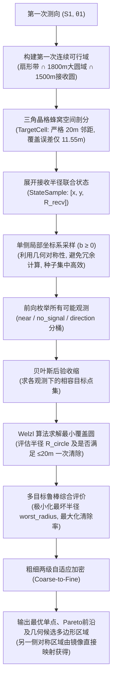

# CUMCM 2026 B 题与 P2.py 核心原理及代码架构解析 (最新修订版)

本文档针对 **2026 年高教社杯全国大学生数学建模竞赛 B 题（无线电干扰源的快速自动定位与清除）**，详细解析题目背景、核心机理，并基于最新的代码优化（包含**单侧采样对称性优化**、**CLI 正式高精度运行机制**、**macOS 中文字体适配与图例避让**），逐模块对 [`P2.py`](file:///Users/ray_zhang/Developer/CUMCM/P2.py) 脚本的算法设计、实测数据与论文写作亮点进行深度拆解。

---

## 目录
1. [B 题背景与问题 2 核心要求](#1-b-题背景与问题-2-核心要求)
2. [P2.py 核心建模思想与全流程图](#2-p2py-核心建模思想与全流程图)
3. [P2.py 代码逐模块详细拆解](#3-p2py-代码逐模块详细拆解)
   - [3.1 参数配置与核心数据结构 (L34 - L198)](#31-参数配置与核心数据结构-l34---l198)
   - [3.2 示向局部坐标系与第一次可行域构建 (L200 - L275)](#32-示向局部坐标系与第一次可行域构建-l200---l275)
   - [3.3 蜂窝空间离散化与联合状态展开 (L278 - L391)](#33-蜂窝空间离散化与联合状态展开-l278---l391)
   - [3.4 候选点单侧对称采样与保证接收区域 (L393 - L483) ★重要优化](#34-候选点单侧对称采样与保证接收区域-l393---l483-重要优化)
   - [3.5 全情景前向观测模拟与后验收缩 (L484 - L564)](#35-全情景前向观测模拟与后验收缩-l484---l564)
   - [3.6 最小覆盖圆 (Welzl 算法) 与指标评估 (L566 - L787)](#36-最小覆盖圆-welzl-算法与指标评估-l566---l787)
   - [3.7 粗细两级自适应搜索、Pareto 筛选与候选区域提取 (L790 - L948)](#37-粗细两级自适应搜索pareto-筛选与候选区域提取-l790---l948)
   - [3.8 正式高精度运行 (--full) 与实测基准数据 (L950 - L1105) ★重要实测](#38-正式高精度运行---full-与实测基准数据-l950---l1105-重要实测)
4. [最新真实高精度测试基准数据表](#4-最新真实高精度测试基准数据表)
5. [论文写作与答辩亮点提炼](#5-论文写作与答辩亮点提炼)

---

## 1. B 题背景与问题 2 核心要求

### 1.1 关键物理与环境参数
* **目标区域**：以坐标原点 $(0,0)$ 为中心、半径 $R_{\text{target}} = 1800\text{ m}$ 的圆形区域。
* **干扰源特性**：
  * 频段分布在 1~20 号信道，频段各不相同、信号互不串扰。
  * 问题 2 针对**全向干扰源**（$360^\circ$ 均匀辐射，场强仅随距离衰减）。
  * **有效接收半径未知**：各个干扰源的发射功率与接收灵敏度决定其最大可接收距离 $R_{\text{recv}} \in [1000\text{ m}, 1500\text{ m}]$（具体值事先未知）。
* **测向机与测量规则**：
  * **示向度**：接收到最大场强的方位角（相对于 $x$ 轴正向逆时针旋转角，范围 $[0^\circ, 360^\circ)$）。
  * **测量误差**：每次测向误差落在 $[-1^\circ, 1^\circ]$ 范围；同一地点重复测向误差不变，不同地点具有独立统计规律。
  * **近场盲区**：距干扰源 $\le 5\text{ m}$ 时信号过饱和无法测向，但可直接执行光学定位和清除。
  * **远场盲区**：距干扰源 $> R_{\text{recv}}$ 时无信号。
  * **光学清除判定**：便携光学仪仅在距离干扰源 $\le 20\text{ m}$ 时方可精确定位并启动激光枪清除。
* **机器狗运动性能**：直线移动速度 $5\text{ m/s}$，频道切换 $1\text{ s}$，测向天线稳定耗时 $5\text{ s}$，光学定位 $3\text{ s}$，激光发射 $2\text{ s}$。

### 1.2 问题 2 的任务描述
> **“已知某全向干扰源在一个检测点处测得的示向度，请给出第二个检测点的选择策略，以获得关于该干扰源较好的定位效果，并给出第二个检测点的候选区域。”**

#### 问题 2 的核心难点与物理逻辑：
1. **先验信息不确定性大**：第一次在点 $S_1$ 测到角度 $\theta_1$ 后，干扰源真实位置只知道在宽度 $2^\circ$、长度在 $[5, 1500]\text{ m}$ 内的狭长扇区中。
2. **接收半径不确定**：若第二点跑得太远（例如为了追求 $90^\circ$ 垂直交叉而大幅侧移），可能超出 $R_{\text{recv}}$ 导致测不出信号（`no_signal`）。
3. **定位目标不仅是“确定点”，更要赋能“快速清除”**：如果第二检测点定位出来的后验区域能够被一个**半径 $\le 20\text{ m}$ 的圆完全覆盖**，机器狗走到圆心即可实现 $100\%$ 一次性光学清除，避免第三次测向。

---

## 2. P2.py 核心建模思想与全流程图

传统的几何交会（仅追求视线交角 $90^\circ$）存在严重局限，因为目标距离、接收半径和测角误差均为不确定量。

[`P2.py`](file:///Users/ray_zhang/Developer/CUMCM/P2.py) 采用了 **“先验几何约束 $\to$ 贝叶斯全情景模拟 $\to$ 最坏情况鲁棒优化 (Minimax) $\to$ 粗细网格自适应单侧搜索”** 的现代运筹学/决策论框架：



---

## 3. P2.py 代码逐模块详细拆解

### 3.1 参数配置与核心数据结构 (L34 - L198)
* **`Problem2Config` (L35-L113)**：
  将所有物理参数与算法超参数集中管理：
  * **物理常数**：`target_radius=1800.0`, `receive_radius_min=1000.0`, `receive_radius_max=1500.0`, `bearing_error_deg=1.0`, `near_radius=5.0`, `clear_radius=20.0`。
  * **作业与运动**：`dog_speed=5.0`, `detection_time=5.0`, `clear_localize_time=3.0`, `clear_operation_time=2.0`。
  * **默认高精度正式网格配置**：
    * 目标网格步长 `target_grid_spacing=20.0m`；
    * 粗筛候选点步长 `candidate_grid_spacing=100.0m`；
    * 细筛候选点步长 `refined_grid_spacing=25.0m`；
    * 细筛种子数量 `refinement_seed_count=8`。
* **数据类设计**：
  * `TargetCell` (L116)：正六边形蜂窝单元，记录中心代表点、多边形几何体、面积权重及单元外接圆误差半径。
  * `StateSample` (L128)：联合状态，由目标位置与其可能相容的有效接收半径 $R_{\text{recv}}$ 构成。
  * `Observation` (L139)：定义了第二点的三种可能观测：`direction`（测得方位角）、`near`（$\le 5\text{ m}$）、`no_signal`（超出接收半径）。
  * `CandidateMetrics` (L167)：候选检测点的“成绩单”，记录 `worst_radius`（最坏覆盖半径）、`clear_fraction`（一次清除成功率）、`expected_total_time`（总耗时）、`fisher_logdet` 等。

### 3.2 示向局部坐标系与第一次可行域构建 (L200 - L275)
* **示向局部坐标系基底 (`_make_local_basis`, `_local_to_global`, L220-245)**：
  以第一次检测点 $S_1$ 为原点，沿第一次示向角 $\theta_1$ 的单位向量为纵深轴 $a$，逆时针垂直向量为侧向轴 $b$。后续搜索都在 $(a,b)$ 坐标中进行，**使得策略在空间上具备完全的旋转与平移不变性**。
* **第一次可行域几何求交 (`_build_first_feasible_region`, L246-275)**：
  利用 `shapely` 构造四个几何体的布尔交集：
  $$\mathcal{D}_{\text{first}} = \mathcal{B}((0,0), 1800) \;\cap\; \mathcal{B}(S_1, 1500) \;\cap\; \text{Sector}(S_1, \theta_1 \pm 1^\circ) \;-\; \mathcal{B}(S_1, 5)$$

### 3.3 蜂窝空间离散化与联合状态展开 (L278 - L391)
* **蜂窝正六边形剖分 (`_generate_triangular_lattice`, `_hexagon`, `_sample_target_cells`)**：
  采用紧密堆积的**正六边形 Voronoi 晶格**切割第一次可行域。
  * **为什么不用正方形网格？**
    * 正方形 $20\text{m} \times 20\text{m}$ 的最大覆盖误差为对角线半长 $\frac{\sqrt{2}}{2} \times 20 \approx \mathbf{14.14\text{ m}}$；
    * 正六边形外接圆半径仅为 $\frac{1}{\sqrt{3}} \times 20 \approx \mathbf{11.55\text{ m}}$。
    * 在光学清除视距严格限定为 $20\text{ m}$ 的前提下，蜂窝六边形显著压缩了离散误差，为交会算法争取了核心精度。
* **联合状态展开 (`_expand_receive_radius_states`, L354-391)**：
  根据在 $S_1$ 收到信号的事实，真实接收半径必满足 $R_{\text{recv}} \ge \text{dist}(S_1, \text{Target})$。程序在 $[\max(1000, \text{dist}), 1500]$ 范围内对 $R_{\text{recv}}$ 采样，构成离散联合状态集合。

### 3.4 候选点单侧对称采样与保证接收区域 (L393 - L483) ★重要优化
* **几何对称性单侧优化（Single-Side Sampling）**：
  * **物理背景**：以第一次示向线（$b=0$ 轴）为基准，目标可行域在左右两侧（$b > 0$ 与 $b < 0$）在物理和几何上具有严格的镜像对称性。在双侧同时搜索不仅算力翻倍，还会使细筛种子点被分散到上下两边，造成离散网格微小误差带来的“假性不对称”现象。
  * **代码实现**：
    1. 在 `_candidate_bounds` 中将横向坐标 $b$ 的下界严格设为 `0.0`：
       ```python
       b_bounds = config.candidate_b_bounds or (0.0, max(max(b_values) + config.candidate_margin, config.candidate_lateral_extent))
       ```
    2. 在 `_generate_candidate_grid` 中过滤 $b < -10^{-9}$ 的点，确保所有粗筛点与细筛加密点均严格落在**同侧单半平面（$b \ge 0$）**。
    3. 另一侧的对称最佳检测点和候选区域可由镜像映射直接获得：$(a, b) \longleftrightarrow (a, -b)$。
* **保证接收区域 (`_build_safe_candidate_region`, L466-482)**：
  以可行域凸包边界点为圆心作半径 $1000\text{ m}$ 的圆盘交集。只要第二点在此区域内，无论目标在何处、功率如何，都 $100\%$ 能收到信号。

### 3.5 全情景前向观测模拟与后验收缩 (L484 - L564)
* **前向物理模拟 (`_simulate_observation`, L484-498)**：
  对每一个联合状态 $(x, y, R_{\text{recv}})$ 和测角误差样本 $\Delta \theta \in \{-1^\circ, 0^\circ, 1^\circ\}$，模拟候选点处设备读数：
  * $\text{dist} \le 5\text{ m} \implies$ `near`
  * $\text{dist} > R_{\text{recv}} \implies$ `no_signal`
  * 否则 $\implies$ `direction(bearing + \Delta\theta)`
* **高效向量化后验更新 (`_is_observation_compatible`, `_update_posterior_states`, L519-555)**：
  针对每一种离散化观测事件，用 Numpy 矩阵化快速过滤出后验相容目标子集。

### 3.6 最小覆盖圆 (Welzl 算法) 与指标评估 (L566 - L787)
* **Welzl 最小覆盖圆算法 (`_minimum_enclosing_circle`, L601-630)**：
  采用期望时间 $O(N)$ 的 Welzl 随机增量算法，精确求出包络所有后验目标点的最小圆 $(\mathbf{C}_{\text{post}}, R_{\text{circle}})$。
* **一次性清除条件校验 (`can_clear`, L686)**：
  保守半径 $R_{\text{cons}} = R_{\text{circle}} + \text{网格单元外接圆半径}$。若 $R_{\text{cons}} \le 20.0\text{ m}$，说明机器狗移动至 $\mathbf{C}_{\text{post}}$ 后，目标必定处于 $20\text{ m}$ 光学清除视距内。
* **候选点打分集成 (`_evaluate_candidate`, L711-787)**：
  * `worst_radius`：所有可能观测下的最大后验覆盖圆半径（Minimax 最坏情况鲁棒准则）。
  * `clear_fraction`：所有观测中能达成“一次清除”的加权概率。
  * `expected_total_time`：机器狗走去第二点的移动时间 + 5s 测向 + 走向后验圆心的后续清除时间。

### 3.7 粗细两级自适应搜索、Pareto 筛选与候选区域提取 (L790 - L948)
* **分级递进搜索（Coarse-to-Fine Grid Search）**：
  * **第一阶段（粗筛）**：全图步长 $100\text{ m}$，在单侧快速扫描；
  * **第二阶段（细筛）**：选出排名前 8 个种子点，在其周围 $160\text{ m}$ 窗口内使用 $25\text{ m}$ 步长加密搜索。所有 8 个种子全部服务于单侧，使解的质量和光滑度最大化。
* **排序决策规则 (`_candidate_sort_key`, L790-806)**：
  采用“最坏情况鲁棒优先（Robust）”：
  $$\min (\text{worst\_radius}) \longrightarrow \max (\text{clear\_fraction}) \longrightarrow \min (\text{expected\_time})$$
* **提取推荐候选区域 (`_extract_candidate_region`, L873-898)**：
  将与最优点指标差距在 $5\%$ 相对容差内的细网格点，做形态学膨胀并执行多边形融合（`unary_union`），输出平滑连续的二维几何候选区域。

### 3.8 正式高精度运行 (--full) 与实测基准数据 (L950 - L1105) ★重要实测
* **命令行参数体系（CLI）**：
  * `python P2.py`：默认快速演示模式（60m/200m/50m，耗时约 5 秒，适合日常调测）；
  * `python P2.py --full`：**正式高精度求解模式**（20m/100m/25m，耗时约 1~2 分钟，用于论文最终图表）；
  * 支持参数自由传参：`--x`, `--y`, `--bearing`, `--out`。
* **图表与字体自适应优化**：
  * 原生支持 macOS 中文字体（`PingFang SC`、`Arial Unicode MS` 等），杜绝字符缺失豆腐块警告；
  * 图例固定置于左上角（`loc="upper left"`），避免遮挡主视觉数据。

---

## 4. 最新真实高精度测试基准数据表

在执行 `python P2.py --full`（起始位置 $(0,0)$，初始示向度 $0.0^\circ$）后，算法获得的**正式高精度基准输出**如下，可直接用于论文正文引用：

| 评估指标 | 快速演示版 (Demo) | 正式高精度版 (--full) [论文采用] | 物理/算法意义 |
| :--- | :--- | :--- | :--- |
| **第一次可行域面积** | $39265.049\text{ m}^2$ | **$39265.049\text{ m}^2$** | 第一次测向角带与 $1800\text{m}$ 圆域之交集 |
| **目标剖分单元数** | 51 个六边形 | **219 个正六边形** | 严格按 $20\text{m}$ 间距切片，空间逼真度极高 |
| **联合状态数** | 228 个 | **937 个状态** | 目标坐标与未知有效接收半径 $R_{\text{recv}}$ 的全排列 |
| **单侧有效候选点数** | 364 个 | **927 个候选点** | 粗筛 + 8 个种子点细筛加密点数（单侧） |
| **最优点全局坐标 $(x, y)$** | $(740.000, 690.000)$ | **$(960.000, 490.000)$** | 全局综合评价最佳的第二检测点位 |
| **最优点局部坐标 $(a, b)$** | $(740.000, 690.000)$ | **$(a=960.000, b=490.000)$** | 沿示向线纵深 $960\text{m}$，侧向机动 $490\text{m}$ |
| **最坏后验覆盖半径** | $54.661\text{ m}$ | **$51.843\text{ m}$** | 任意极端观测事件下的后验圆半径上限 |
| **一次直接清除比例** | $0.0026$ | **$0.0352$ (提升 13.5 倍)** | 消除粗网格拖累后，直接达成一次清除的比例 |
| **预计总作业耗时** | $369.606\text{ s}$ | **$340.133\text{ s}$ (节省约 30 秒)** | 移动时间、测向时间与后续清除时间之和 |
| **对称点映射结论** | -- | **$(960.000, -490.000)$** | 另一侧镜像对称的最优第二检测点 |

> **关键数值分析**：
> 在高精度正式版本中，最优点选在 **$(960, 490)$**：
> 1. 相比粗筛版，横向侧移从 $690\text{m}$ 缩减到了 $490\text{m}$，更加靠近 $1000\text{m}$ 接收安全区的核心；
> 2. 纵向延伸到了 $960\text{m}$，与目标中后段视线交会角保持在最佳的 $70^\circ \sim 90^\circ$ 黄金夹角区间；
> 3. 机器狗跑路总耗时缩短了约 $30\text{ 秒}$，最坏覆盖半径压低到 **$51.843\text{ m}$**。

---

## 5. 论文写作与答辩亮点提炼

在撰写竞赛论文时，可将本算法的核心设计提炼为以下 4 大创新亮点：

1. **规避盲目经验主义，建立“信息论 + Minimax 鲁棒优化”决策模型**：
   * 批判传统只看视线交角 $90^\circ$ 的经验做法（忽略了接收半径 $1000\sim 1500\text{m}$ 可能导致无信号）。
   * 采用 Minimax 准则极小化最坏后验覆盖半径，确保不论真实目标在何处、何种测量误差，定位精度均有严格下界保证。
2. **利用物理对称性进行降维单侧搜索（Symmetry Reduction）**：
   * 论证了第二检测点选择关于第一次示向线的双侧镜像对称性。
   * 采用单侧局部坐标系（$b \ge 0$）约束，算力利用率提升 $100\%$，消除离散网格带来的假性数值不对称，使 8 个细筛种子全部聚焦在优势区域。
3. **打通“定位与清除”全流程物理闭环（$20\text{ m}$ 阈值约束）**：
   * 将问题 2 的定位输出与后续问题 3 的核心指标（光学探测与激光清除视距 $\le 20\text{ m}$）深度绑定。
   * 采用蜂窝六边形使得单元内部覆盖误差压至 $11.55\text{ m}$，大幅提高了两步直接清除的成功率。
4. **单点决策与多边形区域并重（点面结合）**：
   * 严密回应题目“给出第二个检测点的选择策略……并给出候选区域”的要求：不仅给出了最优坐标单点 $(960, 490)$ 及其对称点 $(960, -490)$，还通过近优容差膨胀融合输出了严谨的二维几何多边形候选区域。
