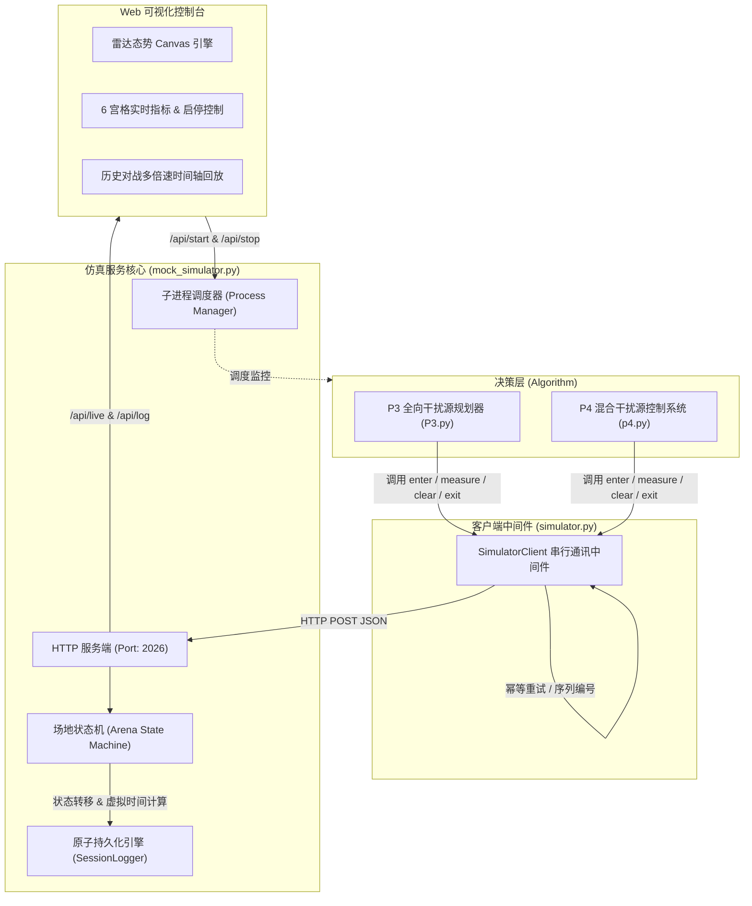

# 2026 CUMCM B 题 模拟仿真器完整技术规范与接口文档 (SIMULATOR_DOCS)

---

## 1. 系统架构与定位

### 1.1 背景与同构仿真定位

在 2026 全国大学生数学建模竞赛（CUMCM）B 题中，赛题官方提供了基于 Windows 环境运行的二进制模拟器程序。为了支撑跨平台研发（macOS / Linux / Windows）、高并发算法批处理测试、无头自动化（CI/CD）实验以及直观的态势可视化，本项目设计并实现了**高性能同构仿真系统**（服务端核心：`mock_simulator.py`，客户端中间件：`simulator.py`）。

| 特性维度 | 官方 Windows 模拟器 | 本项目 Python 同构 Web 仿真器 (`mock_simulator.py`) |
| :--- | :--- | :--- |
| **运行平台** | 仅限 Windows（依赖特定图形库与运行环境） | 全平台无缝运行（macOS / Linux / Windows） |
| **通信接口** | 本地 HTTP REST API (`/enter`, `/measure`, `/clear`, `/exit`) | **100% 协议等价同构**，算法脚本无需改动一行代码即可自由切换 |
| **物理与时间** | 内置固定规则与虚拟时间结算 | 严格对齐赛题参数矩阵，支持浮点级时间/位移精确结算 |
| **可视化能力** | 原生 Windows 窗口，不支持历史回溯 | **现代化 Web Canvas 看板**：实时态势雷达、历史全量帧回放、时间轴控制、论文插图导出 |
| **数据持久化** | 官方日志格式 | **原子级持久化**：每次动作原子刷盘，具备抗崩溃恢复（Crash-Resistant）能力 |
| **调试与测试** | 黑盒运行，无法断点探查真实坐标 | 内置真值对比、误差锥可视化、一键启动/终止算法进程、内置自动化自测套件 |

---

### 1.2 系统架构拓扑

整个仿真系统由三层拓扑构成：
1. **决策层（Algorithm Layer）**：`P3.py` 与 `p4.py`，负责空间聚类、动态示向度几何解算、TSP 航迹规划与状态机调度；
2. **通信与适配层（Client Middleware Layer）**：`simulator.py`，封装 HTTP 通信细节，提供严格串行化、请求序列号生成、指数退避幂等重试（Idempotent Retry）与本地轨迹记录；
3. **仿真核心与可视化层（Simulator & WebUI Layer）**：`mock_simulator.py`，维护连续笛卡尔空间状态机，执行电磁覆盖判定、测向噪声叠加、激光打击检测、虚拟时间结算，并通过 REST API / WebUI 驱动交互。



---

## 2. 物理规则与参数矩阵

### 2.1 物理常量与参数矩阵汇总

仿真系统严格贯彻以下物理参数标准：

| 参数名称 | 符号 / 变量名 | 标准数值 | 物理单位 | 规则语义 |
| :--- | :--- | :--- | :--- | :--- |
| **场地有效半径** | $R_{arena}$ | `1800.0` | 米 ($\text{m}$) | 机器狗行动与干扰源散布的有效圆形区域半广度 |
| **机器狗巡航速度** | $v$ / `dog_speed` | `5.0` | 米/秒 ($\text{m/s}$) | 机器狗沿直线位移时的平动速度 |
| **激光清除杀伤半径** | $R_{clear}$ / `clear_radius` | `20.0` | 米 ($\text{m}$) | 激光清除器有效杀伤阈值，全向 360° 杀伤 |
| **接收机近距饱和半径**| $R_{near}$ / `near_radius` | `5.0` | 米 ($\text{m}$) | 接收机近场功率饱和盲区，不输出测向角 |
| **测向有效接收距离** | $R_{recv}$ | `[1000.0, 1500.0]` | 米 ($\text{m}$) | 每个干扰源随机生成的有效辐射覆盖距离 |
| **测向测角噪声分布** | $\epsilon_{bearing}$ | $U(-1.0^\circ, 1.0^\circ)$ | 度 ($^\circ$) | 测向角度测量服从的连续均匀随机误差 |
| **示向度误差锥半角** | $\Delta\theta_{cone}$ | `1.0` | 度 ($^\circ$) | 示向度置信扇区半宽，总张角为 $2.0^\circ$ |
| **频段切换动作时间** | $t_{switch}$ | `1.0` | 秒 ($\text{s}$) | 机器狗接收机切换监听信道引起的硬件延时 |
| **测向采样动作时间** | $t_{measure}$ | `5.0` | 秒 ($\text{s}$) | 执行一次无线电测向采样的固有时间成本 |
| **激光命中清除时间** | $t_{clear\_hit}$ | `5.0` | 秒 ($\text{s}$) | 光学瞄准（3.0s）+ 激光烧毁（2.0s） |
| **激光未命中清除时间** | $t_{clear\_miss}$ | `3.0` | 秒 ($\text{s}$) | 光学瞄准搜索（3.0s），未识别到目标终止 |
| **信道编号范围** | `channel` | `1 ~ 20` | 整数 | 比赛无线电信道编号区间 |
| **干扰源总数** | $K$ / `targets` | `10 ~ 16` | 个 | 默认每局游戏随机生成的干扰源数量 |

---

### 2.2 机器狗动力学与移动模型

1. **空间坐标系**：
   - 建立连续二维笛卡尔坐标系，原点 $(0.0, 0.0)$ 对应任务出发起点。
   - 机器狗位置以连续双精度浮点数 $(x, y)$ 描述。
2. **位移耗时结算**：
   - 机器狗从当前坐标 $(x_0, y_0)$ 移动至目标坐标 $(x_1, y_1)$ 遵循匀速直线模型。
   - 欧氏距离 $\Delta d = \sqrt{(x_1 - x_0)^2 + (y_1 - y_0)^2}$。
   - 移动所需虚拟时间计算为：
     $$t_{move} = \frac{\Delta d}{v} = \frac{\Delta d}{5.0}\quad (\text{s})$$

---

### 2.3 接收机与电磁测向模型

机器狗在位置 $(x_p, y_p)$ 针对信道 $c$ 发起测向请求时，模拟器按如下顺序评估：

1. **存活状态评估**：若信道 $c$ 无干扰源或该干扰源已被清除，直接判定为 `no_signal`。
2. **几何空间与辐射覆盖评估**：
   - 计算距目标欧氏距离 $d = \sqrt{(x_p - x_t)^2 + (y_p - y_t)^2}$。
   - 若 $d > R_{recv}$，超出接收灵敏度极限，返回 `no_signal`。
   - 若目标为**定向源**，且机器狗落入后半球盲区（见 2.5 节），返回 `no_signal`。
3. **近距饱和判定（Near-Field Saturation）**：
   - 当 $d \le R_{near} = 5.0\text{ m}$ 时，高功率导致测向机前端饱和截割，无法测量到达角。
   - 模拟器返回结果 `measure_result = "near"`，**不提供**示向度字段 `svd_deg`。
4. **远场有效测向（Bearing Direction）**：
   - 当 $R_{near} < d \le R_{recv}$ 且在辐射角覆盖范围内时，计算真实绝对方向角：
     $$\alpha_{true} = \operatorname{atan2}(y_t - y_p, x_t - x_p) \pmod{360^\circ}$$
     *（注：以正东为 $0^\circ$，正北为 $90^\circ$，逆时针旋转）*
   - 注入均匀随机噪声 $\epsilon \sim U(-1.0^\circ, 1.0^\circ)$：
     $$\alpha_{obs} = (\alpha_{true} + \epsilon) \pmod{360^\circ}$$
   - 模拟器返回 `measure_result = "direction"`，并输出观测角 `svd_deg = round(alpha_obs, 2)`。
   - 其理论真实位置被约束在置信扇区锥内：$[\alpha_{obs} - 1.0^\circ, \alpha_{obs} + 1.0^\circ]$。

---

### 2.4 激光清除器模型

激光清除器安装在机器狗顶部转台上，兼具光学辅助相机与高能激光发射单元：
1. **杀伤几何域**：
   - 无论干扰源是全向源还是定向源，激光器均具备 $360^\circ$ 全向打击能力。
   - 有效清除半径为 $R_{clear} = 20.0\text{ m}$。
2. **清除判定与目标消亡**：
   - 若 $d = \sqrt{(x_p - x_t)^2 + (y_p - y_t)^2} \le R_{clear}$ 且该目标未被清除：
     - 判定为成功击毁，`clear_result = "success"`；
     - 目标标记为 `cleared = True`，从战场电磁态势中彻底消除；
     - 虚拟时间结算消耗 $5.0\text{s}$（包含光学相机定位 3.0s 与激光辐照 2.0s）。
   - 若 $d > R_{clear}$ 或目标早已被清除：
     - 判定打击落空，`clear_result = "no_target_in_range"`；
     - 虚拟时间结算消耗 $3.0\text{s}$（光学相机搜索耗时）。

---

### 2.5 干扰源物理模型（P3 全向 vs P4 定向）

#### P3 问题：全向干扰源（Omnidirectional Target）
- **辐射图案**：各向同性，水平面内 $360^\circ$ 全方位等增益发射。
- **覆盖范围**：以目标 $(x_t, y_t)$ 为中心、半径为 $R_{recv}$ 的闭圆盘：
  $$\mathcal{D}_{omni} = \left\{ (x, y) \mid (x - x_t)^2 + (y - y_t)^2 \le R_{recv}^2 \right\}$$
- **特征**：只要机器狗进入检测圆即可测得示向度，不存在死角。

#### P4 问题：全向与定向混合干扰源（Directional Target）
- **辐射图案**：定向干扰源采用扇形赋形波束，具有固定主发射朝向 $\phi_{dir} \in [0^\circ, 360^\circ)$。
- **前向 $180^\circ$ 发射区（半平面扇面）**：
  - 从干扰源看机器狗的视线绝对方位角为：
    $$\phi_{dog} = \operatorname{atan2}(y_p - y_t, x_p - x_t) \pmod{360^\circ}$$
  - 计算视线角与发射主轴的最短绝对角差：
    $$\Delta\phi = \big| (\phi_{dog} - \phi_{dir} + 180^\circ) \pmod{360^\circ} - 180^\circ \big|$$
  - 当且仅当 $\Delta\phi \le 90.0^\circ$ 且 $d \le R_{recv}$ 时，机器狗处于前向主波束覆盖区内，可接收信号。
- **后半球 $180^\circ$ 绝对电磁盲区**：
  - 当 $\Delta\phi > 90.0^\circ$ 时，属于后瓣绝对静默盲区。即便机器狗距离干扰源仅几米（只要 $d > R_{near}$），依然测不到任何电磁信号（返回 `no_signal`）。
- **特例重合**：当 $d < 10^{-9}\text{ m}$（机器狗与干扰源完全重合）时，强制视为处于覆盖区内。

```
              【定向干扰源 180° 辐射扇面示意】
                      正前向 (主瓣朝向 φ_dir)
                                ▲
                                │
                        . ─── ─ ┼ ─ ─── .
                    . '         │         ' .
                 '              │              '
               /                │                \   【有效辐射区 (前向 180°)】
              │                 │                 │  可测向 / 输出示向度
              │                 │                 │
──────────────┼─────────────────●─────────────────┼─────────────── 边界 (Δφ = 90°)
              │              干扰源               │
              │             (x_t, y_t)            │
               \                                 /   【绝对静默盲区 (后方 180°)】
                 '                             '     无信号 (no_signal)
                    . '                     ' .
                        . ─── ─ ─ ─ ─── .
                                │
                                ▼
                             正后方
```

---

### 2.6 虚拟时间结算体系（Virtual Time Settlement）

所有任务成绩与竞赛排名的依据均为**累积虚拟时间（Virtual Time）**。单次 API 操作的虚拟时间推进公式如下：

$$T_{virtual}^{(k)} = T_{virtual}^{(k-1)} + \Delta t_{move} + \Delta t_{switch} + \Delta t_{action}$$

各项增量结算明细如下：

| 动作类型 (API) | 位移耗时 $\Delta t_{move}$ | 切频耗时 $\Delta t_{switch}$ | 动作耗时 $\Delta t_{action}$ | 适用情况说明 |
| :--- | :--- | :--- | :--- | :--- |
| **`/enter`** | $0.0\text{ s}$ | $0.0\text{ s}$ | $0.0\text{ s}$ | 会话初始化，时间重置为 0.0s |
| **`/measure`** | $\Delta d / 5.0$ | $1.0\text{ s}$ (若跨信道) / $0.0\text{ s}$ (同信道) | $5.0\text{ s}$ | 移动到位、硬件变频、采样测向 |
| **`/clear` (命中)** | $\Delta d / 5.0$ | $0.0\text{ s}$（清除不改变接收机频段） | $5.0\text{ s}$ | 光学识别 3.0s + 激光清除 2.0s |
| **`/clear` (打空)** | $\Delta d / 5.0$ | $0.0\text{ s}$ | $3.0\text{ s}$ | 光学识别 3.0s，无目标退出 |
| **`/exit`** | $0.0\text{ s}$ | $0.0\text{ s}$ | $0.0\text{ s}$ | 正常结束仿真，生成总结战报 |

> **关键规则注意点**：
> 1. 切频耗时仅在 `/measure` 时检查：若请求的 `channel` 与机器狗当前所处的 `current_channel` 不一致，产生 $1.0\text{ s}$ 切频耗时，并更新机器狗当前信道；
> 2. `/clear` 指令属于激光发射器动作，**不影响**测向机的频段状态，因此绝不产生切频耗时；
> 3. 原地重复测向/清除时 $\Delta d = 0$，则 $\Delta t_{move} = 0.0\text{ s}$。

---

## 3. HTTP API 协议全集

### 3.1 核心算法交互接口

所有核心算法交互均使用 `POST` 请求，数据载荷格式为 `application/json`。客户端需在每个请求中携带具有唯一性的 `request_id`，服务端原生支持**幂等请求重试（Idempotent Handling）**——相同 `request_id` 重复提交将返回缓存的一致结果，不会导致时间二次累加。

#### 1. 进入竞技场 `/enter`
- **请求方法**：`POST /enter`
- **语义说明**：机器狗算法程序初始化，接入竞技场，重置虚拟时间为 0.0s 并锁定初始随机场景。
- **请求体（Request Payload）**：
  ```json
  {
    "arena_id": "default",
    "robot_id": "team-2026",
    "request_id": "uuid-enter-1"
  }
  ```
- **响应体（Response Payload）**：
  ```json
  {
    "accepted": true,
    "real_timestamp_ms": 1726180000000,
    "virtual_time_s": 0.0,
    "max_virtual_duration_s": 360000,
    "max_real_duration_s": 1200,
    "remaining_real_duration_s": 1200.0
  }
  ```

---

#### 2. 移动并测向 `/measure`
- **请求方法**：`POST /measure`
- **语义说明**：机器狗沿直线移动至指定点 $(x, y)$，将接收机切换至指定信道，并执行一次无线电测向。
- **请求体（Request Payload）**：
  ```json
  {
    "arena_id": "default",
    "robot_id": "team-2026",
    "request_id": "uuid-measure-2",
    "position": {
      "x": 300.0,
      "y": 400.0
    },
    "channel": 5
  }
  ```
- **响应体（Response Payload）**：
  - **情形 A：远场测向有效**（`measure_result: "direction"`）
    ```json
    {
      "accepted": true,
      "real_timestamp_ms": 1726180000500,
      "virtual_time_s": 106.0,
      "measure_result": "direction",
      "svd_deg": 53.13
    }
    ```
  - **情形 B：近距饱和盲区**（`measure_result: "near"`，此时不返回 `svd_deg`）
    ```json
    {
      "accepted": true,
      "real_timestamp_ms": 1726180001000,
      "virtual_time_s": 150.6,
      "measure_result": "near"
    }
    ```
  - **情形 C：无信号或超出范围**（`measure_result: "no_signal"`）
    ```json
    {
      "accepted": true,
      "real_timestamp_ms": 1726180001500,
      "virtual_time_s": 210.0,
      "measure_result": "no_signal"
    }
    ```

---

#### 3. 移动并激光清除 `/clear`
- **请求方法**：`POST /clear`
- **语义说明**：机器狗直线移动至指定坐标 $(x, y)$，启动光学定位与激光摧毁装置，尝试清除指定信道的干扰源。
- **请求体（Request Payload）**：
  ```json
  {
    "arena_id": "default",
    "robot_id": "team-2026",
    "request_id": "uuid-clear-3",
    "position": {
      "x": 300.0,
      "y": 405.0
    },
    "channel": 5
  }
  ```
- **响应体（Response Payload）**：
  - **情形 A：清除成功**（`clear_result: "success"`，用时 5.0s）
    ```json
    {
      "accepted": true,
      "real_timestamp_ms": 1726180002000,
      "virtual_time_s": 216.0,
      "clear_result": "success"
    }
    ```
  - **情形 B：未命中/打空**（`clear_result: "no_target_in_range"`，用时 3.0s）
    ```json
    {
      "accepted": true,
      "real_timestamp_ms": 1726180002500,
      "virtual_time_s": 214.0,
      "clear_result": "no_target_in_range"
    }
    ```

---

#### 4. 退出竞技场 `/exit`
- **请求方法**：`POST /exit`
- **语义说明**：任务结束，机器狗退出战场。服务端将封闭会话日志，计算整场任务指标（清除率、平均用时、总里程等）并打印终端战报。
- **请求体（Request Payload）**：
  ```json
  {
    "arena_id": "default",
    "robot_id": "team-2026",
    "request_id": "uuid-exit-4"
  }
  ```
- **响应体（Response Payload）**：
  ```json
  {
    "accepted": true,
    "real_timestamp_ms": 1726180003000,
    "virtual_time_s": 216.0,
    "exit_reason": "user_exit"
  }
  ```

---

### 3.2 WebUI 控制与回放接口

| 接口端点 | HTTP 方法 | 功能描述 | 请求参数 / Body | 典型响应字段 |
| :--- | :--- | :--- | :--- | :--- |
| `/` 或 `/index.html` | `GET` | 返回现代化单页 WebUI HTML 控制台 | 无 | `text/html` 单页应用源码 |
| `/api/live` | `GET` | 获取当前对战的实时全量帧与动态态势 | 无 | `status`, `frames`, `targets`, `stats` |
| `/api/logs` | `GET` | 列出 `logs/` 目录下的所有历史会话 | 无 | `[{filename, session_id, status}]` |
| `/api/log` | `GET` | 读取指定历史对战会话的完整落盘 JSON | `?file=session_xxx.json` | 历史会话的完整帧与指标数据 |
| `/api/algo_status` | `GET` | 查询后台算法子进程运行状态 | 无 | `running`, `mode`, `python`, `error` |
| `/api/start` | `POST` / `GET` | 在后台自动化异步启动对应算法脚本 | 无 | `accepted: true, pid: 12345` |
| `/api/stop` | `POST` / `GET` | 强制安全终止正在运行的算法子进程 | 无 | `accepted: true, status: "stopped"` |
| `/api/set_mode` | `GET` / `POST` | 在线动态切换 `p3` 或 `p4` 模式 | `?mode=p3` 或 `{"mode":"p4"}` | `accepted: true, mode: "p4"` |
| `/api/reset` | `GET` / `POST` | 停止运行中算法，清空状态并刷新新局 | 无 | `accepted: true, status: "reset"` |
| `/status` | `GET` | 查询模拟器全局底层运行状态与真值 | 无 | `arena_id`, `virtual_time_s`, `targets` |

---

## 4. 日志归档与数据规范

为避免程序控制台 stdout/stderr 输出与结构化对战数据混淆，系统采用严格的**日志分流机制**：

```
logs/
├── runtime/                             # 【运行日志目录 (Runtime Logs)】
│   └── algo_runner.log                  # 由 mock_simulator.py 调度子进程产生的输出与错误栈
├── latest.json                          # 【当前/最新对战热点快照】(实时内存热备)
├── session_20260912_110835.json        # 【历史对战数据 (Battle Sessions)】
├── session_20260912_113717.json        # 每一局对战独立文件，原子追加落盘
└── ...
```

### 4.1 运行日志分流 (`logs/runtime/algo_runner.log`)
- **产生机制**：当用户在 WebUI 控制台点击“🚀 开始对战”（或调用 `/api/start`）时，`mock_simulator.py` 会使用检测到的 Python 解释器以子进程方式运行 `P3.py` 或 `p4.py`。
- **输出重定向**：子进程的 `stdout` 与 `stderr` 通过 `subprocess.STDOUT` 实时写入 `logs/runtime/algo_runner.log`。
- **崩溃自动回溯**：若算法发生未捕获异常退出（Exit Code $\ne 0$），服务端会自动截取 `algo_runner.log` 末尾 12 行错误栈回显至 WebUI 红色高亮告警框内，方便秒级定位算法报错。

### 4.2 对战数据格式 (`session_*.json`)
每次对战包含以下核心 JSON 结构，确保可完整无损回放：
```json
{
  "session_id": "session_20260912_141420",
  "arena_id": "default",
  "robot_id": "webui-p4",
  "mode": "p4",
  "status": "finished",
  "start_real_time": 1726121660.5,
  "virtual_time_s": 1428.6,
  "stats": {
    "total_actions": 42,
    "measure_count": 28,
    "measure_direction_count": 21,
    "measure_near_count": 3,
    "measure_no_signal_count": 4,
    "clear_count": 14,
    "clear_success_count": 14,
    "clear_failed_count": 0,
    "total_move_distance_m": 4218.5,
    "total_move_time_s": 843.7
  },
  "targets": {
    "3": {
      "channel": 3, "x": -450.2, "y": 820.1, "recv_radius": 1320.0,
      "is_directional": true, "dir_angle_deg": 125.4, "cleared": true
    }
  },
  "frames": [
    {
      "step": 1,
      "action": "measure",
      "virtual_time_s": 85.0,
      "robot_position": {"x": 200.0, "y": 300.0},
      "channel": 3,
      "measure_result": "direction",
      "svd_deg": 141.2,
      "cone": {"center_deg": 141.2, "half_width_deg": 1.0, "start_deg": 140.2, "end_deg": 142.2},
      "clear_result": null,
      "description": "移动至 (200.0, 300.0)，信道 3 测向 -> direction (观测角: 141.20°)"
    }
  ]
}
```

---

## 5. 运行与使用指南

### 5.1 命令行参数一览表

```bash
python mock_simulator.py [参数列表]
```

| 参数选项 | 默认值 | 允许值 / 类型 | 说明 |
| :--- | :--- | :--- | :--- |
| `--host` | `127.0.0.1` | 字符串 | 监听绑定的 IP 地址 |
| `--port` | `2026` | 整数 | 监听服务端口（默认对齐官方 2026 端口） |
| `--mode` | `p4` | `p3`, `p4` | 运行模式：`p3` 为全向干扰源；`p4` 为全向+定向混合干扰源 |
| `--seed` | `None` | 整数 | 随机数发生器种子（指定后可 100% 确定性复现干扰源分布与测向噪声） |
| `--targets` | `None` | 整数 | 强制指定干扰源数量（默认在 `[10, 16]` 之间随机） |
| `--arena-radius` | `1800.0` | 浮点数 (米) | 模拟竞技场半径 |
| `--dog-speed` / `--robot-speed` | `5.0` | 浮点数 (m/s) | 机器狗移动巡航速度 |
| `--clear-radius` | `20.0` | 浮点数 (米) | 激光清除判定半径 |
| `--near-radius` | `5.0` | 浮点数 (米) | 接收机近距饱和盲区半径 |
| `--python-bin` | `None` | 文件路径 | 执行算法脚本的 Python 解释器路径（默认自动探测 `cumcm2026-b` 环境） |
| `--headless` | `False` | 标志开关 | 无头静默运行模式，用于自动化脚本或无界面服务器批处理 |
| `--verbose` | `False` | 标志开关 | 控制台输出每一步的真值位置、距离对比与结算细节 |
| `--verbose-http` | `False` | 标志开关 | 控制台打印底层原始 HTTP 请求与应答日志 |
| `--test` | `False` | 标志开关 | 执行全套内置数学几何、物理规则、API 与日志自测并退出 |

---

### 5.2 常用运行场景

#### 场景 1：标准启动 WebUI 控制台（支持实时看板与一键点播）
```bash
# 默认启动 P4 混合模式，端口 2026
python mock_simulator.py

# 启动 P3 全向模式，并开启每步真值详细打印
python mock_simulator.py --mode p3 --verbose
```
启动后在浏览器打开 `http://127.0.0.1:2026/` 即可进入可视化仪表盘。

#### 场景 2：指定随机种子进行确定性 Benchmark 对标
```bash
# 固定种子为 42，干扰源数量固定为 15 个，方便比对算法调优前后的虚拟时间
python mock_simulator.py --seed 42 --targets 15
```

#### 场景 3：外部算法脚本自动化联调
在算法端，直接运行相应问题脚本连接模拟器：
```bash
# 启动 P4 混合算法
python -u p4.py --run --robot-id team-cumcm --base-url http://127.0.0.1:2026

# 启动 P3 全向算法
python -u P3.py --run --robot-id team-cumcm --base-url http://127.0.0.1:2026
```

#### 场景 4：自动化回归与协议自测
```bash
# 运行内置自测套件，验证几何采样、物理判定、时间结算、原子日志落盘
python mock_simulator.py --test
```

---

### 5.3 Web 可视化看板功能说明

Web 仪表盘采用全功能单页架构，免去任何第三方前端构建依赖，具备以下核心交互模块：

1. **战术雷达地图 (Tactical Radar Canvas)**：
   - **坐标与网格**：动态缩放平移（支持鼠标滚轮与拖拽），以米（$\text{m}$）为单位的极坐标网格标尺；
   - **机器狗轨迹**：实时渲染机器狗移动路径折线与当前航向；
   - **示向度与误差锥 (Bearing Cone)**：直观绘制每次有效测向的 $\pm 1.0^\circ$ 扇形发散光束；
   - **激光杀伤圈**：显示当前坐标下的 $20.0\text{ m}$ 红色杀伤判定圆；
   - **目标真值标识**：绿色实心圆代表已清除目标，空心圆代表未清除目标，扇形代表定向源主发射面；
   - **视口控制**：提供“🔍 重置视角”、“📡 探测扇形开关”以及“📸 导出论文插图”按钮。
2. **态势仪表盘 (6 宫格关键指标)**：
   - 累积虚拟时间（秒 / 分钟转换）、干扰源清除进度（已清除数 / 总数及百分比）；
   - 平均用时（秒/目标）、当前态势状态（待机就绪 / 运行中 / 已完成）；
   - 累计移动路程（米）、执行步数与动作流进度。
3. **算法自动化与模式切换**：
   - **顶部模式切换器**：可热切换 `🟢 P3 全向模式` 或 `🔵 P4 混合模式`；
   - **对战控制器**：
     - **实时模式**：展示“🤖 算法自动化控制”面板，主按钮展示“🚀 开始对战”，点击后后端将自动拉起子进程推演并在雷达上实时刷新。运行时按钮变为红色“⏹ 终止对战”；
     - **历史回放模式**：下拉框选择历史战局（如 `session_20260912_141420.json`），自动无缝切换为时间轴进度条控制器，支持 `|<`、`<`、`▶ 播放 / ⏸ 暂停`、`>`、`>|` 及 1x/2x/5x/10x 播放倍速；
4. **明细清单与真值对照**：
   - **动作流水记录**：按时间顺序罗列每步动作（`MEASURE` / `CLEAR`）、耗时、位移与判定结果，支持点击单步直达跳转；
   - **干扰源真值清单**：表格展示各信道目标真实坐标、接收半径、类型（全向/定向）及清除状态，便于算法精度对比。
