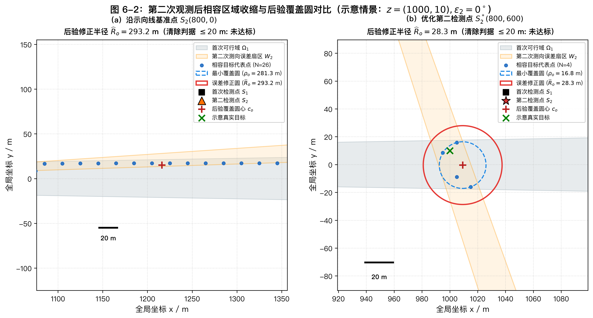

# 6 问题二：第二检测点的优化选择

单次示向测量只能将未知干扰源约束在以检测点为顶点的狭长角带扇区内，无法唯一确定其空间坐标，亦无法获知该干扰源固定但先验未知的有效信号接收半径。为了实现对干扰源的高精度定位并为后续物理清除创造条件，必须通过移动设备选择第二个检测点。

第二检测点的优化决策面临多重物理机制的相互制约：在几何交会层面，第二次检测视线与初次视线的交角越接近正交，两组示向角带交会出的后验区域几何跨度越小；在信号可达性层面，若横向侧移幅度过大或纵深推进过远，一旦干扰源的有效接收半径处于较低水平，第二检测点将面临无法接收到信号的风险；在任务时间层面，追求极端交角往往要求机器狗行进更远距离，带来显著的机动耗时增加；在清除闭环层面，若第二次观测后目标后验区域的最小外接圆半径能够收缩至清除视距（$20\,\mathrm m$）以内，机器狗抵达圆心即可直接实施光学定位与激光清除，省去后续多次搜索机动。

本章围绕上述核心决策矛盾，建立“初次可行域约束 $\to$ 空间六边形网格剖分与接收半径联合状态扩展 $\to$ 全情景前向观测模拟 $\to$ 基于最小覆盖圆与离散误差修正的最坏后验评价 $\to$ 两级网格搜索与近优区域提取”的优化方法体系，为第二检测点的选择提供兼顾几何精度与信号保证的决策依据。

## 6.1 首次观测约束与第二检测点可行域

### 6.1.1 首次观测几何模型与先验不确定性

以半径为 $R_T = 1800\,\mathrm m$ 的圆形目标区域中心 $O(0,0)$ 为原点建立平面直角坐标系，$x$ 轴正向向东，$y$ 轴正向向北，方位角以正东方向为零度并按逆时针方向计量。

设首次检测位置为 $S_1 = (x_1, y_1)$，测得该频道的示向读数为 $\theta_1$。系统中存在两类本质未知的物理状态：
1. **目标真实空间位置** $z = (x, y)^\top \in \mathbb{R}^2$；
2. **目标有效信号接收半径** $r \in [r_{\min}, r_{\max}] = [1000, 1500]\,\mathrm m$，其对特定干扰源为固定常数，但对搜索方先验未知。

测向设备的最大测角误差上界为 $\varepsilon = 1^\circ$。由于首次检测已成功获取有效示向度，根据题目物理规则，干扰源与 $S_1$ 的欧氏距离必然严格大于强信号近场盲区半径 $d_{\text{near}} = 5\,\mathrm m$，且必然不大于该干扰源的有效接收半径 $r$。由于 $r \le 1500\,\mathrm m$，目标到首次检测点的距离上限确定为 $1500\,\mathrm m$。必须指出，虽然 $r \ge 1000\,\mathrm m$，但这绝不意味着目标距首次检测点必须大于 $1000\,\mathrm m$；干扰源完全可能处于 $5\,\mathrm m < \|z - S_1\| < 1000\,\mathrm m$ 的近距范围内。

已知目标必位于目标圆域 $B_0 = \{z \in \mathbb{R}^2 : \|z\| \le R_T\}$ 内。复用第5章的示向误差几何模型，首次观测对应的物理可行空间为
$$
\Omega_1 = \left\{ z \in \mathbb{R}^2 : \|z\| \le 1800,\ 5 < \|z - S_1\| \le 1500,\ |\operatorname{wrap}(\arg(z - S_1) - \theta_1)| \le 1^\circ \right\},
$$
其中 $\operatorname{wrap}(\phi) = (\phi + 180^\circ) \bmod 360^\circ - 180^\circ$ 为角度规整算子。集合 $\Omega_1$ 是目标圆域、最大接收边界圆盘、盲区开圆盘及角带扇区的交集，构成了后续所有推断的先验空间可行域。

### 6.1.2 沿示向线局部正交标架与双侧搜索

为了将机器狗的机动方向解耦为“沿初次视线的纵深推进”与“垂直初次视线的横向侧移”，以 $S_1$ 为原点建立随动局部正交标架：
$$
\boldsymbol{e}_{\parallel} = \begin{pmatrix} \cos\theta_1 \\ \sin\theta_1 \end{pmatrix}, \qquad \boldsymbol{e}_{\perp} = \begin{pmatrix} -\sin\theta_1 \\ \cos\theta_1 \end{pmatrix}.
$$
任意第二检测候选点 $S_2$ 均可由局部标量坐标 $(a, b)$ 唯一线性表示：
$$
S_2 = S_1 + a \boldsymbol{e}_{\parallel} + b \boldsymbol{e}_{\perp}.
$$
其中 $a$ 为沿示向线的纵向位移，$b$ 为沿左法向的横向位移。

在无界理想平面中，由于几何对称性，$b$ 与 $-b$ 对应的交角大小相同；但在实际约束下，场地外边界 $B_0$ 会对扇形区域实施非对称截断，导致首次可行域 $\Omega_1$ 在示向线两侧的面积与几何形态通常不对称。因此，搜索模型必须保留对 $b$ 的双侧对称搜索机制（$b \in [-b_{\max}, b_{\max}]$），不可预先假定单侧等价。

此外，题目明确指出“在同一地点重复测量误差固定不变”，因此在同一点位重复测向无法利用统计独立性消除误差，无法缩小可行区域。算法在候选点生成中严格排除 $S_2 = S_1$（即 $a=b=0$）。

### 6.1.3 保守保证接收区域构建

若要求第二检测点无论真实目标位于 $\Omega_1$ 内的何处、其有效接收半径取何值，均必然能够接收到信号，则 $S_2$ 到 $\Omega_1$ 内任意点的距离均不得超过最小可能接收半径 $r_{\min} = 1000\,\mathrm m$。据此构造保证接收区域：
$$
\mathcal{S} = \bigcap_{z \in \Omega_1} B(z, 1000) = \left\{ S_2 \in \mathbb{R}^2 : \max_{z \in \Omega_1} \|S_2 - z\| \le 1000 \right\}.
$$

关于集合 $\mathcal{S}$ 的性质需明确以下学术边界：
1. **充分性与保守性**：$\mathcal{S}$ 属于保证信号接收的充分条件，它是针对最不利目标位置与最不利接收半径（$1000\,\mathrm m$）的保守交集，而非利用首次观测后能够收到信号的最大可能区域。若目标恰好处于较近距离或其实际 $r > 1000\,\mathrm m$，则机器狗处于 $\mathcal{S}$ 外部同样可能获得信号。
2. **凸分析简化**：在凸几何意义下，紧集与圆盘的交集等价于该紧集凸包极点与圆盘的交集。数值实现中，利用 Shapely 提取可行域凸包 $\operatorname{Conv}(\Omega_1)$ 的离散多边形顶点，依次作半径为 $1000\,\mathrm m$ 的圆盘求交，获得 $\mathcal{S}$ 的高精度多边形数值逼近。
3. **机动空间界限**：目标圆域 $B_0$ 的 $1800\,\mathrm m$ 半径仅是对干扰源分布的约束，赛题并未将机器狗的运动轨迹限制在目标圆域内部。机器狗完全可以根据战术交会需要移动至目标圆域外侧，因此候选点搜索空间不能未经说明就强行施加 $B_0$ 裁剪。

### 6.1.4 侧移量与交会几何的物理权衡

沿示向线推进（$b=0$）与横向侧移（$b \ne 0$）对定位精度的影响存在本质差异：
* 若 $S_2$ 严格位于初次示向线上（$b=0$），两次测向视线共线，交会角退化为 $0^\circ$ 或 $180^\circ$。新观测无法在横向维度提供任何角分辨力，定位区域只能依赖近场盲区边界和接收半径上限发生微小的纵向截断，定位区域跨度依然保持在数百米量级；
* 若适度增加横向侧移（$b \ne 0$ 且 $S_2 \in \mathcal{S}$），两视线构成显著交角，两次角带交叉截出的多边形空间跨度急剧缩小，后验不确定区域可由宏观扇区迅速压缩为一个紧凑区域；
* 若横向侧移过大（$|b|$ 过大以至 $S_2 \notin \mathcal{S}$），候选点脱离了保证接收区，在目标接收半径偏小的情形下产生无信号响应（`no_signal`），不仅无法测得方向，还会导致机器狗白白浪费大量机动时间。

因此，优化第二检测点的本质是在“增大基线交角以提升精度”与“保持在保证接收区内以规避脱靶风险”之间寻求兼顾。

## 6.2 联合状态离散与观测更新

### 6.2.1 空间六边形 Voronoi 网格剖分

为实现连续可行域上的高精度后验推断与数值积分，采用正六边形 Voronoi 晶格单元剖分连续可行域 $\Omega_1$。在平面空间填充中，正六边形晶格比正方形网格具有更高的圆对称性与更均匀的各向同性误差。

以中心间距 $d_g = 20\,\mathrm m$ 构建三角网格基底，生成对应的正六边形单元。各单元多边形与连续可行域 $\Omega_1$ 进行几何求交，滤除交集面积小于 $10^{-9}\,\mathrm m^2$ 的退化单元，得到 $N_{\text{cell}}$ 个互不相交的有效裁剪多边形单元 $\{C_i\}_{i=1}^{N_{\text{cell}}}$。

在每个单元 $C_i$ 内部提取代表点 $z_i \in C_i$，并赋予归一化面积权重：
$$
w_i = \frac{\operatorname{Area}(C_i)}{\sum_{j=1}^{N_{\text{cell}}} \operatorname{Area}(C_j)}.
$$

为了补偿连续几何单元离散为单点代表点所引入的空间截断误差，遍历每个裁剪单元 $C_i$ 边界上的所有折线离散顶点，计算代表点至单元边界的最大欧氏距离：
$$
\delta_i = \max_{P \in \partial C_i} \|P - z_i\|_2.
$$

需严格说明的是，对于不受边界裁剪的完整正六边形单元，中心到外接顶点的外接圆半径为 $d_g / \sqrt{3} \approx 11.55\,\mathrm m$；但由于 $\Omega_1$ 边界的切割，边缘部分单元发生多边形畸变且内部代表点发生偏移，其实际最大距离 $\delta_i$ 必须通过几何边界精确提取，不可直接宣称所有单元的离散误差均不超过 $11.55\,\mathrm m$。

### 6.2.2 接收半径条件相容与联合状态空间扩展

对于任意空间代表点 $z_i$，其与首次检测点的空间跨度为 $d_{1,i} = \|z_i - S_1\|$。由于首次检测已确定测得有效示向角，物理规律要求目标接收半径必须大于等于传播距离：
$$
r \ge r_{\text{lower}}(z_i) = \max\left(r_{\min},\ d_{1,i}\right).
$$

在相容闭区间 $[r_{\text{lower}}(z_i), r_{\max}]$ 内，结合设定的 $K_r = 5$ 个等间距基础采样值，并严格纳入相容区间的下确界端点 $r_{\text{lower}}(z_i)$ 与上确界 $r_{\max} = 1500\,\mathrm m$，得到该空间位置所对应的离散相容接收半径集合 $\{r_{ij}\}_{j=1}^{M_i}$。

定义离散联合状态为元组 $s_{ij} = (z_i, r_{ij})$。在同一空间单元内部，各相容半径样本平分该空间单元的面积权重，即
$$
w(s_{ij}) = \frac{w_i}{M_i}, \qquad \sum_{i=1}^{N_{\text{cell}}} \sum_{j=1}^{M_i} w(s_{ij}) = 1.
$$
所有合法二元组构成了覆盖位置与接收能力全维度的先验联合状态集合 $\mathcal{S}_{\text{prior}}$。

### 6.2.3 三类物理观测模型与向量化相容更新

当机器狗机动至候选检测位置 $S_2$ 执行第二次检测时，由处于联合状态 $s = (z, r)$ 的真实目标所激发的物理响应 $o$ 严格归纳为三类互斥情形：
$$
o = \begin{cases}
\text{near}, & \text{若 } \|z - S_2\| \le 5\,\mathrm m, \\
\text{direction}(\theta_2), & \text{若 } 5\,\mathrm m < \|z - S_2\| \le r, \\
\text{no\_signal}, & \text{若 } \|z - S_2\| > r.
\end{cases}
$$

当观测为 `direction` 时，测向仪输出叠加了随机误差 $\varepsilon_2 \in [-1^\circ, 1^\circ]$ 的示向度读数：
$$
\theta_2 = \left( \arg(z - S_2) + \varepsilon_2 \right) \bmod 360^\circ.
$$

必须强调，`no_signal` 绝非应当废弃的无效观测，它提供了确定性的排他约束：目标到 $S_2$ 的距离必然严格大于其有效接收半径 $r$。在后验推断中，该事件能够直接剪枝剔除所有满足 $\|z_i - S_2\| \le r_{ij}$ 的不相容状态，在收敛目标可行域方面同样具有明确的几何贡献。

为了对连续测角误差与观测读数进行数值枚举，选取典型误差样本集 $\varepsilon_2 \in \{-1^\circ, 0^\circ, 1^\circ\}$。对于有方向观测，按照角分箱宽度 $\Delta\theta = 0.25^\circ$ 对示向角进行分箱聚类：
$$
\theta_2^{\text{bin}} = \operatorname{round}\left( \frac{\theta_2}{\Delta\theta} \right) \cdot \Delta\theta \bmod 360^\circ.
$$
聚合相同特征的观测事件，计算其对应的情景发生权重。

给定候选点 $S_2$ 与某一具体观测事件 $o$，利用向量化数组操作计算全体联合状态的相容性布尔掩码：
* 若 $o = \text{near}$，相容判据为 $\|z_i - S_2\| \le 5\,\mathrm m$；
* 若 $o = \text{no\_signal}$，相容判据为 $\|z_i - S_2\| > r_{ij}$；
* 若 $o = \text{direction}(\theta_2^{\text{bin}})$，相容判据为
  $$
  5 < \|z_i - S_2\| \le r_{ij} \quad \text{且} \quad \left|\operatorname{wrap}\left(\arg(z_i - S_2) - \theta_2^{\text{bin}}\right)\right| \le 1^\circ + \frac{\Delta\theta}{2} = 1.125^\circ.
  $$
  其中引入 $\Delta\theta/2$ 的半宽容差，用于完全吸收分箱聚类产生的舍入误差，防止离散截断错误排除相容真值。

筛选出的相容联合状态子集记为 $\mathcal{S}_{\text{post}}(o)$。将其投影到不重复的空间目标代表点，提取相容目标代表点集合 $\mathcal{Z}_o = \{z_k\}_{k \in I_o}$ 及其单元离散误差集合 $\{\delta_k\}_{k \in I_o}$。

### 6.2.4 学术边界说明

空间面积权重、等间距半径采样以及等权误差样本是用于离散计算的评估度量，赛题并未给定干扰源空间位置的先验概率密度、接收半径的分布律或测向误差的统计分布。因此，后文计算出的综合比例均严格界定为“加权情景比例”，不应直接称作客观物理世界中的实际概率；本章更新本质上是相容约束集合的剪枝更新，而非完整贝叶斯后验推断。

## 6.3 基于最坏覆盖半径的选点评价

### 6.3.1 最小覆盖圆与离散空间误差修正

对于任意后验相容目标点集 $\mathcal{Z}_o = \{z_k\}_{k \in I_o}$：
1. 若观测为 `near`，目标已被锁定在以 $S_2$ 为中心、半径 $5\,\mathrm m$ 的邻域内，最小覆盖圆直接取圆心 $c_o = S_2$，半径取 $\rho_o = 5\,\mathrm m$；
2. 若观测为其他情形，采用计算几何中的 Welzl 随机增量算法求解点集 $\mathcal{Z}_o$ 的最小覆盖圆（Minimum Enclosing Circle）。该算法在期望时间 $O(|\mathcal{Z}_o|)$ 内求得唯一确定的外接圆，输出圆心 $c_o$ 与样本覆盖半径 $\rho_o$。

为了弥合由连续六边形网格离散化为代表点所产生的空间空隙，定义经空间离散误差修正后的保守后验覆盖半径：
$$
\widehat{R}_o = \rho_o + \max_{k \in I_o} \delta_k.
$$

由欧氏空间三角不等式可知，对于对应保留单元内部的任意连续候选点 $P \in C_k$，均有
$$
\|P - c_o\| \le \|P - z_k\| + \|z_k - c_o\| \le \delta_k + \rho_o \le \widehat{R}_o.
$$
因此，以 $c_o$ 为圆心、以 $\widehat{R}_o$ 为半径的闭圆盘严格包含了所有相容连续单元的几何并集 $\bigcup_{k \in I_o} C_k$。

这一处理逻辑与第5章形成衔接：第5章已严格证明，区域最远点对构成的直径圆并不必然覆盖整个多边形（例如等边三角形的反例）；而在问题二的定位与清除闭环中，必须使用能确保完全包络全部候选位置的最小外接圆及离散误差修正圆，而不能直接使用直径圆。

### 6.3.2 选点综合评价指标体系

对每个候选检测点 $S_2$，在遍历所有可能观测情景后，计算以下指标：

1. **主评价指标（最坏后验覆盖半径）**：
   $$
   R_{\max}(S_2) = \max_{o \in \mathcal{O}(S_2)} \widehat{R}_o(S_2).
   $$
   该指标刻画在最不利目标位置、最不利接收半径和最不利测角误差叠加下，后验候选区域的最大可能空间覆盖尺度。

2. **清除视距判据与加权可清除比例**：
   赛题规定，简易光学探测仪在距离干扰源 $d \le 20\,\mathrm m$ 时可实施精确定位并启动激光清除。
   若某情景下 $\widehat{R}_o(S_2) \le 20\,\mathrm m$，则机器狗行进至覆盖圆心 $c_o$ 时，目标必然位于其 $20\,\mathrm m$ 光学视距内，可直接启动光学精确定位（$3\,\mathrm s$）与激光清除（$2\,\mathrm s$），无需实施第三次测向机动。
   据此定义加权可清除情景比例为
   $$
   p_c(S_2) = \sum_{o \in \mathcal{O}(S_2)} w(o) \cdot \mathbb{I}(\widehat{R}_o(S_2) \le 20\,\mathrm m).
   $$

3. **信号可达权重（接收率）**：
   $$
   p_s(S_2) = \sum_{o \ne \text{no\_signal}} w(o).
   $$

4. **辅助评价指标**：
   * 加权平均覆盖半径：$\bar{R}(S_2) = \sum_o w(o) \widehat{R}_o(S_2)$；
   * 90% 分位数覆盖半径：$R_{0.90}(S_2)$；
   * 两阶段时间代理指标：
     $$
     T_{\text{agent}}(S_2) = \frac{\|S_2 - S_1\|}{v} + t_{\text{detect}} + \sum_{o \in \mathcal{O}(S_2)} w(o) \left[ \frac{\|c_o - S_2\|}{v} + \mathbb{I}(\widehat{R}_o \le 20)(t_{\text{loc}} + t_{\text{clear}}) \right].
     $$
     其中速度 $v = 5\,\mathrm m/\mathrm s$，测向耗时 $t_{\text{detect}} = 5\,\mathrm s$，光学定位耗时 $t_{\text{loc}} = 3\,\mathrm s$，激光清除耗时 $t_{\text{clear}} = 2\,\mathrm s$。

需再次申明，对于不可清除情景（$\widehat{R}_o > 20\,\mathrm m$），机器狗抵达 $c_o$ 后必须执行第三次及后续测向机动，该过程属于问题三的多阶段动态规划，未在此处计入。因此 $T_{\text{agent}}$ 仅作为前两步机动与清除预期耗时的局部代理指标，不能称为全任务期望完成时间。

### 6.3.3 接收率修正与字典序排序准则

为抑制脱离信号覆盖的极端选点，定义接收率修正目标函数：
$$
J(S_2) = \frac{R_{\max}(S_2)}{\left[\max(p_s(S_2), 0.05)\right]^\alpha}, \qquad (\alpha = 1).
$$
候选点的全局优劣按照鲁棒优先的多级字典序进行综合判定：
$$
\operatorname{SortKey}(S_2) = \Big( \mathbb{I}(S_2 \notin \mathcal{S}),\ J(S_2),\ -p_c(S_2),\ R_{0.90}(S_2),\ \bar{R}(S_2),\ T_{\text{agent}}(S_2) \Big).
$$

排序规则首先保证候选点位于保证接收区域 $\mathcal{S}$ 内部；在保证接收区内部，由于 $p_s(S_2) = 1$，修正函数 $J(S_2)$ 自然退化为原始最坏覆盖半径 $R_{\max}(S_2)$。随后依次按照最坏半径最小、可清除比例最高、高分位与平均半径更小、时间成本更低的顺序完成全序比较。

### 6.3.4 第二次观测区域收缩图文对照分析

为直观展现选点策略对后验定位区域收缩的决定性影响，选定基准观测情景：设干扰源真实位置位于 $z = (1000.0, 10.0)$，有效接收半径 $r = 1200\,\mathrm m$，第二次测角误差取 $\varepsilon_2 = 0^\circ$。对“沿示向线基准点 $S_2(800, 0)$”与“优化第二检测点 $S_2^*(800, 600)$”实施对照模拟，生成图 6-2。需注意，此处单一情景仅作为几何机理展示，不能代替前述最坏覆盖半径的严谨评测。



对图 6-2 的对比分析表明：
1. **沿示向线基准点（图 6-2(a)）**：由于新视线与原视线平行，测向角带几乎完全重合，第二次观测无法形成有效的横向交角截断。相容目标代表点多达 26 个，最小覆盖圆半径为 $\rho_o = 281.29\,\mathrm m$，加上局部单元误差 $\max\delta_i = 11.94\,\mathrm m$ 后，保守覆盖半径高达 $\widehat{R}_o = 293.23\,\mathrm m$。该尺度远超 $20\,\mathrm m$ 清除阈值，表明沿线推进无法摆脱长条形狭长角带的不确定性。
2. **优化第二检测点（图 6-2(b)）**：机器狗侧移至 $(800, 600)$，与目标连线形成约 $36.9^\circ$ 的明显交角。两组扇区的非共线截交使得后验相容代表点骤减至 4 个，最小覆盖圆半径大幅收敛至 $\rho_o = 16.77\,\mathrm m$（已直接落入 $20\,\mathrm m$ 视距内），加上单元误差 $\max\delta_i = 11.55\,\mathrm m$ 后的保守覆盖半径为 $\widehat{R}_o = 28.31\,\mathrm m$。空间后验面积相较基准点缩减超过一个数量级，展现了适度侧移带来的显著交会增益。

## 6.4 粗细网格求解与近优候选区域

### 6.4.1 两级自适应粗细网格搜索算法

连续平面空间上的候选点优化属于非凸全局寻优问题。针对计算资源与求解精度的平衡，设计两级自适应网格搜索算法：
1. **第一级粗网格全局普查**：在局部坐标系 $(a, b)$ 内，以步长 $\Delta_{\text{coarse}} = 100\,\mathrm m$ 构建覆盖搜索窗口的粗网格点阵，执行全情景后验仿真与指标初评；
2. **第二级细网格局部精化**：提取粗网格评估排名前 $K = 4$ 的优质种子点，在以每个种子点为中心、半宽 $W_{\text{refine}} = 160\,\mathrm m$ 的正方形邻域内，以细网格步长 $\Delta_{\text{fine}} = 50\,\mathrm m$ 进行网格加密采样与全情景重评；
3. **合并去重与全局重排**：将两级网格产生的所有候选点按全局坐标合并去重，统一调用字典序准则重排，提取排名第一的候选点作为当前求解的最优检测点 $S_2^*$。

必须明确说明，该算法属于离散空间与局部加密下的近似优化方法，最终输出解应规范表述为“当前搜索与离散精度下的最优候选点”，不宣称连续全局最优或已具备严格收敛性证明。

```text
算法 6-1：第二检测点粗细网格两级优化求解算法
输入：首次检测点 S_1，示向度 θ_1，配置参数 (d_g=20 m, Δ_coarse=100 m, Δ_fine=50 m, K=4)
输出：最优第二检测点 S_2^*，推荐候选区域 C
1. 构建首次连续可行域 Ω_1 与保证接收区域 S
2. 以 d_g 正六边形网格剖分 Ω_1，提取单元代表点及离散误差，扩展为联合状态空间 S_prior
3. 在局部坐标 (a, b) 中以 Δ_coarse 生成粗网格点阵，枚举情景评估各候选点性能
4. 选取粗网格前 K=4 个种子点，在半宽 160 m 窗口内以 Δ_fine 进行细网格加密采样并评估
5. 合并全部候选点并去重，按字典序准则 SortKey 排序，取 S 内部最优解为 S_2^*
6. 依据近优容差筛选满足条件的近优点集 Q，以每个点作半径 Δ_fine/√2 的圆盘
7. 对全体圆盘执行几何并运算，输出推荐连续区域 C = ⋃_{q∈Q} B(q, Δ_fine/√2)
```

### 6.4.2 近优候选区域的形态学提取与学术边界

在实际任务部署中，单一孤立的最优点容易受到局部地形障碍、突发威胁或机动限制的干扰，指挥决策往往需要具备一定几何跨度的推荐候选区域。

基于算法求得的最优点 $q^* = S_2^*$，按照以下阈值条件筛选近优候选点集合 $\mathcal{Q}$：
$$
\mathcal{Q} = \left\{ q \in \mathcal{S} : J(q) \le 1.05 J(q^*) + 2\,\mathrm m, \quad p_c(q) \ge p_c(q^*) - 0.02 \right\}.
$$
在此必须明确：式中最后一个条件代表“可清除比例相较最优点的绝对降幅不超过 2 个百分点”，绝不能混淆表述为达到最优值的 98%。

以每个入选近优点 $q \in \mathcal{Q}$ 为中心，作半径等于细网格单胞对角线半长 $r_b = \Delta_{\text{fine}} / \sqrt{2} \approx 35.36\,\mathrm m$ 的圆盘，通过形态学膨胀与连续几何求并运算，生成推荐候选区域：
$$
\mathcal{C} = \bigcup_{q \in \mathcal{Q}} B\left(q, \frac{\Delta_{\text{fine}}}{\sqrt{2}}\right).
$$

关于推荐区域 $\mathcal{C}$ 需明确以下学术边界：
$\mathcal{C}$ 用于表达围绕近优点簇的平滑几何邻域。算法并未对连续区域 $\mathcal{C}$ 内部的每一个连续无限点进行重新仿真评价，亦未将圆盘并集的外轮廓再次强制截断于 $\mathcal{S}$ 内部；因此不能断言 $\mathcal{C}$ 内的每一个连续点均严格满足保证接收与近优阈值。若后续战术执行需要在 $\mathcal{C}$ 内部选取非网格实际点，应调用评测模型对其进行独立验证。

### 6.4.3 第二检测点评价分布图文解析

图 6-1 展示了在基准输入条件 $S_1 = (0,0),\ \theta_1 = 0^\circ$ 下，全域候选点的离散情景最坏覆盖半径分布、保证接收区边界以及推荐区域。


结合图 6-1 的空间分布特征进行深入分析：
1. **可行域与保证接收区**：灰色带状区域为首次可行域 $\Omega_1$，呈顶角 $2^\circ$、向东延伸的狭长扇区；虚线包络的浅绿色区域为保证接收区 $\mathcal{S}$，在 $a \in [500.4, 1005.0]\,\mathrm m$ 范围内形成一个最大横向跨度达 $\pm 650.7\,\mathrm m$ 的凸状走廊，明确了不脱离信号的安全机动边界；
2. **最坏覆盖半径的空间演化**：色条反映原始最坏后验覆盖半径 $R_{\max}(S_2)$。在靠近示向线中心轴（$b=0$）的区域，覆盖半径普遍在 $200\sim350\,\mathrm m$ 以上（呈现黄色高亮），表明纵向交会的定位性能处于劣势；随着侧移量 $|b|$ 逐渐增大，覆盖半径迅速下降（过渡至深蓝紫色），定位精度显著改善；
3. **最优点与推荐区域定位**：在保证接收区 $\mathcal{S}$ 内部，最优检测点锁定在红星标记处 $S_2^* = (800.0, 600.0)$，对应最坏后验覆盖半径 $R_{\max} = 52.113\,\mathrm m$。紫色轮廓勾勒出围绕近优点簇的推荐区域 $\mathcal{C}$（面积为 $3826.8\,\mathrm m^2$）。右下角局部放大框清晰展示了 $50\,\mathrm m$ 细网格的离散取样点及其最坏半径响应，证实了算法在保证接收区边界附近的精细刻画能力。

## 6.5 结果对比与选点结论

### 6.5.1 主算例选点策略综合对比

为了量化不同决策逻辑在几何精度、信号保证和机动耗时上的差异，在基准算例（$S_1 = (0,0),\ \theta_1 = 0^\circ$）下，选取四个具有明确物理代表性的策略点进行统一复核评测，对比结果如表 6-1 所示。

**表 6-1 主算例选点策略对比表**

| 选点策略 | 局部坐标 $(a, b) / \mathrm m$ | 全局坐标 $(x, y) / \mathrm m$ | 是否保证接收 | 最坏覆盖半径 $\widehat{R}_{\max} / \mathrm m$ | 加权可清除比例 $p_c$ | 从首次点移动距离 / $\mathrm m$ | 预计总时间 $T_{\text{agent}} / \mathrm s$ |
|---|---:|---:|:---:|---:|---:|---:|---:|
| 沿示向线基准点 | $(800.0, 0.0)$ | $(800.0, 0.0)$ | 是 | 316.922 | 7.40% | 800.0 | 239.5 |
| 保证接收区内中度侧移点 | $(800.0, 300.0)$ | $(800.0, 300.0)$ | 是 | 79.486 | 14.23% | 854.4 | 273.3 |
| **算法优化点** | **(800.0, 600.0)** | **(800.0, 600.0)** | **是** | **52.113** | **3.18%** | **1000.0** | **348.7** |
| 保证接收区外过度侧移点 | $(800.0, 800.0)$ | $(800.0, 800.0)$ | 否 | 104.506 | 0.19% | 1131.4 | 410.1 |

注：各策略点均通过相同的全情景后验评价模型进行复评；主算例输入为 $S_1 = (0,0),\ \theta_1 = 0^\circ$；对称点 $(800.0, -600.0)$ 的各项指标与优化点完全一致。

### 6.5.2 策略对比与物理机制深度剖析

表 6-1 揭示了第二检测点决策背后的多目标博弈规律：

1. **沿示向线基准点（$b=0$）的局限性**：虽然该策略移动距离最短（$800\,\mathrm m$）、总时间最省（$239.5\,\mathrm s$），且位于保证接收区内部，但由于交会角为零，其最坏覆盖半径高达 $316.922\,\mathrm m$。这意味着在不利情景下，机器狗获得的新几何信息极为贫乏，无法支撑后续的高效收敛。
2. **中度侧移点（$b=300\,\mathrm m$）的特征**：当机器狗横向侧移 $300\,\mathrm m$ 后，移动距离仅增加 $54.4\,\mathrm m$（约 $6.8\%$），但最坏后验覆盖半径从 $316.922\,\mathrm m$ 骤降至 $79.486\,\mathrm m$（降幅达 $74.9\%$），且加权可清除比例提升至 $14.23\%$。这充分验证了横向基线对打破狭长角带不确定性的显著作用。
3. **算法优化点（$b=600\,\mathrm m$）的综合优势**：在继续增大侧移至保证接收区临界边缘时，交会几何进一步收紧，最坏覆盖半径达到全局最优的 $52.113\,\mathrm m$，相较沿线基准点改善达 $83.6\%$。虽然其加权可清除比例（$3.18\%$）低于中度侧移点，但在鲁棒最坏评价准则下，其极大压低了后验误差的上界，有效遏制了极端恶劣情景的出现。
4. **过度侧移点（$b=800\,\mathrm m$）的失效机理**：过度追求交角会导致脱离保证接收区（处于 $\mathcal{S}$ 外部）。此时信号接收率下降至 $99.64\%$，在出现无信号的场景中后验区域扩散，使得最坏后验覆盖半径恶化至 $104.506\,\mathrm m$，同时带来更长的行进距离（$1131.4\,\mathrm m$）与更高的机动耗时（$410.1\,\mathrm s$）。
5. **清除视距达标的诚实结论**：需要明确指出，在主算例中，优化点的最坏覆盖半径为 $52.113\,\mathrm m > 20\,\mathrm m$。这表明两次检测能大幅度改善定位精度、大幅压缩不确定空间，但在最不利情景下仍无法保证仅凭两次测向就达到 $100\%$ 的一次性物理清除条件，在部分情景下依然需要依赖后续第三步检测。

### 6.5.3 场地边界裁剪算例检验

为验证模型与算法在非对称、受场地外边界截断场景下的适应性，构造边界裁剪算例：设首次检测点位于目标区域东侧边界附近 $S_1 = (1000.0, 0.0)$，示向角 $\theta_1 = 0^\circ$。

在此算例中，首次测向扇区在向东延伸仅 $800\,\mathrm m$ 后即与 $R_T = 1800\,\mathrm m$ 的目标圆域边界相交，纵深范围由默认的 $1500\,\mathrm m$ 压缩为 $800\,\mathrm m$，首次可行域面积锐减至 $11168.413\,\mathrm m^2$。

调用本章优化算法求解，得到如下关键结论：
* 保证接收区域面积相应扩大为 $1576750.696\,\mathrm m^2$；
* 最优第二检测点定位在局部坐标 $(a^*, b^*) = (490.0, -340.0)\,\mathrm m$，对应全局坐标为 $(1490.0, -340.0)$；
* 该点位于保证接收区内部，最坏后验覆盖半径显著缩小至 $25.824\,\mathrm m$；
* 离散模型下加权可清除情景比例高达 $62.12\%$；
* 从首次检测点移动至第二检测点的距离仅为 $596.4\,\mathrm m$，两阶段预计总时间仅为 $205.3\,\mathrm s$。

边界算例的求解表明，当先验可行域因地理边界限制而缩短纵深时，两次测向后的相容区域被极大地压缩，可清除比例提升至六成以上。这充分证明了本文基于六边形网格剖分与严格保证接收区构建的模型，在对称和非对称复杂边界约束下均具有高度的鲁棒性与通用性。

### 6.5.4 本章总结

本章针对问题二给出了第二检测点的优化决策模型与候选区域提取方案。通过构建沿示向线局部标架，将候选点搜索与先验可行域空间特性解耦；采用六边形网格剖分与未知接收半径联合状态扩展，实现了对三类物理观测的全情景仿真；利用 Welzl 最小外接圆与离散空间误差修正，建立了以最坏后验覆盖半径为主指标的字典序评价体系；最终通过粗细两级自适应网格搜索，求得保证接收约束下的最优检测点及近优候选区域，为后续多阶段动态搜索与清除路径规划提供了坚实可靠的决策基准。
