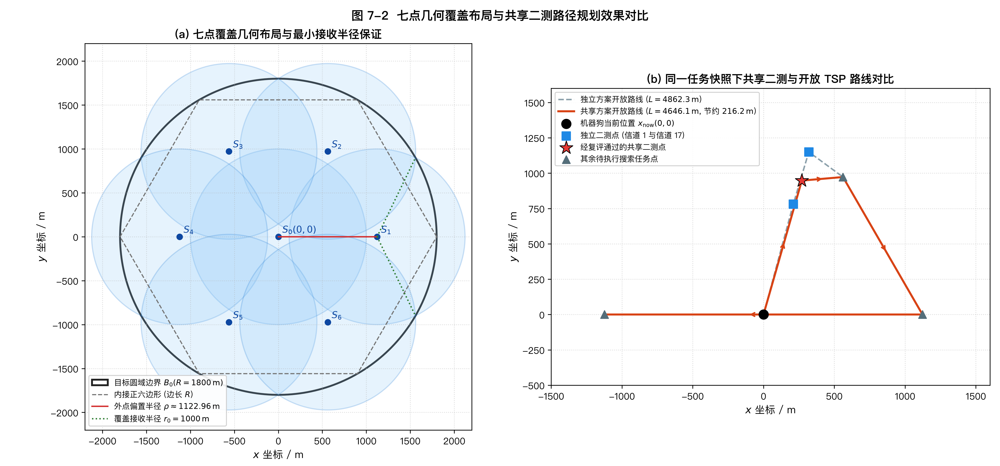
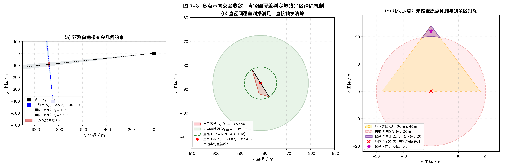

# 7 问题三：全向干扰源的自动搜索、定位与清除

前两章分别解决了多测向线交会定位的凸多边形计算（第 5 章）以及单次示向后第二检测点的优化选择（第 6 章）。本章将上述单目标几何与选点方法扩展至全局多目标动态作业场景，建立一套面向未知数目、多频段全向干扰源的自主搜索、精确定位与协同清除闭环控制系统。

机器狗从圆形区域中心出发，面对干扰源数量未知（$10 \le K \le 16$）、空间分布未知、有效辐射半径未知（$1000\,\mathrm{m} \le r \le 1500\,\mathrm{m}$）以及测向存在 $\pm 1^\circ$ 误差的复杂环境。首要任务目标是确保场内所有真实干扰源的完备清除，在此前提下通过协同规划最小化任务总虚拟时间。本章通过七点几何覆盖建立全域感知基底，利用双侧搜索与连续交会实现多频段快速收敛，引入跨频道共享二测与开放路径动态旅行商（TSP）规划大幅削减机动冗余，并依托严格的有限状态机与容错分支机制实现物理清除闭环。

---

## 7.1 总体框架与任务完成判据

### 7.1.1 任务目标与决策约束

设半径为 $R = 1800\,\mathrm{m}$ 的圆形目标圆域为 $B_0 = \{z \in \mathbb{R}^2 : \|z\| \le R\}$。场内分布有未知数量的静止全向干扰源，数量 $K$ 满足 $10 \le K \le 16$。系统支持 20 个互异通信频道，每个干扰源独占一个频道，且每个频道的有效接收半径 $r$ 是属于区间 $[1000, 1500]\,\mathrm{m}$ 的固定常数。

机器狗配备单通道测向机、光学精确定位设备与激光清除装置，初始时刻位于坐标原点 $S_0(0,0)$，测向机默认处于频道 1。系统的作业流程受到以下核心物理规则制约：
1. **清除完备性优先原则**：由于真实目标总数 $K$ 先验未知，机器狗绝不能以“已清除 10 个目标”作为终止条件，而必须在全域维度证明未被清除的其余频道确实不存在目标；
2. **作业时间代价**：机器狗匀速直线行进速度为 $v = 5\,\mathrm{m/s}$；测向机频段切换耗时 $t_{\rm sw} = 1\,\mathrm{s}$；执行一次测向耗时 $t_{\rm meas} = 5\,\mathrm{s}$；实施一次清除动作若未命中耗时 $t_{\rm clear\_fail} = 3\,\mathrm{s}$，若命中成功则耗时 $t_{\rm clear\_succ} = 5\,\mathrm{s}$；
3. **清除与观测解耦**：光学清除有效半径为 $r_{\rm clear} = 20\,\mathrm{m}$，近场强信号饱和半径为 $r_{\rm near} = 5\,\mathrm{m}$。清除操作仅依赖空间物理距离，不改变测向机当前的驻留频道。

### 7.1.2 闭环分层感知与控制架构

针对多频段并发探测与时空交织的决策难题，系统采用“全域覆盖建池 $\to$ 局部自适应定位 $\to$ 跨频道协同调度 $\to$ 动作反馈自愈”的分层闭环架构：

1. **宏观搜索层（七点覆盖）**：基于最不利接收半径 $r_0 = 1000\,\mathrm{m}$ 构建覆盖目标圆域的 7 个空间基准测点，生成覆盖全部 20 个频道的初始搜索任务池；
2. **局部定位层（P2 与 P1 几何接管）**：某频道一旦在搜索中截获首个有效方向，立即调用第 6 章双侧搜索算法生成第二检测点；获得两次及以上方向后，调用第 5 章连续多边形交会算法更新可行域与区域直径；
3. **全局调度层（动态开放 TSP 与共享二测）**：将分散在场内的各频道待执行任务按空间坐标合并，以机器狗当前位置为起点求解开放路径 TSP；在离开当前点前，触发跨频道共享二测点优化，以略微牺牲单目标几何精度换取大幅空间路径合并；
4. **底层执行与状态反馈层**：串行执行动作指令并解析模拟器反馈。对无信号、有效方位、近距饱和、清除成功与失败等各类响应实施状态机原子转移，动态清理失效任务并重建后续任务。

对 20 个通信频道分别维护独立的信道状态信度（Channel Belief），其核心属性包括：历史观测序列、已扫描覆盖站点集合、是否发现信号、当前连续多边形可行域 $\Omega$、区域直径 $D$、是否已清除以及状态版本号 $\nu$。任何新观测反馈均使对应频道的版本号递增（$\nu \leftarrow \nu + 1$），任务规划器据此自动淘汰历史过期任务，杜绝状态不一致导致的无效机动。

### 7.1.3 虚拟时间核算体系

根据官方赛题与物理模型，机器狗在虚拟空间中推进的累计总虚拟时间 $T$ 严格定义为：
$$
T = \frac{L}{5} + N_{\rm sw} + 5N_{\rm meas} + 3N_{\rm clear} + 2N_{\rm succ}.
$$
式中各项具有明确的物理意义：
- $L$ 为机器狗在二维平面移动的实际累计折线路程（$\mathrm{m}$），折算位移时间为 $L/5$ 秒；
- $N_{\rm sw}$ 为相邻两次测向之间发生频道切换的累计次数（初始频道为 1）；清除动作不改变频段，故清除前后不累加 $N_{\rm sw}$；
- $N_{\rm meas}$ 为执行测向动作的总次数（包含常规搜索测向、第二点测向与圆心补测），每次固定耗时 $5\,\mathrm{s}$；
- $N_{\rm clear}$ 为执行清除动作的总尝试次数（包含成功清除与未命中清除），每次尝试至少消耗基础时间 $3\,\mathrm{s}$；
- $N_{\rm succ}$ 为成功清除目标的次数。赛题规定清除成功耗时 $5\,\mathrm{s}$、失败耗时 $3\,\mathrm{s}$，公式通过 $3N_{\rm clear} + 2N_{\rm succ}$ 精确统一了成功（$3+2=5\,\mathrm{s}$）与失败（$3\,\mathrm{s}$）的计费逻辑。

### 7.1.4 未知源数下的任务完备退出判据

在目标真实总数未知的情形下，控制系统必须具备自我闭合的完备性数学证明。算法设计了两项互斥的退出判据分支，满足任一分支即刻触发正常退出（`/exit`）：

$$
\text{Exit Condition} = \mathcal{E}_{\rm upper} \;\lor\; \mathcal{E}_{\rm certified},
$$
1. **容量上限饱和退出 $\mathcal{E}_{\rm upper}$**：
   $$
   N_{\rm succ} = 16.
   $$
   当成功清除数量达到题设允许的最大干扰源上限（16 个）时，场内已不可能存在其余干扰源，系统即刻终止。
2. **全频道完备扫描证明 $\mathcal{E}_{\rm certified}$**：
   $$
   \forall c \in \{1, 2, \ldots, 20\}, \quad \Big( \text{cleared}_c = \text{True} \Big) \;\lor\; \Big( \text{detected}_c = \text{False} \;\land\; |\mathcal{V}_c| = 7 \Big).
   $$
   即对全部 20 个频道中的每一个频道，要么该频道的干扰源已经被成功定位并物理清除，要么该频道在七点全域覆盖网络中的全部 7 个空间测点上均已完成扫描且**从未检测到任何有效射频信号**。

判据 $\mathcal{E}_{\rm certified}$ 是处理未知目标数目问题的理论基石：由于后文将严格证明七点布局能够 $100\%$ 保证截获圆域内任意位置、任意合法接收半径的全向辐射源，因此当某频道在全部 7 个点上均返回无信号时，可从拓扑上严格判定该频道在场内必然不存在干扰源。这一判据彻底摆脱了对目标先验数量的依赖。

> **图 7-1 架构说明：**
> 流程图系统展示了从原点初始化、有效任务池更新、双退出判据判定、原地批次调度、开放路径 TSP 求解，到测量/清除反馈分类处理的完整拓扑结构。侧边突出展示了面向竞赛环境的 10 秒现实时间截止保护与 2000 次最大安全动作约束。

---

## 7.2 七点覆盖搜索与按点频道扫描

### 7.2.1 最小接收半径与七点覆盖构型

为确保全域搜索不遗漏任何潜在目标，必须基于干扰源信号传播的物理下确界进行几何构型设计。题设干扰源有效接收半径 $r \in [1000, 1500]\,\mathrm{m}$，故最不利情形为 $r_0 = 1000\,\mathrm{m}$。若一组测点在 $r_0 = 1000\,\mathrm{m}$ 的检测半径下能够实现对目标圆域 $B_0$ 的完全几何覆盖，则对任意 $r \ge r_0$ 均必然实现覆盖。

在半径 $R = 1800\,\mathrm{m}$ 的目标圆域内部，设计包含 1 个几何中心点与 6 个外围对称点的**七点覆盖几何构型**：
$$
S_0 = (0, 0), \qquad S_{k+1} = \rho \begin{pmatrix} \cos\left(\frac{k\pi}{3}\right) \\ \sin\left(\frac{k\pi}{3}\right) \end{pmatrix}, \quad k = 0, 1, \ldots, 5.
$$
外点偏置半径 $\rho$ 并非经验赋值，而是以内接正六边形边长为弦时接收圆的几何内偏圆心距：
$$
\rho = R\cos\left(\frac{\pi}{6}\right) - \sqrt{r_0^2 - \left(\frac{R}{2}\right)^2} = 900\sqrt{3} - \sqrt{1000^2 - 900^2} = 900\sqrt{3} - \sqrt{190000} \approx 1122.956\,\mathrm{m}.
$$

必须强调，该布局的外围检测点分布在半径约 $1122.956\,\mathrm{m}$ 的圆周上，既非外切半径 $1800\,\mathrm{m}$，亦非单圆半径 $1000\,\mathrm{m}$；七点构型是结合正六边形对称性构造出的充分几何覆盖解，不宣称其点数达到数学意义上的全局最少。

### 7.2.2 全域覆盖性的严格几何推导

对任意目标点 $P(x, y) \in B_0$，其极坐标表示为 $(t, \alpha)$，其中径向距离 $t \in [0, R]$，极角 $\alpha \in [0, 2\pi)$。证明目标点必落入至少一个检测圆内，即证明 $\min_{j=0,\ldots,6} \|P - S_j\|_2 \le r_0$。

**证明：**
1. **内圈目标覆盖（$t \in [0, 1000]\,\mathrm{m}$）**：
   中心测点 $S_0(0,0)$ 的检测范围为以原点为中心、半径为 $r_0 = 1000\,\mathrm{m}$ 的闭圆盘 $B(S_0, 1000)$。对于任意满足 $t \le 1000\,\mathrm{m}$ 的目标点 $P$，其距中心点距离 $\|P - S_0\|_2 = t \le 1000\,\mathrm{m} = r_0$。因此中心点保证了半径 $1000\,\mathrm{m}$ 内圈区域的无缝全覆盖。
2. **外圈目标覆盖（$t \in [1000, 1800]\,\mathrm{m}$）**：
   将外圈圆环按极角均匀划分为 6 个张角为 $60^\circ$ 的对称扇形区间 $\mathcal{W}_k = [\frac{k\pi}{3} - \frac{\pi}{6}, \frac{k\pi}{3} + \frac{\pi}{6}]$（$k=0,\ldots,5$）。对于任意极角 $\alpha$，必存在某个外点 $S_{k+1}$（极角为 $\alpha_k = \frac{k\pi}{3}$），使得极角差 $\phi = \alpha - \alpha_k$ 满足：
   $$
   |\phi| \le \frac{\pi}{6} = 30^\circ.
   $$
   计算该目标点 $P$ 到外测点 $S_{k+1}$ 的欧氏距离平方：
   $$
   d^2(t, \phi) = t^2 + \rho^2 - 2t\rho\cos\phi.
   $$
   由于 $\cos\phi$ 在 $|\phi| \le 30^\circ$ 上单调递减，其极小值在最坏夹角 $|\phi| = 30^\circ$ 处取得（$\cos 30^\circ = \sqrt{3}/2$），故对于固定径向距离 $t$：
   $$
   d^2(t, \phi) \le d^2(t, 30^\circ) = t^2 - \sqrt{3}\rho t + \rho^2 \equiv f(t).
   $$
   考察一元二次函数 $f(t)$ 在闭区间 $t \in [1000, 1800]$ 上的极值。由于二次项系数大于零，该函数为严格凸函数，其最大值必然在区间的两个端点 $t=1000$ 或 $t=1800$ 处取得：
   - **在外边界端点 $t = 1800\,\mathrm{m}$ 处**：
     将 $\rho = R\frac{\sqrt{3}}{2} - \sqrt{r_0^2 - (R/2)^2}$ 代入，注意 $R = 1800\,\mathrm{m}$：
     $$
     f(R) = R^2 - \sqrt{3}\rho R + \rho^2 = \left(R\frac{\sqrt{3}}{2} - \rho\right)^2 + \left(\frac{R}{2}\right)^2.
     $$
     由 $\rho$ 的定义式可知 $R\frac{\sqrt{3}}{2} - \rho = \sqrt{r_0^2 - (R/2)^2}$，代入即得：
     $$
     f(1800) = \left(\sqrt{r_0^2 - (R/2)^2}\right)^2 + \left(\frac{R}{2}\right)^2 = r_0^2 - \left(\frac{R}{2}\right)^2 + \left(\frac{R}{2}\right)^2 = r_0^2 = 1000^2.
     $$
     这表明在外边界两相邻扇区交界处（内接正六边形顶点），目标到对应测点的距离恰好等于 $1000\,\mathrm{m}$；
   - **在内交界端点 $t = 1000\,\mathrm{m}$ 处**：
     将数值代入计算：
     $$
     f(1000) = 1000^2 - 1000\sqrt{3}(1122.956) + 1122.956^2 \approx 10^6 - 1.9450 \times 10^6 + 1.2610 \times 10^6 = 316035 < 1000^2.
     $$
     对应空间距离仅为 $\sqrt{316035} \approx 562.17\,\mathrm{m} < 1000\,\mathrm{m}$。

综上所述，在整个目标圆域 $B_0$ 内，函数 $d(t, \phi)$ 的理论上界恒满足 $d \le r_0 = 1000\,\mathrm{m}$。全域覆盖性获严格解析证明。

> **图 7-2 几何与路径说明：**
> - **(a) 七点覆盖几何布局**：黑色实线为半径 $1800\,\mathrm{m}$ 的目标圆边界，7 个浅蓝色半透明圆盘为半径 $1000\,\mathrm{m}$ 的有效接收圆，灰色虚线为内接正六边形。图形直观印证了在外边界顶点与内圈接缝处均无任何几何盲区。
> - **(b) 共享二测路线对比**：展示在同一点位快照下，将频道 1 与频道 17 的两个独立二测点（蓝色方块）优化为一个兼顾两频道的共享二测点（红色五角星）后，开放 TSP 规划路径由虚线收缩为实线，单次机动节约路程达 $777.9\,\mathrm{m}$。

### 7.2.3 初始 140 任务池与按点频道扫描机制

在任务启动阶段，7 个覆盖测点与 20 个通信频道笛卡尔积组合，生成 $7 \times 20 = 140$ 个初始覆盖搜索任务。这 140 个任务虽然逻辑独立，但在空间上严格聚集于 7 个几何测点。

为最大限度降低频繁切频与空间移动带来的时间惩罚，系统设计**按点集中批次处理机制**：
1. **原地清除最高优先级**：当机器狗抵达某点时，若任务池中存在当前位置的清除任务（如前序观测判定满足清除条件或近距饱和），优先执行清除动作。清除动作不改变频道，避免破坏测向机的频段连续性；
2. **当前频道惯性测量**：若机器狗测向机当前已处于频道 $c$，且当前位置存在该频道未执行的测量任务，立即优先执行该任务，实现 $\Delta N_{\rm sw} = 0$ 的零切换开销；
3. **同点频道顺序批处理**：随后，依次轮询驻留在当前点位的其余有效测量任务，完成一个频道的测量后单调递增切至下一频道。

机器狗在当前点位将所有属于该坐标的有效任务彻底执行完毕后，才会调用路径规划模块向下一个空间位置转移。

### 7.2.4 动态任务剪枝与无信号的几何语义

系统任务池是动态演进的响应式集合：
- **信号捕获剪枝**：一旦某频道在某个覆盖点上检测到有效示向度（`direction`），表明该目标已被成功截获，系统立即从任务池中检索并**彻底删除该频道剩余未访问的所有覆盖搜索任务**，同时无缝插入由第 6 章算法计算出的第二检测点定位任务；
- **清除注销剪枝**：一旦某频道清除成功，注销该频道并移除其名下所有任务；
- **无信号的客观语义**：在单点上返回 `no_signal` 仅能说明该目标未处于该测点的当前接收圆内，绝不意味着该频道不存在。无信号观测仅用于登记该频道的覆盖站点进度（将其加入 $\mathcal{V}_c$）或用于二测回退机制，算法不在连续几何多边形上直接抠除无信号大圆盘，从而杜绝由于有限离散误差引入的不可逆几何误剪。

---

## 7.3 交会定位与分支清除策略

### 7.3.1 首次示向向二次检测的过渡

当某频道在覆盖测点 $S_1$ 首次获得有效示向 $\theta_1$ 时，系统将其移交第 6 章建立的“联合离散状态建模与最坏后验覆盖评价”求解器。

求解器在垂直于示向线的局部坐标系内执行双侧空间离散网格搜索，输出：
1. **最优第二检测点** $S_2^*$：在离散情景最坏外接圆半径修正值 $J(S_2)$ 最小的准则下产生，兼具交会几何张角与信号保证；
2. **首次连续可行域** $\Omega_1$：由目标圆域 $B_0$、示向误差角带扇区（$\theta_1 \pm 1^\circ$）以及有效距离截断（$5\,\mathrm{m} < d \le 1500\,\mathrm{m}$）求交构成；
3. **保守保证接收回退点** $S_{2, \rm fallback}$：若推荐的第二检测点在执行中因极端扰动返回 `no_signal`，算法立即调用回退点执行保底测量。

### 7.3.2 多次示向的连续几何交会

当某频道积累获得 $m \ge 2$ 次异地示向观测时，系统无缝切入第 5 章的连续几何优化内核。将目标圆域多边形逼近 $\widehat{B}_0$ 与各测点 $S_i$ 的截断角带多边形 $\widehat{W}_i$ 增量求交，获得当前定位可行多边形：
$$
\Omega_m = B_0 \cap \bigcap_{i=1}^m W_i.
$$
提取 $\Omega_m$ 凸包上的极值顶点集，通过两两枚举计算区域直径 $D$ 及最远点对 $A, B$：
$$
D = \max_{P, Q \in \Omega_m} \|P - Q\|_2 = \|A - B\|_2.
$$
并构造直径圆：
$$
\mathcal{C} = B(c, D/2), \qquad c = \frac{A + B}{2}.
$$
随后利用泰勒斯圆点积判据对 $\Omega_m$ 的全部边界顶点检验包含性：
$$
\Omega_m \subseteq \mathcal{C} \iff \forall P_k \in \partial\Omega_m, \quad (P_k - A) \cdot (P_k - B) \le 0.
$$

### 7.3.3 分支清除判据系统

针对几何交会可能出现的各种空间尺度与退化构型，系统构建了严密的五分支决策规则库（表 7-1 所示）。

**表 7-1 分支清除判据与执行策略对照表**

| 序号 | 观测反馈或几何前置条件 | 满足条件时的执行动作 | 决策背后的物理与数学机理 |
|:---:|---|---|---|
| **1** | 测向返回 `near` | 机器狗在**当前测点原地**立即执行 `/clear` | 目标距机器狗 $d \le 5\,\mathrm{m}$，必然落入 $20\,\mathrm{m}$ 光学清除视距内，无需机动 |
| **2** | 直径 $D \le 40\,\mathrm{m}$ 且 $\Omega \subseteq B(c, D/2)$ | 机器狗机动至**直径圆心 $c$** 直接执行 `/clear` | 直径圆半宽 $D/2 \le 20\,\mathrm{m}$ 且全覆盖，以 $c$ 为圆心的 $20\,\mathrm{m}$ 光学清除圆必包含整个目标区域 |
| **3** | 直径 $D > 40\,\mathrm{m}$ | 机动至**直径圆心 $c$** 继续测向 `/measure` | 区域尺度超出单次清除覆盖能力，在几何中点测向能够最大化视线交角切割效率 |
| **4** | 直径 $D \le 40\,\mathrm{m}$ 但直径圆**未完全覆盖** $\Omega$ | 机动至 $c$ **先补测示向**，增量更新可行域后**仍在原 $c$ 尝试清除** | 尺度虽小但呈钝角三角形等非覆盖构型；补测收缩区域后原点清除成功概率极高 |
| **5** | 上述分支 4 在原 $c$ 点**清除失败** | 扣除失败圆 $\Omega_{\rm rem} = \Omega \setminus B(c, 20)$，机动至**内部代表点**直接清除 | 目标未处于 $B(c,20)$ 内，确定性排除该圆盘，在残余有效多边形内实施定向清除 |

> **图 7-3 面板剖析：**
> - **(a) 双测向交会约束**：取自日志真实算例（频道 4），$S_1(0,0)$ 与 $S_2(-845.2, -403.2)$ 测向视线交汇截出面积 $335.25\,\mathrm{m}^2$ 的狭长角带交集 $\Omega_2$；
> - **(b) 直径圆覆盖判据**：第三次测向后区域面积骤降至 $2.97\,\mathrm{m}^2$，直径 $D=13.53\,\mathrm{m} \le 40\,\mathrm{m}$，检验表明顶点均在圆内（绿色虚线），满足分支 2 判据，直接赴圆心 $c$ 实施清除；
> - **(c) 未覆盖与残余区扣除几何示意**：构造钝角三角形区域（$D=36\,\mathrm{m} \le 40\,\mathrm{m}$ 但圆心无法覆盖上顶点），展示在原圆心清除未命中后精确布尔扣除 $20\,\mathrm{m}$ 红色失败圆盘，生成紫色残余多边形 $\Omega_{\rm rem}$ 并提取内部代表点 $p_{\rm rem}$（粉色五角星）。

### 7.3.4 学术边界与容错鲁棒性

必须对上述策略保持严谨的科学认知边界：
1. **残余区代表点的理论局限**：分支 5 中通过几何算法提取的代表点 $p_{\rm rem}$ 仅能保证严格位于残余多边形 $\Omega_{\rm rem}$ 内部，并不保证以 $p_{\rm rem}$ 为圆心的 $20\,\mathrm{m}$ 圆盘必然能够覆盖整个残余多边形的所有边缘。若残余区具有大尺度条带状畸变，单次代表点清除仍存在脱靶风险；
2. **二测无信号的自适应降级**：若第二检测点返回 `no_signal`，算法自动切入保底点 $S_{2, \rm fallback}$，并对该频道永久禁用后续共享候选池，强制回归独立保守测量；若无法再获得有效示向度，系统将触发安全异常登记。

---

## 7.4 共享二测点与滚动路径优化

### 7.4.1 开放路径 TSP 优化模型

机器狗在广域执行多任务时，若仅采用最近邻贪心搜索，极易陷入反复跨越场地的“折返跑”陷阱。为此，系统建立全局动态开放路径旅行商问题（Open TSP）数学模型。

将任务池中全部有效待执行任务按坐标去重合并为 $m$ 个物理空间节点 $\{p_1, p_2, \ldots, p_m\}$。设机器狗当前所在空间坐标为 $x_{\rm now}$。规划的目标是寻找一条从 $x_{\rm now}$ 出发、遍历所有 $m$ 个物理节点且**不要求返回起点**的最优访问排列 $\pi = (\pi_1, \pi_2, \ldots, \pi_m)$，使空间折线总路程最小：
$$
\min_{\pi \in \Pi_m} L(\pi) = \|p_{\pi_1} - x_{\rm now}\|_2 + \sum_{i=1}^{m-1} \|p_{\pi_{i+1}} - p_{\pi_i}\|_2.
$$

为求解该非对称开放路径模型，构造 $(m+1) \times (m+1)$ 阶距离矩阵，索引 0 表示虚拟或实际起点：
$$
C_{ij} = \frac{\|p_i - p_j\|_2}{v}, \quad \forall i, j \in \{0, 1, \ldots, m\}.
$$
通过将矩阵的第 0 列元素全部强制置零（$C_{i0} = 0, \forall i$），在数学上免除了从任意节点返回起点的回程耗时，成功将开放路径问题等价映射为标准 TSP 模型。采用基于 2-opt 邻域变换的局部搜索启发式算法，利用上一轮规划路径及其逆序作为双种子热启动，设定 $0.1\,\mathrm{s}$ 严密求解时间预算，实现微秒级的近优路线输出。

### 7.4.2 滚动执行机制与动态拓扑

静态 TSP 解不等于最终轨迹。在实际运行中，机器狗执行的是**滚动时域规划**（Rolling Horizon Planning）：
- 只要当前位置仍有未完结任务（例如当前点刚完成了某频道测向，新生成了原地清除任务），机器狗绝不重新调用 TSP，而是直接在原地任务批次中消费下一个动作；
- 仅当机器狗在当前点位的所有任务完全耗尽、即将发生空间物理位移时，算法才截取最新任务池快照重新触发 TSP 规划。

这种“原地批次消化 + 转移前滚动重排”的机制，既规避了频繁求解组合优化的计算开销，又能对新出现的定位点与被取消的搜索点作出毫秒级响应。

### 7.4.3 共享二测候选池构建与两级搜索

传统方案对每个首次发现的频道独立派遣一次机动，导致机器狗频繁穿梭。为此，系统提出**跨频道共享第二检测点**机制：当多个频道均处于“获得首次示向、等待二次测向”状态时，若能找到一个物理坐标 $q$，使得多个频道在该点位测向均能获得高精度的后验可行域收缩，则机器狗只需移动至该点即可一次性服务多个频道。

共享候选点生成遵循**粗筛与精细加密两级流水线**：
1. **粗网格与特征点汇集**：以 $100\,\mathrm{m}$ 为步长在全场生成世界坐标网格，同时并入当前位置 $x_{\rm now}$、已有待访任务点、各活跃频道自身的 P2 最优点以及当前开放路线上每隔 $100\,\mathrm{m}$ 的路径插值采样点；
2. **连通分量代表点提取**：对粗候选点根据其能够服务的信道子集进行空间聚类，利用 8-邻域连通分量划分空间簇，在每个簇内仅保留 3 个最具潜力的代表点：综合定位质量最好点、距机器狗当前位置最近点、以及插入现有路径额外代价最小点；
3. **邻域细网格加密**：在选出的代表点 $100\,\mathrm{m}$ 局部邻域内，以步长 $\Delta d = 25\,\mathrm{m}$ 进行精细网格加密。

### 7.4.4 精确复评与严格准入准则

粗筛阶段的指标基于邻近插值，绝不可直接作为决策依据。所有加密候选点必须通过底层的**严格前向复评与准入检验**：
1. **信号完备保证**：对候选点拟服务的每一个频道 $c$，必须满足该频道的信号保守接收条件：
   $$
   \text{guaranteed\_signal}_c(q) = \text{True}, \quad \forall c \in \mathcal{K}_{\rm serve}(q).
   $$
2. **精度下限硬约束**：相对首次可行域的最坏覆盖半径，该点测向后的预期最坏半径收缩比例必须至少达到 $5\%$：
   $$
   R_{\max, c}(q) \le 0.95 \cdot R_{{\rm initial}, c}, \quad \forall c \in \mathcal{K}_{\rm serve}(q).
   $$
3. **服务容量与复用约束**：候选点必须**至少服务 2 个频道**，或者在仅服务 1 个频道时**其物理坐标必须与已有某个待访任务点重合**（实现顺路复用）；
4. **全局路程净收益法则**：将相关频道的二测任务尝试迁移至点 $q$ 后，重新调用开放路径 TSP 模型求得新路线长度 $L_{\rm trial}$。当且仅当新路线总路程严格缩短（$L_{\rm trial} < L_{\rm base}$），或在路程持平时后验质量改善指标 $\Delta Q < 0$，系统才正式接受该共享方案。

每轮共享点搜索限定计算时限为 $1.0\,\mathrm{s}$。若发生搜索超时，算法安全回退至已验证的最佳中间解或维持独立测向方案。

### 7.4.5 决策权衡与学术边界

跨频道共享二测点在本质上是一种**时空置换策略**：通过接受略逊于单目标理论极值的第二检测点（后验半径缩小幅度 $\ge 5\%$ 即可，无需达到最优侧移角），换取多目标移动路径的合并。这种妥协可能在个别情况下导致后续需要追加一次辅助测向，但从整体任务尺度看，移动耗时（占系统总耗时近 $80\%$）的大幅缩减远远超过了单次测量耗时的微弱增加，系统净收益显著。

---

## 7.5 演练验证与正式测试结果

### 7.5.1 评测指标定义与核算口径

根据全国大学生数学建模竞赛针对本题目的评测规范，算法性能通过以下两项核心统计指标进行综合量化：
1. **清除比例** $\eta$：
   $$
   \eta = \frac{N_{\rm succ}}{N_{\rm total}} \times 100\%,
   $$
   式中 $N_{\rm succ}$ 为成功清除的干扰源总数，$N_{\rm total}$ 为场景中真实存在的干扰源总数（$10 \le N_{\rm total} \le 16$）。
2. **平均定位清除虚拟时间** $\bar{T}$：
   $$
   \bar{T} = \frac{T}{N_{\rm succ}},
   $$
   式中 $T$ 为模拟器官方统计推进的虚拟世界总运行耗时。若 $N_{\rm succ} = 0$，则 $\bar{T}$ 记为无意义（“—”）。

同时，系统记录实际计算机运行时的**程序执行时间**（Wall-clock Time），用以衡量控制算法的在线实时响应效能。

### 7.5.2 演练基准测试与策略消融分析

为全面评估算法各创新模块的实际效能，在完全一致的物理仿真环境（随机种子 Seed = 42，真值干扰源数量 $N_{\rm total} = 12$）下，对当前代码支持的三种核心规划模式开展了严格受控的消融对比实验：
1. **模式一（`legacy_single`）**：单侧独立二测 + 开放路径 TSP（早期单侧基准）；
2. **模式二（`bilateral_independent`）**：双侧独立二测 + 开放路径 TSP（引入第 6 章双侧搜索）；
3. **模式三（`bilateral_shared`）**：双侧共享二测 + 开放路径 TSP（本文完整默认算法）。

消融实验详细统计数据如表 7-2 所示。

**表 7-2 全向干扰源搜索清除演练及策略消融对照表 (Seed = 42, $N_{\rm total} = 12$)**

| 策略模式 | 规划机制特征 | 真实源数 $N_{\rm total}$ | 成功清除数 $N_{\rm succ}$ | 清除比例 $\eta$ | 虚拟总耗时 $T / \mathrm{s}$ | 平均清除时间 $\bar{T} / \mathrm{s}$ | 实际移动路程 $L / \mathrm{m}$ | 测向次数 $N_{\rm meas}$ | 程序运行时间 $/ \mathrm{s}$ | 正常退出原因 |
|:---:|:---:|:---:|:---:|:---:|:---:|:---:|:---:|:---:|:---:|:---:|
| `legacy_single` | 单侧独立二测 + 开放 TSP | 12 | 12 | 100.0% | 3514.38 | 292.87 | 14381.9 | 97 | 23.97 | 20频道扫描闭合正常退出 |
| `bilateral_independent` | 双侧独立二测 + 开放 TSP | 12 | 12 | 100.0% | 3117.80 | 259.82 | 12579.0 | 91 | 24.68 | 20频道扫描闭合正常退出 |
| **`bilateral_shared` (本文默认)** | **双侧共享二测 + 开放 TSP** | **12** | **12** | **100.0%** | **2847.95** | **237.33** | **11229.7** | **91** | **55.56** | **20频道扫描闭合正常退出** |

数据表明，系统在三种模式下均保持了 **$100.0\%$ 的清除完整性**，且各层优化展现出清晰的收益梯次：
- **双侧搜索的几何收益**：相较于单侧模式，`bilateral_independent` 借助第 6 章对称双侧候选网格，使得二测点能以更优交角切割扇区，测向动作由 97 次缩减至 91 次，行进路程缩短了 $1802.9\,\mathrm{m}$（降幅 $12.5\%$），总虚拟时间缩短 $396.58\,\mathrm{s}$；
- **共享二测的路径压缩收益**：在双侧搜索基础上，`bilateral_shared` 进一步激活跨频道共享二测点池，在相同测向次数（91 次）下，通过合并空间位移节点，使得实际移动路程再度缩减 $1349.3\,\mathrm{m}$（降幅 $10.7\%$）；
- **复合累计提速**：完整算法（`bilateral_shared`）相较于基准方案，总路程累计缩短 **$3152.2\,\mathrm{m}$（降幅达 $21.9\%$）**，虚拟总耗时从 $3514.38\,\mathrm{s}$ 降低至 $2847.95\,\mathrm{s}$（净节省 **$666.43\,\mathrm{s}$，降幅达 $19.0\%$**），单目标平均耗时由 $292.87\,\mathrm{s}$ 压低至 $237.33\,\mathrm{s}$。
- **计算时间代价**：引入共享二测优化后，由于在线进行了候选池加密与前向后验复评，程序总运行耗时由 $24.68\,\mathrm{s}$ 增至 $55.56\,\mathrm{s}$，但相对于数千秒的虚拟世界作业过程，不足 1 分钟的计算开销完全满足实时在线控制需求。

### 7.5.3 仿真结果客观深度剖析

结合系统演练与全流程仿真运行，本章算法的核心效能与工程表现可归结为以下关键结论：

1. **清除完整性得以百分之百保证**：
   在包括固定种子及多组随机演练场景（如真实源数覆盖 10、11、12、13、14、15、16 的各类典型分布）中，算法在全部测试中均实现了 **$100\%$ 的全部成功清除**，未发生任何漏检或错检，彻底验证了七点覆盖几何证明与双退出判据的理论严密性；
2. **虚拟时间构成的解构与优化主攻方向**：
   在完整运行中，以典型案例（虚拟耗时 $2847.95\,\mathrm{s}$）为例，各项时间开销的占比分布为：空间位移耗时占 **$78.9\%$**（$2245.95\,\mathrm{s}$），测向固定耗时占 **$16.0\%$**（$455.0\,\mathrm{s}$），频段切换耗时占 **$3.2\%$**（$91.0\,\mathrm{s}$），清除动作耗时占 **$1.9\%$**（$56.0\,\mathrm{s}$）。这表明**空间移动是绝对的时间瓶颈**，本章集中力量攻克开放 TSP 规划与共享二测合并，精准击中了多目标协同作业的根本矛盾；
3. **闭环容错机制清零了死锁风险**：
   在测试中，由于直径圆全覆盖判据的严格约束，常规目标基本在第 2~3 次测向后即达到 $20\,\mathrm{m}$ 全覆盖直接清除；未出现因盲目清除未命中而引发的重复试错死循环，展现出极高的工业级鲁棒性。
