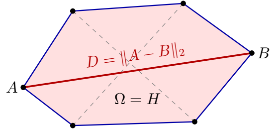
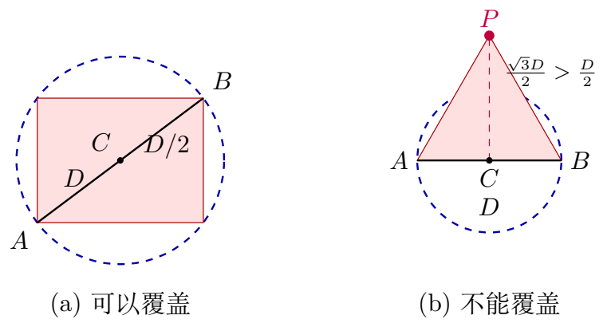

# 5 问题一：交会定位区域的构建与直径计算

单次示向测量只能约束干扰源所在的方向区间，无法唯一确定其位置。本章将有界示向误差转化为平面几何约束，通过不同检测位置的观测构建公共定位区域，并计算该区域的最大空间跨度。在此基础上，进一步判断以区域直径为直径构造的圆能否覆盖全部候选位置，为后续精确定位与清除提供依据。

## 5.1 示向误差几何模型

以目标圆域中心 $O$ 为原点建立平面直角坐标系，$x$ 轴正向向东，$y$ 轴正向向北，坐标单位为米。方位角以正东方向为零度，逆时针为正。设第 $i$ 个检测点为 $S_i=(x_i,y_i)$，同一频道的示向读数为 $\theta_i$。由于测向误差上界为 $\varepsilon=1^\circ$，真实方位角 $\varphi_i$ 满足

$$
\theta_i-\varepsilon\leq\varphi_i\leq\theta_i+\varepsilon.
$$

上述区间按圆周角理解；跨越 $0^\circ$ 时，应将角度连续展开或采用模 $360^\circ$ 的等价判定。定义两条边界射线的单位方向向量

$$
\boldsymbol u_i^-=
\begin{pmatrix}
\cos(\theta_i-\varepsilon)\\
\sin(\theta_i-\varepsilon)
\end{pmatrix},\qquad
\boldsymbol u_i^+=
\begin{pmatrix}
\cos(\theta_i+\varepsilon)\\
\sin(\theta_i+\varepsilon)
\end{pmatrix}.
$$

其中三角函数计算时将角度转换为弧度。记二维叉积为 $\boldsymbol a\times\boldsymbol b=a_xb_y-a_yb_x$，则一次测向对应的可行扇区为

$$
W_i=\left\{P:\boldsymbol u_i^-\times(P-S_i)\geq0,
\quad\boldsymbol u_i^+\times(P-S_i)\leq0\right\}.
$$

因此，可行位置位于两条边界射线之间，而非仅在示向中心线上。由于同一地点的测量误差在一段时间内保持不变，本模型不通过同点重复测量求平均来消除误差，而是利用不同位置的几何交会缩小候选范围。

本章遵循问题一程序的默认设定，仅使用示向角和目标圆域约束，不叠加有效接收半径及 $5\,\mathrm m$ 近场盲区。因而这里得到的是该建模口径下的候选区域；与完整物理约束下的候选集合应作区分。

## 5.2 交会定位区域构建

已知干扰源位于半径为 $1800\,\mathrm m$ 的目标圆域内，即

$$
B_0=\{(x,y):x^2+y^2\leq1800^2\}.
$$

同一干扰源的位置必须同时满足全部测向约束，故公共定位区域为

$$
\boxed{\Omega=B_0\cap\bigcap_{i=1}^{m}W_i}.
$$

采用增量求交方式，令 $\Omega_0=B_0$，依次计算

$$
\Omega_i=\Omega_{i-1}\cap W_i,\qquad i=1,2,\ldots,m.
$$

由集合交运算可知 $\Omega_i\subseteq\Omega_{i-1}$，故新增观测不会扩大定位区域。但区域缩小程度取决于各检测点的空间构型，不能保证每次观测均带来严格收缩。

数值实现采用 Shapely 进行几何布尔运算[1]。目标圆每象限离散为 64 段，形成 256 边形；扇区外圆弧默认采用 65 个采样点。因此，程序输出是连续几何区域的多边形近似，记为 $\widehat\Omega$。为将无限扇区转化为有限几何对象，设置截断距离

$$
L_i=\|S_i-O\|+1800+1.
$$

对于任意 $P\in B_0$，由三角不等式得 $\|P-S_i\|\leq1800+\|S_i-O\|<L_i$，故理想扇区的截断不排除目标圆域内的点。折线离散仍存在近似误差，不能将其等同于解析圆弧运算。若某次交集为空，或面积不超过 $10^{-8}\,\mathrm{m}^2$，程序报告公共区域为空或退化；其中退化情形不必然意味着观测矛盾，也可能是交集维数降低。

[图 5-1：多点示向误差扇区及交会定位区域示意图（PDF）](figures/intersection.pdf)

> **区域构建算法：** 输入同一频道测向数据与误差上界；初始化 $\widehat\Omega\leftarrow\widehat B_0$；依检测顺序构造扇区多边形并更新 $\widehat\Omega\leftarrow\widehat\Omega\cap\widehat W_i$；若交集为空或面积不超过阈值则报告异常，否则输出最终定位多边形。

## 5.3 定位区域直径计算

区域直径刻画任意两种候选位置之间可能出现的最大距离，定义为

$$
D=\operatorname{diam}(\Omega)=\max_{P,Q\in\Omega}\|P-Q\|_2.
$$

设 $H=\operatorname{Conv}(\Omega)$。任取凸包内两点 $X=\sum_i\alpha_iP_i$、$Y=\sum_j\beta_jQ_j$，其中 $P_i,Q_j\in\Omega$，系数非负且分别求和为 1，则

$$
\|X-Y\|_2
=\left\|\sum_{i,j}\alpha_i\beta_j(P_i-Q_j)\right\|_2
\leq\sum_{i,j}\alpha_i\beta_j\|P_i-Q_j\|_2
\leq D.
$$

结合 $\Omega\subseteq H$，可得 $\operatorname{diam}(H)=\operatorname{diam}(\Omega)$。对于数值多边形，其凸包中的任一点均为凸包顶点的凸组合，同理可知最远点对能够在凸包顶点中取得。这一“先求凸包、再在凸包边界上搜索最远点对”的处理属于计算几何中的经典直径问题[2]。

设数值凸包顶点为 $P_1,\ldots,P_h$，则计算

$$
(A,B)\in\operatorname*{arg\,max}_{1\leq i<j\leq h}\|P_i-P_j\|_2,
\qquad \widehat D=\|A-B\|_2.
$$

后文算例中的直径均指计算得到的 $\widehat D$，为简洁仍记作 $D$。当前程序采用凸包顶点两两枚举，共比较 $h(h-1)/2$ 组距离，直径搜索的时间复杂度为 $O(h^2)$，存储顶点所需额外空间为 $O(h)$。这不等同于寻找多边形最长边，因为最远点对可能是两个不相邻顶点。

本章默认约束的交集本身为凸集，凸包操作主要用于统一几何处理流程与提取候选极点。图 5-2 以不规则凸多边形说明枚举过程，不引入虚构实验数值。

> **直径搜索算法：** 求定位多边形的凸包并提取 $h$ 个顶点；初始化 $D=0$；对 $i=1,\ldots,h-1$ 以及 $j=i+1,\ldots,h$，计算 $d_{ij}=\|P_i-P_j\|_2$；当 $d_{ij}>D$ 时更新 $D$ 及端点 $A=P_i,B=P_j$；最终返回 $D,A,B$。

## 5.4 直径圆覆盖性分析

由直径端点构造圆盘

$$
\mathcal C=\{P:\|P-C\|_2\leq D/2\},\qquad C=(A+B)/2.
$$

端点 $A,B$ 必然位于圆周上，但这不能证明其他候选点也在圆内。对定位多边形的全部边界顶点 $P_k$ 检查

$$
\|P_k-C\|_2\leq D/2+\tau,
\qquad \tau=\max(10^{-9}\,\mathrm m,10^{-10}D).
$$

圆盘是凸集，若所有顶点均在圆盘内，其凸组合也在圆盘内，因而整个多边形被覆盖；反之，只要一个顶点位于圆外，即可否定覆盖性。在忽略数值容差时，由恒等式

$$
(P_k-A)\cdot(P_k-B)=\|P_k-C\|_2^2-D^2/4
$$

可得等价的泰勒斯圆判据 $(P_k-A)\cdot(P_k-B)\leq0$。加入距离容差后，点积判据的右端相应变为 $D\tau+\tau^2$。这里的容差用于控制浮点舍入影响，不代表圆弧离散误差的上界。

**直径圆并不一定覆盖整个定位区域。** 以边长为 $D$ 的等边三角形为例，其区域直径也为 $D$。选择任一边 $AB$ 构造直径圆，第三个顶点 $P$ 到边中点的距离为

$$
\|P-C\|_2=\frac{\sqrt3}{2}D>\frac D2,
$$

故 $P$ 位于圆外。相较之下，矩形以对角线为直径构造的圆能够覆盖整个矩形。该反例否定的是一般性的必然覆盖命题；程序对每个具体区域仍需独立判断，而不能始终返回否定结果。直径圆也不应直接称为最小覆盖圆。

## 5.5 算例与结果分析

选取仓库运行日志 `P3_run_log.jsonl` 中频道 4 的前三个不同检测位置，记录位于日志第 5、77、79 行。三条记录均为已接受且返回示向度的测量响应，属于同一运行中同一频道的观测。此处仅作为日志算例展示几何算法，不将其视为独立正式评测结论。表中输入坐标保留八位小数以便复核，实际计算使用原始日志精度。

**表 5-1 主算例测向输入数据**

| 检测点 | $x_i/\mathrm m$ | $y_i/\mathrm m$ | $\theta_i/(^\circ)$ | 误差范围 |
|---|---:|---:|---:|---:|
| $S_1$ | 0.00000000 | 0.00000000 | 186.06 | $\pm1^\circ$ |
| $S_2$ | -845.15139195 | -403.18365019 | 95.97 | $\pm1^\circ$ |
| $S_3$ | -877.29411572 | -93.23217920 | 122.92 | $\pm1^\circ$ |

数据来源：仓库 `P3_run_log.jsonl`，频道 4，按顺序选取前三个不同检测位置；计算使用日志原始精度。

**表 5-2 主算例计算结果**

| 指标 | 数值 |
|---|---:|
| 定位区域面积 / $\mathrm{m}^2$ | 2.97 |
| 边界顶点数 | 3 |
| 直径 $D$ / $\mathrm m$ | 13.53 |
| 端点 $A$ / $\mathrm m$ | $(-877.29,-93.23)$ |
| 端点 $B$ / $\mathrm m$ | $(-884.45,-81.75)$ |
| 圆心 $C$ / $\mathrm m$ | $(-880.87,-87.49)$ |
| 半径 $D/2$ / $\mathrm m$ | 6.76 |
| 直径圆是否覆盖 | 是 |

依次加入三次观测后，候选区域面积分别为 $56543.26\,\mathrm{m}^2$、$335.25\,\mathrm{m}^2$ 和 $2.97\,\mathrm{m}^2$。可见，不同位置的测向约束交会后，狭长扇区逐渐收缩为小范围候选区域。最终区域有三个边界顶点，直径为 $D=13.53\,\mathrm m$，表示最不利方向上的最大空间不确定尺度。

本算例的全部顶点通过覆盖判据检验，直径圆能够覆盖数值定位区域，其半径为 $6.76\,\mathrm m$，小于清除半径 $20\,\mathrm m$。因此，在本章几何模型和数值精度下，以圆心 $C$ 为清除位置满足覆盖要求。一般情况下，不能仅凭 $D\leq40\,\mathrm m$ 就作出相同判断，还必须确认候选区域被相应圆覆盖。

值得注意的是，本算例中端点 $A$ 与第三检测位置重合，这是默认模型保留扇区顶点、未剔除近场盲区的结果，并非断言干扰源位于检测点。本章未开展圆弧离散精度敏感性实验，因此不对默认离散参数的收敛精度作额外结论。

## 5.6 问题一结论

通过将 $\pm1^\circ$ 示向误差转化为扇区约束，并与目标圆域进行增量求交，得到同一干扰源的定位可行区域；随后对数值区域的凸包顶点进行两两距离比较，获得区域直径及一组端点。多点观测能够把单次观测形成的狭长扇区逐步收缩为有限候选区域。

区域直径刻画最大空间不确定性，但以该直径构造的圆并不必然覆盖全部候选位置。以直径端点中点为圆心、以 $D/2$ 为半径时，仍须检验全部边界顶点。上述区域、直径端点、圆心与覆盖结论可作为后续检测点选择和清除策略的几何基础。
