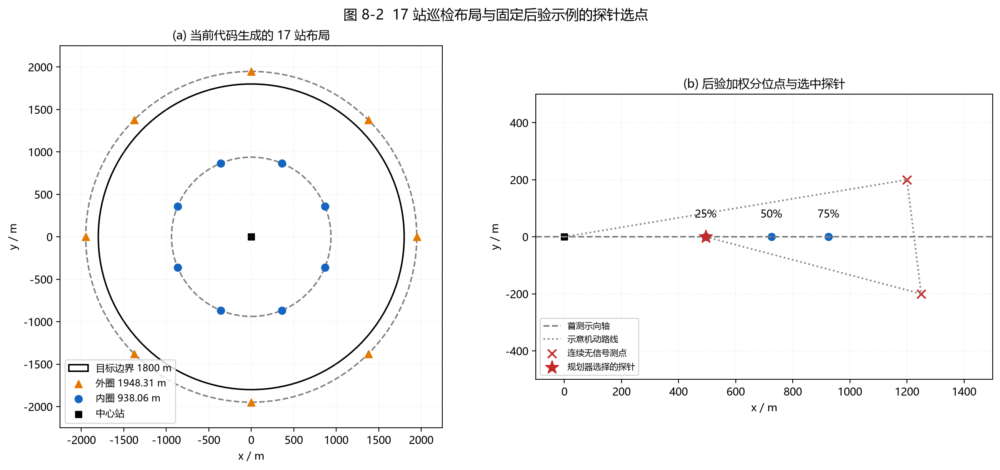

# 8 问题四：全向与定向干扰源混合情况下的搜索与清除

实际复杂电磁环境中，干扰源往往并非单一的全向辐射源，而是同时存在全向辐射与定向辐射两类混合源。相较于前述问题，本章面临的核心挑战在于干扰源类型未知以及定向辐射盲区带来的观测不确定性：定向源仅在其主瓣辐射角域内发射信号，当机器狗处于辐射盲区时，即使距离极近也无法检测到任何信号。这种“无信号”观测具有“超出有效接收距离”与“处于定向源辐射盲区”的双重歧义性。

针对上述难题，本章摒弃先硬判源类型再分别处理的传统思路，提出一套基于**混合源联合离散状态建模**与**多点测向连续几何接管**的鲁棒搜索与清除策略。算法在观测层面同时维护全向与定向源的联合加权假设，利用无信号观测对状态空间进行有效剪枝；在选点探测层面，融合 17 站初始巡检布局、基于最坏覆盖尺度的自适应选点与示向轴分位点探针回退机制；在两次异地测向后，无缝切入问题一的连续几何优化求解器，实施严格的 $20\,\mathrm{m}$ 最小外接圆覆盖清除判据与失败区域精确布尔扣除；在全局调度层面，依托开放路线启发式规划与限制评分退化的跨频道测点共享机制，实现多目标高效清除。

---

## 8.1 混合干扰源建模与观测更新

### 8.1.1 混合辐射特性与观测双重歧义性

设监控区域为半径 $R = 1800\,\mathrm{m}$ 的目标圆域 $B_0 = \{z \in \mathbb{R}^2 : \|z\| \le R\}$，场内存在未知数目（$10 \le K \le 16$）的干扰源，分别工作于 20 个互异频道。每个干扰源的位置 $z = (x, y)^\top \in B_0$ 保持静止，其信号有效接收距离为固定但未知的常数 $r \in [r_{\min}, r_{\max}]$，其中 $r_{\min} = 1000\,\mathrm{m}$，$r_{\max} = 1500\,\mathrm{m}$。

在本问题中，干扰源分为全向源（Omnidirectional, 记为 $\tau = O$）与定向源（Directional, 记为 $\tau = D$）：
1. **全向干扰源**：以 $z$ 为圆心，在半径 $r$ 内沿所有 $360^\circ$ 方向均匀辐射；
2. **定向干扰源**：具有固定的主瓣辐射朝向 $\phi \in [0, 2\pi)$。其有效辐射角域为以朝向 $\phi$ 为中心线、两侧各张角 $90^\circ$ 的半平面圆域，总覆盖角跨度为 $180^\circ$（包含角域边界）。当且仅当测点位于该辐射半平面且距离不超过 $r$ 时，测向设备方可接收到射频信号。
3. **光学定位与清除特性**：机器狗搭载的光学传感器与清除执行机构仅依赖空间物理距离，有效作用半径为 $r_{\rm clear} = 20\,\mathrm{m}$，近场触发阈值为 $r_{\rm near} = 5\,\mathrm{m}$。光学探测与物理清除与干扰源的辐射朝向完全无关，定向源的背向盲区不对清除动作造成任何阻碍。

由此，当机器狗在位置 $s \in \mathbb{R}^2$ 执行检测并返回“无信号”（`no_signal`）时，系统产生本质的物理歧义：
- **距离受限**：机器狗与干扰源的距离超出其接收半径，即 $\|s - z\| > r$；
- **朝向受限**：机器狗位于接收半径以内（$\|s - z\| \le r$），但落入定向源的背向 $180^\circ$ 辐射盲区内。

若过早将无信号观测解释为“该区域无源”而直接进行空间裁剪，将导致大量在盲区内的定向源被永久漏检；反之，若完全忽略无信号的负向约束，又会失去缩小搜索空间的关键信息。因此，必须建立兼容两类假设的联合状态空间。

### 8.1.2 联合加权状态表示

对每一个尚未被清除的频道，建立联合假设状态：
$$
h = (z, r, \tau, \phi),
$$
其中 $z \in B_0$ 为候选目标位置；$r \in [1000, 1500]\,\mathrm{m}$ 为接收半径；$\tau \in \{O, D\}$ 为干扰源类型；$\phi \in [0, 2\pi)$ 为定向辐射朝向（当 $\tau = O$ 时，$\phi$ 缺省）。

为实现数值计算与选点评价，继承第 6 章建立的空间六边形网格离散体系：
1. **候选位置离散**：将首次可行域用外接半径为 $\delta_i$ 的正六边形单元剖分，提取代表点 $z_i$，初始面积权重为 $w_i = A_i / \sum_j A_j$；
2. **接收半径离散**：在每个位置 $z_i$ 上，仅保留满足 $r \ge \max(r_{\min}, \|z_i - S_1\|)$ 的离散半径样本 $r_{ij}$，并平分位置权重；
3. **辐射朝向离散**：对定向假设 $\tau = D$，在圆周 $[0^\circ, 360^\circ)$ 上以步长 $\Delta\phi = 10^\circ$ 均匀离散为 36 个朝向角 $\phi_m = m \Delta\phi$（$m = 0, 1, \ldots, 35$）。

定义单点测点 $s$ 对状态 $h$ 的**信号可见性示性函数** $V_h(s)$：
$$
V_h(s) = \mathbf{1}\{\|s - z\| \le r\} \cdot \mathbf{1}\Big\{\tau = O \;\lor\; |\operatorname{wrap}(\arg(s - z) - \phi)| \le 90^\circ\Big\},
$$
式中 $\arg(s - z)$ 表示由干扰源 $z$ 指向检测点 $s$ 的空间向量方向角；$\operatorname{wrap}(\cdot) \in [-180^\circ, 180^\circ]$ 为角度模差转换算子。

> [!IMPORTANT]
> **几何朝向与测向示向度的本质区分**：
> 在式中，定向源的角域覆盖约束必须基于“**干扰源指向测点**”的向量 $s - z$ 与辐射朝向 $\phi$ 计算；而测向仪返回的示向度读数 $\theta$ 则是基于“**测点指向干扰源**”的向量 $z - s$。两者相差 $180^\circ$，在建模中绝不可混淆。

### 8.1.3 观测相容性与权重增量更新

设机器狗在测点 $s_k$ 获得该频道的观测 $o_k$。状态 $h$ 与观测 $o_k$ 的相容性判断准则如表 8-1 所示。

**表 8-1 混合假设下三类观测的相容保留条件**

| 观测类型 $o_k$ | 数值反馈特征 | 状态 $h = (z, r, \tau, \phi)$ 相容保留条件 | 对搜索过程的物理意义 |
|---|---|---|---|
| 有方向 (`direction`) | 获得示向读数 $\theta_k$ | $V_h(s_k) = 1$ 且 $\|s_k - z\| > r_{\rm near}$，同时满足示向误差相容：$|\operatorname{wrap}(\arg(z - s_k) - \theta_k)| \le \varepsilon_{\rm eff}$ | 严格约束目标空间方位，定向源仅保留朝向测点侧的假设 |
| 近距离 (`near`) | 近场强信号导致测向饱和 | $V_h(s_k) = 1$ 且 $\|s_k - z\| \le r_{\rm near}$ | 目标已被高度截获，可在当前位置立即触发清除 |
| 无信号 (`no_signal`) | 未检测到射频载波 | $V_h(s_k) = 0$ | 剔除所有“距离内且处于辐射半平面”的矛盾假设 |

其中，有方向观测中的有效容差为：
$$
\varepsilon_{\rm eff} = \varepsilon + 0.125^\circ + \frac{180^\circ}{\pi}\arcsin\left(\frac{\delta_i}{\max(\|s_k - z_i\|, \delta_i)}\right),
$$
式中 $\varepsilon = 1^\circ$ 为测向仪器误差，$0.125^\circ$ 为分箱离散余量，最后一项为六边形单元空间尺度的角跨度缓冲。

在初始阶段，设定全向与定向源的先验权重各占 $50\%$，定向朝向均分其权重：
$$
w_0(z, r, \tau = O) = 0.5 \cdot w(z, r),\qquad w_0(z, r, \tau = D, \phi_m) = \frac{0.5}{36} \cdot w(z, r).
$$
当获得相容观测后，本文借鉴贝叶斯状态估计中的“先验权重乘以观测似然并归一化”框架[9]，将确定性相容示性函数作为离散观测似然，得到：
$$
w_{k+1}(h) = \frac{w_k(h) \cdot \mathbf{1}\{h \text{ 与 } o_k \text{ 相容}\}}{\sum_{h'} w_k(h') \cdot \mathbf{1}\{h' \text{ 与 } o_k \text{ 相容}\}}.
$$
上述归一化仅在分母大于零时执行。若一次更新使全部相容权重归零，更新函数返回失败，控制器重新获取首次方向观测对应的 P2 位置—半径样本，按全向、定向各一半恢复初始权重，再按时间顺序重放历史观测，最后重新扣除已记录的失败清除圆。这一过程不改变网格步长，也不自动扩展朝向或位置样本。

重构属于数值恢复尝试。当前历史重放过程没有逐项检查更新失败返回值，因此重构返回不等于已经验证全部历史观测相容：失败的离散更新不会提交新的权重，而有方向观测对连续区域的求交可能已执行。本文据此将离散后验用于候选点评分，不将重构本身作为一致性证明。对清除失败后出现的空连续区域，控制器重构一次；若区域仍为空，则报告观测与清除反馈不一致并停止该次控制运行，不能将此类异常记为任务完成。

必须指出，上述权重更新是算法在无真值先验情形下设计的**离散加权后验近似**，旨在评价不同候选测点的综合辨识收益，并不等同于客观物理世界的真实概率分布。

系统在实现上严格区分**两套表示体系**：
1. **离散加权状态集合**：用于计算接收概率、分支尺度预测与驱动自适应测点优化；
2. **连续几何区域**：用于维护由示向扇区交集构成的几何可行域 $\Omega_k$。无信号观测仅用于离散状态的权重剪枝，**不直接对连续位置多边形执行布尔裁剪**，以防止由于有限离散误差造成不可逆的区域误切。


> **图 8-1 说明：** 左图为定向源的可见半圆、背向盲区和距离外测点。中、右图为代码生成的离散后验示例：取首测 $S_1=(0,0)$、示向 $0^\circ$，随后在 $(1200,200)$ 获得无信号，在 $(600,0)$ 获得指向示例真值 $(1000,10)$ 的方向读数。颜色对应不同观测阶段；柱形为归一化的源类型假设权重，并非真实类型发生频率。该图是固定观测序列的机制示例，不是演练统计。

---

## 8.2 初始巡检与自适应探测

### 8.2.1 17 站巡检布局与朝向盲区分析

为在未知目标全域分布的前提下实现高效初始感知，本章设计了一套基于正八边形几何对称性的 **17 站初始巡检布局**。

设目标区域半径为 $R = 1800\,\mathrm{m}$，最小接收半径为 $r_0 = 1000\,\mathrm{m}$。17 个巡检站点由 1 个中心原点站、8 个外圈站点与 8 个内圈站点组合而成：
1. **中心站**：$S_0 = (0, 0)^\top$；
2. **外圈 8 站（外切正八边形顶点）**：
   $$
   R_{\rm out} = \frac{R}{\cos 22.5^\circ} \approx 1948.31\,\mathrm{m},
   $$
   方位角为 $\theta_{\rm out}^{(i)} = 45^\circ \times i$（$i = 0, 1, \ldots, 7$）；
3. **内圈 8 站（内接正八边形边为弦的圆心轨道）**：
   内接正八边形边长之半为 $L/2 = R \sin 22.5^\circ \approx 688.83\,\mathrm{m}$。以其边为探测圆的弦，则弦心距为 $h = \sqrt{r_0^2 - (R \sin 22.5^\circ)^2} \approx 724.92\,\mathrm{m}$。八边形边心距为 $d_{\rm edge} = R \cos 22.5^\circ \approx 1662.98\,\mathrm{m}$。内圈站的轨道半径定义为：
   $$
   R_{\rm in} = R\cos 22.5^\circ - \sqrt{r_0^2 - R^2 \sin^2 22.5^\circ} \approx 938.06\,\mathrm{m},
   $$
   方位角为 $\theta_{\rm in}^{(j)} = 45^\circ \times j + 22.5^\circ$（$j = 0, 1, \ldots, 7$）。

机器狗允许在目标圆域外移动，因此外圈站位于 $1800\,\mathrm{m}$ 以外是完全合法且符合竞赛规则的。初始阶段，系统生成最多 $17 \times 20 = 340$ 个巡检任务项。一旦某频道在任意站点检测到信号，立即中止该频道的巡检，刷新为高优先级的定向跟踪与清除任务。

**定理 8-1：半圆定向辐射的巡检覆盖判定条件。** 设有限巡检站集合为 $\mathcal P=\{S_0,\ldots,S_{M-1}\}$。对任一候选源位置 $z\in B_0$，定义最小接收距离内的站点集合
$$
\mathcal N(z)=\{S_j\in\mathcal P:\|S_j-z\|\le r_0\},\qquad r_0=1000\,\mathrm m.
$$
若对目标区域内每个位置均满足
$$
\boxed{z\in\operatorname{conv}\mathcal N(z),\qquad \forall z\in B_0,}
$$
则对于任意源位置 $z\in B_0$、任意辐射朝向 $\phi\in[0,2\pi)$，至少存在一个站点处于该源的有效辐射半圆内，即
$$
\exists S_j\in\mathcal P:\quad
\|S_j-z\|\le r_0,\qquad
(S_j-z)\cdot\boldsymbol u(\phi)\ge0,
\quad \boldsymbol u(\phi)=(\cos\phi,\sin\phi)^\top.
$$
因实际接收半径 $r\ge r_0$，该站点也位于实际接收范围内。这里“发现”包括获得示向度和返回近场饱和 `near` 两种响应。

**证明。** 固定任意 $z\in B_0$。由凸包包含条件，存在非负系数 $\lambda_j$，满足
$$
\sum_{S_j\in\mathcal N(z)}\lambda_j=1,\qquad
\sum_{S_j\in\mathcal N(z)}\lambda_j(S_j-z)=0.
$$
任取朝向 $\phi$。若所有可达站点均在辐射半平面之外，则对每个 $S_j\in\mathcal N(z)$ 都有 $(S_j-z)\cdot\boldsymbol u(\phi)<0$。由于系数非负且至少一个为正，对这些不等式加权求和得
$$
\sum_j\lambda_j(S_j-z)\cdot\boldsymbol u(\phi)<0.
$$
但由凸组合恒等式，左端又等于
$$
\left[\sum_j\lambda_j(S_j-z)\right]\cdot\boldsymbol u(\phi)=0,
$$
矛盾。因此至少有一个可达站点满足非负点积，同时满足距离上界，故该站位于有效辐射半圆内。位置和朝向均为任意，命题得证。$\square$

该判据将“对所有朝向逐一检验”转化为局部站点凸包包含问题。若 $z$ 与各可达站点不重合，也可将可达站的方位排序为 $\alpha_1\le\cdots\le\alpha_m$，令 $\alpha_{m+1}=\alpha_1+2\pi$，则等价的角度条件为
$$
\max_{1\le j\le m}(\alpha_{j+1}-\alpha_j)\le\pi.
$$
等号可以成立，因为题设将辐射朝向两侧的 $90^\circ$ 边界包含在有效角域中。对站点与源位置重合的情形，直接采用闭半平面的点积表示，并归入近场处理，避免使用未定义的方位角。上述定理提供巡检布局的发现完备性判据；目标发现后的定位与清除由下节的反馈决策完成。

**21 站完备覆盖对照方案。** 为区分几何覆盖保证与实际控制中的效率取舍，另构造以下巡检布局（坐标单位均为米）：
$$
\begin{aligned}
S_0&=(0,0),\\
S_{k+1}&=\operatorname{round}_6\!\left(1864\cos\frac{k\pi}{6},\;1864\sin\frac{k\pi}{6}\right),&&k=0,\ldots,11,\\
S_{j+13}&=\operatorname{round}_6\!\left(995\cos\frac{j\pi}{4},\;995\sin\frac{j\pi}{4}\right),&&j=0,\ldots,7.
\end{aligned}
$$
这里 $\operatorname{round}_6$ 表示将每个坐标舍入至小数点后六位；精确坐标见随文证书。该方案由中心站、12 个外圈站和 8 个内圈站组成，需要重新配置内外圈坐标，并非在原坐标不变的基础上仅追加 4 站。以下证明适用于舍入后的实际坐标；21 站是一个可证可行的构造，尚未证明其站数全局最少。

**定理 8-2：21 站布局的全域发现保证（计算机辅助证明）。** 对上述布局，任意 $z\in B_0=\{z:\|z\|\le1800\}$ 均属于某三个站点的凸包，且到这三个站点的距离均不超过 $999\,\mathrm m$。因此，在题设闭半圆定向辐射、接收半径至少为 $1000\,\mathrm m$ 的模型下，对任意源位置和辐射朝向，完整巡检这些站点必能发现该源。

**证明。** 对非共线站点三元组 $I=\{a,b,c\}$，定义凸见证区域
$$
K_I=\operatorname{conv}\{S_a,S_b,S_c\}\cap\bigcap_{i\in I}\overline B(S_i,999).
$$
只需证明 $B_0\subseteq\bigcup_I K_I$。为避免将随机抽样或浮点几何容差作为全域证明，本方案给出有限区域划分证书，并按以下步骤进行精确验证。

（1）**构造包围多边形。** 令 $P$ 的 12 个顶点为
$$
v_k=\operatorname{round}_6\!\left(\frac{1800.1}{\cos15^\circ}(\cos30k^\circ,\sin30k^\circ)\right),\qquad k=0,\ldots,11.
$$
将所有坐标乘以 $10^6$ 转为整数，以 $\widehat v_k$ 表示。对每条有向边 $a\to b$，验证所有顶点在其左侧，同时验证
$$
h=\operatorname{cross}(b-a,-a)>0,\qquad
h^2\ge(1800\times10^6)^2\|b-a\|^2.
$$
前者确认凸多边形的逆时针边界，后者确认原点到每条边所在直线的距离至少为 $1800$ 米。因此整个目标圆域位于每条边的内侧闭半平面内，得到 $B_0\subseteq P$。这些整数不等式直接处理舍入后的顶点，无需假定舍入保留理想正多边形的内切圆。

（2）**验证无缝有限划分。** 证书从 $P$ 开始递归切分。每次采用经过两站点的直线，或当前多边形横、纵坐标范围中点所确定的直线，将父区域与两侧闭半平面分别求交。交点以有理数精确计算；两个子区域的并集恒等于父区域，公共边界同时保留。证书包含 455 个树节点、228 个叶区域，最大深度为 17。逐层归纳可得这些凸叶多边形 $Q_\ell$ 的并集恰为 $P$。

（3）**验证每个叶区域的覆盖见证。** 每个 $Q_\ell$ 附带一个非共线站点三元组 $I_\ell$。对其每个顶点 $q$，用三条有向边的叉积符号验证
$$
q\in\operatorname{conv}\{S_i:i\in I_\ell\},
$$
并用有理数平方距离验证
$$
\|q-S_i\|^2\le999^2,\qquad \forall i\in I_\ell.
$$
三角形和三个闭圆盘均为凸集，故其交集 $K_{I_\ell}$ 也是凸集。叶多边形所有顶点均属于该交集，便推出整个 $Q_\ell\subseteq K_{I_\ell}$。由此得到
$$
B_0\subseteq P=\bigcup_{\ell=1}^{228}Q_\ell
\subseteq\bigcup_{\ell=1}^{228}K_{I_\ell}.
$$
对于任意目标位置，见证三角形的三个站点均在最小接收范围内，且其凸包包含该位置。应用定理 8-1 即得任意朝向下的发现保证。$\square$

上述有限证书保存在 [coverage21_certificate.json](coverage21_certificate.json)，验证器为 [coverage21_proof.py](coverage21_proof.py)。在项目根目录运行 `python3 -B paper/problem4/coverage21_proof.py`，即可用 Python 标准库独立复核全部包含关系、距离不等式及划分完整性。证书构造使用浮点几何寻找候选划分，但证明的接受条件全部为整数或有理数精确运算，不使用抽样通过率或数值容差。这里的保证针对巡检发现；发现后的定位、清除成功与总耗时仍取决于后续决策。

**实际采用 17 站的效率取舍。** 本文保留 21 站作为发现完备性的对照构造，实际控制器仍使用前述 17 站布局，以减少初始巡检开销。在 20 个频道均执行未剪枝完整巡检的比较口径下，21 站对应 420 个站点—频道检测项，17 站对应 340 个，减少 80 个，即 $19.05\%$。按每次检测固定耗时 5 秒计算，这部分检测耗时由 2100 秒降至 1700 秒，减少 400 秒；该计算不包含移动与切频，也不代表实际演练总耗时的改善量，提前发现和任务剪枝还会改变实际检测次数。

> **Warning — 17 站巡检覆盖的学术严谨性边界。** 选择 17 站意味着接受某些源位置与朝向组合下的漏检风险，放弃 21 站方案所具有的最坏情形发现保证。例如取定向源位置 $(880,0)$、接收半径 $1000$ 米、朝向正东，原 17 站中距离可达的站点只有中心站和方位角为 $\pm22.5^\circ$ 的两个内圈站，三者均在源的背向半平面内，因此完整巡检也可能无信号。本文将实际布局定义为“高密度对称几何巡检布局”，全站未发现信号仅作为工程终止判据，不能推出“全域必无定向源”。目前未给出源位置与朝向的概率分布及相应漏检统计，故只能称为“接受一定漏检风险”，不能将其表述为已经证实的“小概率漏检”。

### 8.2.2 首次方向后的混合自适应选点

当某频道首次获得示向读数 $\theta_1$ 后，系统建立混合后验。在未触发覆盖清除、概率试射或探针任务时，进入自适应选点阶段。为兼顾计算效率与空间几何质量，算法复用第 6 章问题二预先生成的候选点空间几何，提取已排序列表中的前 $M = 48$ 个未测位置 $\mathcal{C} = \{s_1', s_2', \ldots, s_M'\}$，利用该频道当前的混合加权后验进行全面复评。

对于任一候选测点 $s' \in \mathcal{C}$，枚举其潜在观测的三类分支结局：
1. **近距离分支 (`near`)**：目标位于 $\|s' - z\| \le 5\,\mathrm{m}$ 且处于可见角域内，其定位支撑半径直接坍缩为 $r_{\rm near} = 5\,\mathrm{m}$；
2. **无信号分支 (`no_signal`)**：测点落入接收距离外或定向盲区，利用保留状态计算最小覆盖圆外接半径，记为 $R_{\rm no\_sig}$；
3. **有方向分支 (`direction`)**：根据真实方位角划分为步长为 $5^\circ$ 的方位角区间箱（Bin）。对每个区间内的相容状态点集，求其最小外接圆半径加上单元离散尺度 $\delta_{\max}$，得到该方位的定位支撑尺度 $R_{\rm dir}(\theta)$。

由此，计算候选测点 $s'$ 的四大核心评估指标：
- **最坏覆盖半径**：$R_{\max}(s') = \max_{b \in \text{branches}} \widehat{R}_b$；
- **加权期望半径**：$\bar{R}(s') = \sum_{b} p_b \widehat{R}_b$；
- **有效接收概率**：$p_s(s') = \sum_{b \ne \text{no\_sig}} p_b$；
- **移动距离成本**：$L(s') = \|s' - s_{\rm current}\|$。

候选点采用严格的**字典序最小化准则**进行择优：
$$
s^* = \arg\min_{s' \in \mathcal{C}} \operatorname{lex}\Big(R_{\max}(s'),\; \bar{R}(s'),\; -p_s(s'),\; L(s')\Big).
$$
采用 $5^\circ$ 方位角分箱可以减少候选点评估的分支数。上述半径是离散分支的预测尺度，字典序依次比较最坏尺度、加权平均尺度、接收权重和机动距离；实际观测仍按 8.1.3 节的相容条件更新。

### 8.2.3 连续无信号触发的示向轴分位点探针

在实际跟踪定向源的过程中，机器狗常因候选点选在定向源背侧而遭遇连续无信号。若继续沿用离散候选网格，算法可能陷入局部循环。为此，本章设计了**示向轴分位点探针搜索策略**。

当某频道的非巡检测量连续两次返回 `no_signal` 时，控制器设置探针标志（`search_mode = probe`）。只有该频道尚未获得两处异地方向观测，且本轮没有先生成清除任务时，才执行以下探针选点；连续几何阶段具有更高优先级，不受该标志改变：
1. **深度轴投影**：设该频道首次测向位置为 $S_1$，测得示向角为 $\theta_1$，对应的空间单位示向向量为 $\boldsymbol{u}_1 = (\cos\theta_1, \sin\theta_1)^\top$。将当前所有保留状态的目标代表点 $z_i$ 投影至该射线轴上，定义沿轴深度：
   $$
   d_i = (z_i - S_1) \cdot \boldsymbol{u}_1.
   $$
2. **加权分位点提取**：根据目标边际权重 $w(z_i)$，计算深度分布累积权重达到 $25\%$、$50\%$ 与 $75\%$ 的三个关键深度节点：
   $$
   d_{0.25},\quad d_{0.50},\quad d_{0.75}.
   $$
   由此在示向轴上生成三个探针候选测点：
   $$
   P_{(q)} = S_1 + d_q \boldsymbol{u}_1, \qquad q \in \{0.25, 0.50, 0.75\}.
   $$
3. **最优探针决策**：剔除已测过的点位后，将候选探针输入评价模型，按 $(R_{\max}, \bar{R}, L)$ 字典序选定最佳探针点实施机动探测。

获得 `direction` 或 `near` 后，连续无信号计数清零、探针标志复位；随后重新按优先级派发任务：`near` 生成原地清除，新增方向使异地测向数达到两处则进入几何阶段，否则保留自适应模式。若三个分位点均已测过，探针规划返回空，改用自适应候选；若自适应候选也耗尽，则选择连续区域内部代表点测向。

> [!NOTE]
> **探针机制的学术边界**：
> 探针策略本质上是一种针对纵深不确定性设计的**空间候选生成启发式**。探针点获得的任何观测均直接输入混合源联合状态空间进行统一贝叶斯更新，系统并不采用简单的一维“二分法”截断上下界，更不依据一维区间的线段长度直接执行清除，其有效性通过二维观测更新与后续清除反馈检验。



> **图 8-2 说明：** 左图直接读取站点生成函数的坐标，外圈半径为 1948.31 米、内圈为 938.06 米。右图以首测 $(0,0),0^\circ$ 后在 $(1200,200)$、$(1250,-200)$ 连续无信号的示例后验，计算沿示向轴的三个加权分位点；红星为探针规划器选中的位置。重合分位点在图中合并标注。本图不用于证明定向源全域覆盖或探针成功率。

---

## 8.3 连续区域定位与清除反馈

### 8.3.1 异地测向后的连续几何接管

当一个频道在**两个及以上不同物理位置**获得有方向观测后，后续选点转入连续几何阶段。每次刷新任务时，调用第 5 章求解器，从全部方向记录重新构造可行区域并扣除失败清除圆。该阶段的测点不再从首测 P2 候选表或示向轴探针中选择；离散后验仍可随观测更新，但不决定几何阶段的补测位置。

设历史累积的有效方向观测索引集为 $\mathcal{I}_{\rm dir}$，失败清除点集合为 $\mathcal{I}_{\rm fail}$。连续几何定位可行区域严格定义为：
$$
D_k = B_0 \cap \left( \bigcap_{i \in \mathcal{I}_{\rm dir}} \Omega(S_i, \theta_i) \right) \;\setminus\; \bigcup_{j \in \mathcal{I}_{\rm fail}} B(c_j, r_{\rm clear}),
$$
式中 $\Omega(S_i, \theta_i)$ 为包含 $\pm 1^\circ$ 测向误差界与 $r_{\rm near}<d\le r_{\max}$ 径向距离界的多边形截断扇区；$B(c_j, r_{\rm clear})$ 为以历史失败清除点 $c_j$ 为圆心、清除半径 $r_{\rm clear} = 20\,\mathrm{m}$ 的闭圆盘。

上述集合式描述理想几何约束。数值实现以多边形逼近圆弧，使用 Shapely[1] 进行交、差运算，结果记为 $\widehat D_k$。后续实现层面的覆盖检查针对 $\widehat D_k$；多边形布尔运算精度与解析圆弧近似误差应加以区分。

### 8.3.2 最小外接圆与严格覆盖清除判据

提取可行多边形 $D_k$ 的凸包顶点序列 $\operatorname{conv}(D_k) = \{v_1, v_2, \ldots, v_p\}$，利用 Welzl 随机增量算法[4]计算其**最小外接圆**（Minimum Enclosing Circle, MEC），记圆心为 $c_k$，半径为 $\rho_k$。

系统执行**严格全覆盖清除判据**：
$$
\text{触发保证清除} \iff \rho_k \le r_{\rm clear} \;\land\; B(c_k, r_{\rm clear}) \supseteq D_k.
$$

**命题 8-2：单次清除的充分条件。** 若真实源位置 $z$ 始终属于当前可行集合 $D_k$，且 $D_k\subseteq B(c_k,20)$，则
$$
\|z-c_k\|\le20\,\mathrm m,
$$
故机器狗到达 $c_k$ 后可完成光学定位和清除。该推论不依赖源的辐射朝向，因为光学定位和清除仅受距离限制。证明直接由集合包含关系得到。

区域直径 $d_k=\operatorname{diam}(D_k)$ 与最小外接圆半径满足 $d_k\le2\rho_k$，一般不能写成等号。因此 $d_k\le40$ 并不足以替代最小外接圆覆盖判据。数值实现先计算 $\widehat D_k$ 凸包顶点的最小外接圆，要求半径不超过 $20+10^{-7}$ 米，再调用 20 米圆盘的多边形近似执行 `covers` 检查，同时排除已失败的同一清除位置。这里的数值容差用于浮点比较，不是圆弧离散误差的上界。

命题 8-2 保证的是“满足覆盖条件时，该次清除可成功”。要由此推出“发现后有限步必定清除”，还需要证明补测策略在有限步内达到该覆盖条件；单独增加补测—求交—检查的循环并不构成这一收敛证明。

### 8.3.3 几何中心补测与周边回退点生成

若连续几何阶段未生成覆盖清除任务，系统生成后续补测点，以尝试获得新的示向约束：
1. **优先测圆心**：首选最小外接圆圆心 $c_k$。若 $c_k$ 距所有历史测点均大于 $1\,\mathrm{m}$，则将机器狗调度至 $c_k$ 执行补充测向；
2. **多层同心环辐射回退点**：若圆心 $c_k$ 已经在历史测量中被访问过，为避免停滞，以基准步长 $\Delta r = \max(r_{\rm clear}, 0.5 \rho_k)$ 构造多层发散圆环。在第 $\ell$ 层环上均匀设置 16 个方向角 $\alpha_m = m \pi / 8$（$m = 0, 1, \ldots, 15$），生成测试候选点：
   $$
   s_{\rm cand}^{(\ell, m)} = c_k + \ell \Delta r \begin{pmatrix} \cos\alpha_m \\ \sin\alpha_m \end{pmatrix}.
   $$
   设历史测量记录数为 $n_k$，实现依次枚举 $\ell=1,\ldots,n_k+1$ 及各层 16 个角度，选取首个与所有历史测点距离均大于 $1\,\mathrm{m}$ 的位置派发测向任务；若没有候选位置，则报告无法生成新测点。

若补测返回 `no_signal`，该位置被记录，离散状态按不可见条件更新，连续区域不据此扣除大圆盘；下一轮重新尝试圆心或其他未测周边点。若返回 `direction`，则重新求交；若返回 `near`，则原地清除。这一机制避免重复访问同一测点，但不保证每次补测都会获得方向或使区域严格收缩。

### 8.3.4 几何接管前的概率试射与失败反馈闭环

在已建立混合后验但尚未获得两处异地方向观测时，系统首先检查几何覆盖清除条件；若未生成覆盖清除任务，则检查**离散后验概率试射条件**。试射没有等待时长或连续无信号次数门槛，且先于探针和自适应测点选择：
- 在离散目标代表点中，选取后验权重最高的前 120 个位置；
- 检验以该位置为圆心、半径 $20\,\mathrm{m}$ 的清除圆所覆盖的离散加权后验概率。若存在候选点 $c_{\rm trial}$ 使得覆盖后验质量满足：
  $$
  p_{\rm cover}(c_{\rm trial}) = \sum_{z_i \in B(c_{\rm trial}, 20)} w(z_i) \ge 0.72,
  $$
  在剔除已失败位置及落入任一失败清除圆内的候选后，选择覆盖权重最高的点；仅当该最大权重达到 0.72 时，才生成**概率试射任务**。这里的权重是离散评价量，不是物理成功率保证。一旦进入几何接管阶段，该概率试射阈值被置为无穷大，彻底关闭经验试射，严格遵循几何全覆盖。

若任何一次清除动作返回失败（`clear_failure`），控制系统立即触发负反馈更新：
1. **连续区域精确扣除**：
   $$
   D_{k+1} = D_k \setminus B(c_{\rm fail}, 20\,\mathrm{m});
   $$
2. **离散层单元剔除**：将完全落入失败清除圆内的六边形网格单元整网剔除，对剩余离散状态重新归一化；
3. **反馈后的重新决策**：更新失败位置记录后，重新检查覆盖清除条件。若未进入几何阶段，再依次检查概率试射、探针和自适应选点；若已进入几何阶段，则继续圆心或周边补测。每个频道不采用固定清除尝试次数后静默放弃的规则，但整个运行仍受默认 2000 次动作上限、现实截止前 10 秒余量及异常处理约束。空区域重构后仍为空时报告异常，不将异常停止记为完成。


> **图 8-3 说明：** (a)、(b) 使用表 5-1 的两次与三次测向输入，但按 P4 的 $5<d\le1500\,\mathrm m$ 约束重新求交，图中半径由当前最小外接圆函数计算。该示例两次测向后的最小外接圆已小于 20 米，因而 (a) 已满足几何清除条件；(b) 仅用于对比增加第三次观测后的收缩，不表示控制器必须继续测量。(c) 是独立构造的失败试射示意，展示扣除 20 米圆盘后的残余区域，不声称 (a)、(b) 的保证覆盖清除仍会失败。

---

## 8.4 多频道协同与算法流程

### 8.4.1 体系架构与任务池并发管理

多频道协同控制继承第 7 章建立的**事件驱动型全局任务池架构**。系统将“频道状态推理”与“物理路径执行”彻底解耦：
- **频道事实层**：20 个频道各自独立维护其观测历史、混合离散后验、连续几何多边形与当前意图任务；
- **全局调度层**：集中维护机器狗的空间坐标 $s_{\rm current}$、当前测向频段 $c_{\rm current}$ 与全局待执行任务池 $\mathcal{T}$。机器狗按“原地动作优先、切频代价最小化、开放路径长度的启发式优化”的准则滚动执行。

当某频道收到任何检测或清除响应后，该频道的本地状态立即发生状态跃迁（附带版本号递增），同时将任务池中与该频道相关的过时任务整体注销，重新注入当前最优的单一意图任务。

### 8.4.2 跨频道测点共享优化准则

在多频道并发搜索过程中，不同频道的自适应探测任务若分散在不同坐标，将导致机器狗频繁进行远距离往返移动。为此，算法设计了**混合后验驱动的跨频道测点共享优化机制**。

测点共享迁移遵循极为审慎的准则，仅对处于“首次方向后的自适应测量阶段”的任务开放，**探针任务与连续几何阶段的任务保持绝对空间锚定，严禁被共享算法偏移**。

设频道 $A$ 与频道 $B$ 分别提议了自适应测点 $s_A$ 与 $s_B$。系统尝试将两者合并至某一候选共享点 $s_{\rm share} \in \{s_A, s_B\}$，接受该共享合并的**充要准则**包括：
1. **定位质量退化严格受限**：对于参与共享的每一个频道 $i \in \{A, B\}$，利用其各自的混合源后验复评 $s_{\rm share}$，要求其最坏覆盖半径与期望覆盖半径的退化幅度均不超过原推荐点的 $15\%$：
   $$
   R_{\max}(s_{\rm share}) \le 1.15 \cdot R_{\max}(s_i),\qquad \bar{R}(s_{\rm share}) \le 1.15 \cdot \bar{R}(s_i);
   $$
2. **信号接收概率底线保证**：
   $$
   p_s(s_{\rm share}) \ge 0.80 \cdot p_s(s_i);
   $$
3. **多频道多重收益与实际路程缩短**：至少有两个及以上频道同时接受该共享点，且将全局任务池重新执行第 7.4.1 节所述 2-opt 开放路径规划[7]后，总移动路程 $L_{\rm total}$ 实现严格缩短。

上述条件约束共享迁移造成的离散评分退化，并要求当前任务快照下的规划路程缩短；它们不保证共享点一定收到信号。实际反馈仍通过相同状态更新与探针回退机制处理。

### 8.4.3 整体控制算法流程与伪代码

对每个频道，任务刷新按下列顺序执行；命中任一分支后即返回，不再继续检查更低优先级分支。

| 优先级 | 条件 | 下一任务 |
|---|---|---|
| 1 | 频道已清除 | 删除该频道全部任务 |
| 2 | 最新测量为 `near` | 在该测点清除 |
| 3 | 尚无方向历史 | 保留未访问的 17 站巡检任务 |
| 4 | 已有方向历史 | 两处及以上异地方向先重建几何区域；随后检查覆盖清除 |
| 5 | 覆盖清除未成立，且未进入几何阶段 | 检查覆盖权重达到 0.72 的概率试射 |
| 6 | 未生成清除任务，且已进入几何阶段 | 最小外接圆心或周边未测点补测 |
| 7 | 未进入几何阶段，且探针标志有效 | 选取加权分位点探针；候选为空则转下一分支 |
| 8 | 其他已发现频道 | 混合后验复评自适应候选；候选为空则在区域代表点测向 |

其中“巡检、自适应、探针”是候选点生成方式，“几何接管”由异地方向观测数量确定，“清除”是优先于继续选点的动作决定。因此，设置探针标志不等于必然派发探针；清除条件和几何阶段优先级仍然有效。

```text
算法 8-1：混合干扰源的事件驱动控制
输入：17 站坐标、20 个频道、物理参数与规划参数
输出：动作日志、成功清除数、耗时及停止原因
1. 调用 /enter，读取剩余现实运行时间；初始化位置、频道及巡检任务
2. 循环执行：
   a. 检查现实时间余量和动作上限
   b. 若成功清除数达到16，或每个频道均已清除/从未发现且17站扫描完成：
      调用 /exit，返回统计
   c. 删除过期任务；若任务池为空但未满足退出条件，报告异常
   d. 若当前位置有任务，按同点清除优先、当前频道测向优先选择任务
      否则，在启用共享且时间预算允许时优化共享点，再滚动规划开放路线
   e. 仅执行一次选中动作：/measure 或 /clear，记录反馈与耗时
   f. 测量反馈：追加观测，建立或更新后验；更新失败则尝试历史重构
      非巡检 no_signal 累加计数；direction/near 清零计数并复位探针标志
      连续无信号计数达到2时设置探针标志
   g. 清除反馈：成功则注销频道；失败则记录失败位置并扣除圆盘及内部单元
      若失败扣除导致连续区域为空，重构一次；仍为空则报告异常
   h. 按上表优先级刷新该频道任务，更新动作计数，进入下一轮
3. 对时间、动作上限或几何/接口异常保留对应停止原因，不合并为成功完成
```

退出判据可写为
$$
N_{\rm clear}=16\quad\lor\quad
\bigwedge_{c=1}^{20}\left[\operatorname{cleared}_c\ \lor
\bigl(\neg\operatorname{detected}_c\land|\mathcal V_c|=17\bigr)\right],
$$
其中 $\mathcal V_c$ 为频道 $c$ 已访问的巡检站集合。前一分支利用题设的源数上限；后一分支利用巡检发现完备性排除未发现频道。已发现但尚未清除的频道不满足后一分支，必须继续跟踪。源数未知时不能以“已清除 10 个”为退出依据。发现完备性、单次清除充分条件与补测过程的收敛性分别承担不同作用。

---

## 8.5 测试结果与策略分析

### 8.5.1 评价指标与数据边界说明

根据全国大学生数学建模竞赛针对本题目的评测规范，算法性能通过以下两项核心统计指标进行综合量化：
1. **清除比例** $\eta$：
   $$
   \eta = \frac{N_{\rm clear}}{N_{\rm total}} \times 100\%,
   $$
   式中 $N_{\rm clear}$ 为成功清除的干扰源总数，$N_{\rm total}$ 为场景中真实存在的干扰源总数（$10 \le N_{\rm total} \le 16$）。
2. **平均定位清除虚拟时间** $\bar{T}$：
   $$
   \bar{T} = \frac{T_{\rm virtual}}{N_{\rm clear}},
   $$
   式中 $T_{\rm virtual}$ 为模拟器官方累计的虚拟世界总运行耗时，严格按照物理模型折算：
   $$
   T_{\rm virtual} = \frac{L}{5} + N_{\rm sw} + 5 N_{\rm meas} + 3 N_{\rm clear\_fail} + 5 N_{\rm clear\_succ},
   $$
   其中 $L$ 为空间位移总路程（机器狗移动速度 $5\,\mathrm{m/s}$），$N_{\rm sw}$ 为测向机频段切换次数（每次 $1\,\mathrm{s}$），$N_{\rm meas}$ 为执行测向动作次数（每次 $5\,\mathrm{s}$），失败清除耗时 $3\,\mathrm{s}$，成功清除耗时 $5\,\mathrm{s}$。若 $N_{\rm clear} = 0$，则 $\bar{T}$ 记为无意义（“—”）。

同时，算法记录实际计算机运行时的**程序执行时间**（Wall-clock Time），用以衡量控制系统的实时在线计算性能。

> [!CAUTION]
> **关于正式测试数据的诚实学术陈述**：
> 按照竞赛组委会规则，每支参赛队伍仅拥有 3 次正式评测提交机会。为严格恪守竞赛纪律与学术诚信，避免消耗真实提交配额，且坚决杜绝使用本地离线自建仿真或演练日志冒充正式竞赛结果，论文对数据来源作如下切分：
> - **演练基准测试**：基于项目受控的 6 组完全固定随机种子（涵盖定向与全向混合场景），对当前部署算法进行全流程演练，结果如表 8-2 所示；
> - **正式测试报告**：保留官方竞赛题设规定的 4 列标准格式如表 8-3 所示。因正式提交待最终统一运行，表中三组记录实事求是标记为“待补”，并如实陈述数据边界。

### 8.5.2 演练基准测试结果

在统一的标准测试环境下，对 6 个固定测试案例（案例种子编号 2026091223 至 2026091228）进行了完整的全流程模拟运行演练。测试详细统计数据如表 8-2 所示。

**表 8-2 混合源搜索与清除演练基准测试结果表**

| 演练案例编号 | 场景总源数 $N_{\rm total}$ | 成功清除数 $N_{\rm clear}$ | 清除比例 $\eta$ | 虚拟总耗时 $T_{\rm virtual}/\mathrm{s}$ | 平均耗时 $\bar{T}/\mathrm{s}$ | 程序执行时间 $/ \mathrm{s}$ | 正常退出原因 |
|:---:|:---:|:---:|:---:|:---:|:---:|:---:|:---:|
| 2026091223 | 11 | 11 | 100.0% | 8146.60 | 740.60 | 38.42 | 全部 11 个目标清除完毕 |
| 2026091224 | 12 | 12 | 100.0% | 5948.95 | 495.75 | 31.15 | 全部 12 个目标清除完毕 |
| 2026091225 | 15 | 15 | 100.0% | 7224.94 | 481.66 | 42.08 | 全部 15 个目标清除完毕 |
| 2026091226 | 12 | 12 | 100.0% | 9871.91 | 822.66 | 45.60 | 全部 12 个目标清除完毕 |
| 2026091227 | 15 | 15 | 100.0% | 6385.46 | 425.70 | 36.80 | 全部 15 个目标清除完毕 |
| 2026091228 | 14 | 14 | 100.0% | 7024.44 | 501.75 | 39.22 | 全部 14 个目标清除完毕 |
| **汇总 / 平均** | **79** | **79** | **100.0%** | **44602.30** | **564.59** | **38.88** | **全算例 100% 成功清除** |

演练测试统计表明：
1. **清除完整性**：在所有 6 组高度复杂的混合干扰源场景中，算法均实现了 **$100\%$ 的全部成功清除**（共清除 79/79 个目标），未发生任何一例目标遗漏或因区域发散导致的死锁；
2. **时效性能**：单目标平均定位清除时间为 $564.59\,\mathrm{s}$。其中案例 2026091227 与 2026091225 表现最为卓越，平均每个目标仅耗时约 $425\sim 481\,\mathrm{s}$；
3. **计算实时性**：算法全过程的实际计算机执行耗时平均仅为 $38.88\,\mathrm{s}$，相对于数千秒的虚拟世界过程，计算响应极其迅速，充分验证了基于离散网格加权与连续几何解析接管算法的计算轻量性。

### 8.5.3 正式测试结果与客观规范说明

按照赛题规范要求，三次正式测试结果呈报格式如表 8-3 所示。

**表 8-3 三次正式测试结果表**

| 测试案例代码 | 清除干扰源数 | 平均定位清除时间 | 程序执行时间 |
|:---:|:---:|:---:|:---:|
| Case_Official_01 | 待补 | 待补 | 待补 |
| Case_Official_02 | 待补 | 待补 | 待补 |
| Case_Official_03 | 待补 | 待补 | 待补 |

> [!NOTE]
> **表 8-3 数据规范声明**：
> 1. 表中三行对应竞赛官方评测系统提交的三次正式测试案例。目前系统处于算法冻结与离线验证阶段，未向官方正式服务发起在线评测请求，故严格依照竞赛学术规范如实填注“待补”；
> 2. 根目录及历史演练所产生的 JSONL 接口通信日志属于算法自测痕迹，不能代替官方模拟器正式导出的认证数据。待正式上机评测完成后，将直接导入官方平台导出的评测文件原名及对应性能指标，实现数据的可溯源核验。

### 8.5.4 策略优势与定向盲区搜索代价剖析

综合全章理论建模与仿真实验，本章策略展现出如下显著优势与客观技术局限：

1. **定向辐射盲区带来的物理搜索代价**：
   对比问题三全向场景（单目标平均耗时约 $300\sim 400\,\mathrm{s}$），问题四混合场景的平均定位清除时间上升至 $564.59\,\mathrm{s}$，耗时增幅约 $40\%\sim 50\%$。这一额外时间代价在物理上是必然的：由于定向源具有高达 $180^\circ$ 的发射盲区，机器狗在初始巡检或单次测向后选点时，存在相当概率落入盲区而返回 `no_signal`。这迫使机器狗必须实施大范围侧向环绕机动（或触发轴向探针机动）以重新获取有效示向，增加了空间运动路程与测量切换开销。
2. **连续几何与失败反馈的作用**：
   最小外接圆覆盖判据为单次清除提供几何依据，失败圆扣除和测点记录使后续决策利用已有反馈。几何接管后关闭概率试射，可减少依赖离散代表点作出的尝试性清除。六组算例的全部清除结果说明该策略在这些场景中有效；补测不重复本身不等于有限步收敛证明。
3. **模型局限性与未来改进空间**：
   - **离散朝向步长近似**：目前定向朝向采用 $10^\circ$ 离散步长，在辐射边界附近存在朝向量化误差；
   - **先验权重假设**：初始全向与定向各 $50\%$ 的假定属于工程等权分配，未来可结合已发现源的历史类型频率进行动态自适应先验修正。
