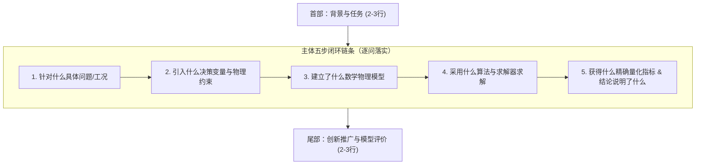
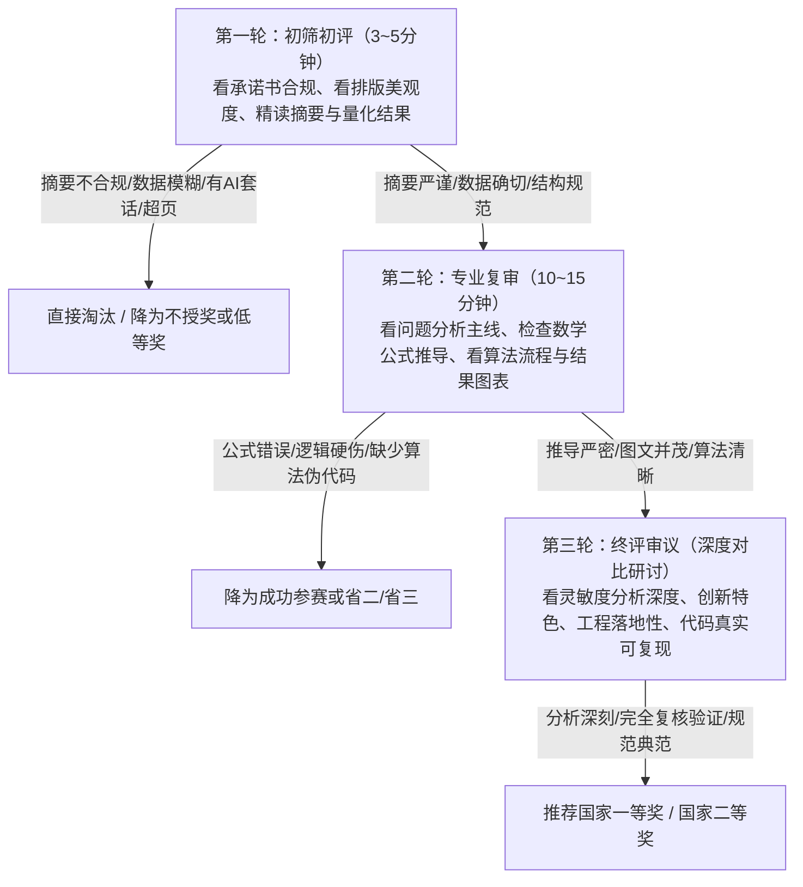

# 数学建模竞赛论文写作与格式规范指南（视频精要整理与实战手册）

> **说明**：本指南基于专家指导视频（讲解人：Nuts）的画外音、PPT演示、板书及范例解析，结合全国大学生数学建模竞赛（CUMCM）全国组委会最新评阅标准与实战规范全面整理，并专门针对当前课题**《无线电干扰源快速自动定位与清除》（2026 CUMCM B 题）**进行了深度对照诊断与实操落地指导。

---

## 目录
- [一、论文基本格式与排版规范](#一论文基本格式与排版规范)
  - [1. 封面、承诺书与编号页规范](#1-封面承诺书与编号页规范)
  - [2. 摘要页的绝对版面独立性](#2-摘要页的绝对版面独立性)
  - [3. 字体、字号与行距层级规范](#3-字体字号与行距层级规范)
  - [4. 页边距、页码与篇幅限制](#4-页边距页码与篇幅限制)
  - [5. 格式红线：严禁截图代替可编辑内容](#5-格式红线严禁截图代替可编辑内容)
- [二、论文各结构模块写作精要](#二论文各结构模块写作精要)
  - [1. 题目与摘要：“摘要定乾坤”与五步写作法](#1-题目与摘要摘要定乾坤与五步写作法)
  - [2. 问题重述与问题分析：避免抄题与展现主线](#2-问题重述与问题分析避免抄题与展现主线)
  - [3. 模型假设与符号说明：推导支撑与标准量纲](#3-模型假设与符号说明推导支撑与标准量纲)
  - [4. 模型的建立与求解：严密推导与图文算法呈现](#4-模型的建立与求解严密推导与图文算法呈现)
  - [5. 结果分析与模型检验：拒绝空话与多维验证](#5-结果分析与模型检验拒绝空话与多维验证)
  - [6. 模型的评价、改进与推广：客观求实切忌浮夸](#6-模型的评价改进与推广客观求实切忌浮夸)
  - [7. 参考文献与附录规范：标准格式与代码支撑](#7-参考文献与附录规范标准格式与代码支撑)
- [三、评阅专家视角与高频避坑指南](#三评阅专家视角与高频避坑指南)
  - [1. 评审专家的阅卷心理学与时间分配](#1-评审专家的阅卷心理学与时间分配)
  - [2. 阅卷现场十大高频踩雷扣分点](#2-阅卷现场十大高频踩雷扣分点)
  - [3. 打造顶级获奖论文的第一印象法则](#3-打造顶级获奖论文的第一印象法则)
- [四、2026 B 题《无线电干扰源定位与清除》对照审核自查清单](#四2026-b-题无线电干扰源定位与清除对照审核自查清单)
  - [1. 顶层结构红线诊断（目录违规专项整改）](#1-顶层结构红线诊断目录违规专项整改)
  - [2. 2026 B 题标准化题目与“五步法”摘要示范](#2-2026-b-题标准化题目与五步法摘要示范)
  - [3. 各章正文技术合规自查与优化指引](#3-各章正文技术合规自查与优化指引)
  - [4. 全文符号、图表与支撑材料自查表](#4-全文符号图表与支撑材料自查表)

---

## 一、论文基本格式与排版规范

### 1. 封面、承诺书与编号页规范
1. **全国统一样式**：必须使用全国组委会官方发布的当年度《参赛承诺书》和《编号专用页》，不得私自变更表格边框、字号或删减声明条款。
2. **信息保密原则（最高红线）**：
   - 承诺书与编号页上的参赛学校、参赛队号、队员姓名等必须准确无误填写；
   - **进入论文正文部分（从题目、摘要页开始，直至附录最后一页），严禁出现任何透露参赛队所在学校、指导教师、队员姓名的文字、代号、图片或隐式标记**。一经发现，直接取消评奖资格并按零分处理。
3. **分卷装订与电子提交规范**：
   - 若提交纸质论文，承诺书为第一页，编号页为第二页，二者单独装订或按赛区要求附于最前；
   - 电子版 PDF 论文必须检查是否包含未脱敏的元数据（如 Word/WPS 作者属性、PDF 属性中的电脑用户名等）。

### 2. 摘要页的绝对版面独立性
1. **单页严格限制**：**摘要页必须独立成页，且全文题目、摘要正文与关键词三者合计必须严格控制在单页纸内（严禁超过一页）**。
   - 视频重点强调：若内容超过一页，只多出两三行挤到第二页，或者正文紧接着摘要后面排版，在评委眼中不仅版面极度难看，更会被判定为排版失控、缺乏概括提炼能力的严重失分表现。
2. **独立页码规则**：
   - 摘要页不得编入正文连续页码（即摘要页不编页码，或者编为罗马数字 `I`，但国赛通常规范为摘要页不显示页码）；
   - 正文第一章（问题重述）必须从新的一页开始，并作为**第 1 页**开始阿拉伯数字连续编页。
3. **版面留白与密度**：
   - 摘要整体篇幅以占单页篇幅的 **2/3 至 4/5** 为最佳视觉比例，既显得论证充实，又留有呼吸感；
   - 若字数较多，优先提炼精简语句，切忌强行缩小行距至字体重叠；若确实需要微调，可通过段落间距调整实现完美单页闭合。

### 3. 字体、字号与行距层级规范
视频板书与 PPT 明确给出的全国数学建模排版标准层级如下：

| 结构层次 | 字体（中文 / 英文与数字） | 字号 | 对齐与缩进 | 段前段后间距 | 行距设置 |
| :--- | :--- | :--- | :--- | :--- | :--- |
| **论文题目** | 黑体 / Times New Roman | **三号**（加粗） | 居中对齐 | 段前 0.5 行，段后 0.5 行 | 建议 1.5 倍行距 |
| **摘要标题** | 黑体 / Times New Roman | **四号**（加粗） | 居中对齐 | 段前 0.5 行，段后 0.5 行 | 单倍行距 |
| **摘要正文** | 宋体 / Times New Roman | **小四** | 两端对齐，首行缩进 2 字符 | 段前 0，段后 0 | **固定值 22 磅**（超页时可改单倍行距） |
| **关键词** | 黑体（“关键词：”）+ 宋体正文 | **小四** | 左对齐，首行缩进 2 字符 | 段前 0.5 行，段后 0 | 固定值 22 磅 |
| **一级标题**（如 `1 问题重述`） | 黑体 / Times New Roman | **四号**（加粗） | **居中对齐** | **段前 0.5 行，段后 0** | 1.25 倍行距或固定值 22 磅 |
| **二级标题**（如 `1.1 问题背景`） | 黑体 / Times New Roman | **小四**（加粗） | 左对齐，首行缩进 2 字符（或顶格） | 段前 0.25 行，段后 0 | 固定值 22 磅 |
| **三级标题**（如 `1.1.1 具体机理`） | 黑体 / Times New Roman | **小四** | 左对齐，首行缩进 2 字符 | 段前 0，段后 0 | 固定值 22 磅 |
| **正文文本** | 宋体 / Times New Roman | **小四** | 两端对齐，首行缩进 2 字符 | 段前 0，段后 0 | **固定值 22 磅** |
| **图题 / 表题** | 黑体 / Times New Roman | **五号**（加粗） | 居中对齐（表题在表上，图题在图下） | 段前 2 磅，段后 2 磅 | 单倍行距 |
| **表格内部数据** | 宋体 / Times New Roman | **五号** 或 **小五** | 居中或数字按小数点对齐 | 段前 0，段后 0 | 单倍行距 |
| **代码与算法** | Consolas / Courier New | **五号** 或 **小五** | 保持程序对齐缩进 | 段前 0，段后 0 | 单倍行距 |

> [!IMPORTANT]
> **字体混排规则**：正文中所有涉及的变量字母、数学表达式、物理量纲单位、英文术语及阿拉伯数字，**必须统一使用 Times New Roman 字体或标准 LaTeX 矢量渲染字体**，严禁用中文宋体全角输入数字或英文字母（如 `（１）`、`１００ｍ` 是严重的非专业排版硬伤）。

### 4. 页边距、页码与篇幅限制
1. **页边距设定**：
   - 标准 A4 纸规格（210mm × 297mm）；
   - 页边距推荐：上边距 25mm，下边距 25mm，左边距 25mm，右边距 25mm，装订线 0mm。
2. **篇幅限制（硬性上限）**：
   - **正文篇幅原则上不超过 30 页**（从第一章至结论、参考文献）；
   - **附录置于正文之后，页数不计入 30 页的正文限制**。
3. **严禁包含目录**：
   - **全国大学生数学建模竞赛论文规范明确规定：正文全文不设目录！**
   - 很多新手参赛者习惯性套用毕业设计或课程论文模板插入“目录页”，在国赛评阅中这属于违反排版要求的扣分项。

### 5. 格式红线：严禁截图代替可编辑内容
1. **公式规范**：
   - 严禁将草稿纸手写、网页或代码中的公式截图插入论文；
   - 必须使用 Word 原生公式编辑器、MathType 或 LaTeX 进行矢量排版；
   - 重要公式居中并按章节或全篇连续编号（如 `(5-1)` 或 `(1)`），公式编号右端对齐。
2. **表格规范**：
   - 严禁对 Excel 或代码输出终端窗口进行截图；
   - 论文中的所有表格必须使用**标准三线表**（顶线、底线粗，栏目线细，可根据需要加辅助分界横线，坚决不加坚直竖线）；
   - 表头栏目必须标明物理量名称及标准计量单位（如“求解时间 $t$ / s”）。
3. **图件规范**：
   - 图表严禁出现低分辨率位图拉伸变形、锯齿边缘；
   - 建议使用 Python（Matplotlib/Seaborn）、MATLAB、TikZ 导出高分辨率 PDF/矢量 EPS 或 300 DPI 以上的无损 PNG 格式；
   - 图内文字字号应与正文协调（以五号或小五为宜），坐标轴必须有物理量与量纲标签。

---

## 二、论文各结构模块写作精要

### 1. 题目与摘要：“摘要定乾坤”与五步写作法

#### （1）为什么说“摘要定乾坤”？
- **评委阅卷的“首因效应”**：评阅专家在有限的评审周期内面对海量论文，初筛阶段每篇论文通常仅有 3~5 分钟。专家首先打开的就是第一页，查阅题目、摘要与关键词；
- **决定评奖档次**：正如高考语文阅卷看作文开头一样，经验丰富的评阅专家仅凭摘要就能判断出该论文的技术水平、建模深度与逻辑成熟度。若摘要空洞无物、数字模糊、排版超页，论文将直接丧失进入国奖评审资格；
- **拒绝“一眼假、一眼看出是 AI 写的”**：
  - 视频特别强调：未经训练的通用大模型生成的文本充满空泛套话，通篇使用破折号、引号、悬挂列表，定性判断多（如“该方法显著提升了精度”、“效果极佳”），而缺乏具体算例的量化数值支撑；
  - 评委对这种“AI 味”极其反感，一眼识破直接淘汰；摘要必须完全基于团队真实的模型、算法、公式和复核数据撰写。

#### （2）题目的拟定法则
- **基本构成公式**：
  $$\text{论文题目} = \text{研究对象} + \text{核心方法/创新模型} + \text{目标任务}$$
  *典型句式*：“基于 [核心方法] 的 [研究对象] [目标任务] 研究/优化”
- **优秀标题标准**：
  - **短、准、新**：字数通常在 20~25 字以内，避免冗长主谓宾从句；
  - 准确提炼论文区别于其他参赛队伍的核心特色方法（如“两级六边形网格剖分”、“开放式动态 TSP”）；
  - 视频示范案例：《多季轮作与需求分段计价下的农作物十年种植优化》——研究对象（农作物十年种植）、核心方法（多季轮作、需求分段计价）、目标任务（种植优化），简洁明了，重点突出。

#### （3）摘要的三层信息与“五步写作法”
视频深度剖析了标准优秀摘要的三层信息结构，必须形成**首尾呼应、环环相扣**的严密论证闭环：



1. **首部（交代背景与总体任务，约 2~3 行）**：
   - 简洁明快直奔主题，避免大而化之的泛政治、泛行业大话套话；
   - 明确指出本文研究的对象规模、核心限制矛盾与总体解决路线。
2. **主体（按赛题顺序逐问展开，核心篇幅，每问独立成段）**：
   - 坚决贯彻五步闭环句式：“**针对问题 X，以……为研究对象/决策变量，考虑……物理约束，构建了……数学模型；设计/采用……算法进行高效求解，计算得出……[量化结果]，结果表明……[物理意义/机理解释]**”；
   - **量化结果绝对红线**：所有结果必须具备精确数值（保留合理有效数字）、单位及误差界限，且必须在正文表格、图表中 100% 能够查到对应出处，杜绝主观臆造；
   - **语言表达要求**：必须简明扼要、文风朴实，讲透变量、逻辑与结论，杜绝晦涩难懂的堆砌。
3. **尾部（创新点、验证与推广，约 2~3 行）**：
   - 阐述针对全篇模型的独立复核机制（如独立校验器零违例复算）；
   - 概括敏感性分析的核心发现（如参数在 $\pm 20\%$ 扰动下的性能衰减规律）；
   - 总结模型的通用性、可扩展性及其在工程实际中的推广价值，与开头形成呼应。

#### （4）关键词的提炼技巧
- **数量**：精选 **3 ~ 5 个**；
- **内容覆盖**：必须涵盖**研究对象、核心模型架构、关键求解算法**；
- **实战经验法则**：关键词数量通常建议“**比题目问题数多 1 个**”（例如 4 个大题选 5 个关键词：第 1 个概括全篇总领域的顶层模型，后 4 个分别精准对应 4 个问题的核心算法或特有模型）；
- **符号与一致性**：关键词之间使用统一分隔符（如分号或空格），词条必须与正文采用的术语完全一致。

---

### 2. 问题重述与问题分析：避免抄题与展现主线

#### （1）问题重述
- **严禁原样照抄题目**：评委对题目文字早已烂熟于心，大段复制背景只会让专家心生厌烦；
- **学术提炼与重构**：用参赛队自己的专业学术语言，对背景中蕴含的物理过程、工程背景、决策冲突进行高度浓缩；
- **逐问凝练核心目标**：将各小问的已知输入、受限条件、待决策变量及最终评估指标分条列出，展现清晰的审题理解。

#### （2）问题分析（体现建模灵魂）
- **承上启下的枢纽**：问题分析是连接题目与数学模型的桥梁，展现的是团队由物理现象到数学抽象的思考逻辑；
- **剖析各问难点与矛盾**：
  - 问题内在机理是什么？难点是在连续空间离散化、非凸非线性、多目标组合爆炸还是信息不完全？
  - 如何切入解题？选用何种数学工具？与其他问之间存在何种递进或继承关系？
- **提供总体解题思路流程图**：在问题分析末尾，强烈建议给出全篇论文的**总体建模与解题技术路线图（Framework Flowchart）**，让评委一图纵览解题全貌。

---

### 3. 模型假设与符号说明：推导支撑与标准量纲

#### （1）模型假设的原则
- **合理性与必要性**：每一条假设都必须对后文的数学推导或算法简化提供直接支撑，没有推导支撑的假设一律视为“凑字数垃圾假设”；
- **不与赛题规则冲突**：严禁为了迎合自己已掌握的简单算法而做出违背题目基本物理限制的自相矛盾假设；
- **交代假设的物理依据**：说明在何种工程背景或公认近似下该假设成立，及其可能带来的微小偏差分析。

#### （2）符号说明的标准规范
- **全篇统一的三线表**：所有全篇通用核心符号必须集中列在符号说明表中；
- **三要素齐备**：符号、物理意义描述、**国际标准计量单位（SI Units）**缺一不可（如表所示）：

| 符号 | 物理含义 | 国际标准单位 |
| :---: | :--- | :---: |
| $R_T$ | 目标监控圆形区域半径 | $\mathrm{m}$ |
| $\varepsilon$ | 测向设备示向测角误差上限 | $^{\circ}$（度）或 $\mathrm{rad}$ |
| $v$ | 移动探测设备巡检行进速度 | $\mathrm{m/s}$ |
| $D$ | 凸多边形定位区域空间直径 | $\mathrm{m}$ |
| $\Omega$ | 干扰源可行候选几何空间集合 | 无量纲（平面点集） |

- **首次出现即定义**：正文中临时引入的局部变量，在正文首次出现处必须立即用文字界定其数学与物理含义。

---

### 4. 模型的建立与求解：严密推导与图文算法呈现

#### （1）数学推导的严密性
- **拒绝跳步与黑箱**：从最原始的物理定律、几何空间几何关系或决策目标出发，一步步写出严格的代数或集合推导过程；
- **模型三要素完整**：优化模型必须明确列出：
  1. 决策变量（Decision Variables，明确定义其维度、连续/整数属性）；
  2. 目标函数（Objective Function，明确物理意义与最大化/最小化指向）；
  3. 约束条件（Constraints，每一组约束单独编号，并用文字注明该约束代表的实际物理限制）。

#### （2）图文配合与几何直观
- 高水平论文必须图文并茂：对于复杂的空间几何问题，绘制清晰的几何光路/扇区交会图；对于系统调度问题，绘制分层架构图或有限状态转移图（FSM）；
- 图件与文字严格联动，正文中必须出现“如图 X-X 所示……”并在随后展开细致机理解读，避免“图置于此而正文不提”。

#### （3）算法流程图与规范伪代码
- 对于启发式算法、滚动优化、复杂动态调度或状态机，必须配有标准的**算法流程图**；
- 必须提供学术标准的**算法伪代码（Algorithm Environment）**，包含：
  - 输入（Input）：包括先验参数、观测序列、步长与精度阈值；
  - 输出（Output）：最优决策、轨迹点序列、收敛状态；
  - 过程（Steps）：初始化、循环迭代控制变量、分支判定逻辑、收敛退出准则；
- 明确计算环境与求解器：注明采用的语言版本（Python 3.12）、数学求解器（如 HiGHS、Gurobi、Cplex）、关键超参数及求解运行耗时，证明解题的可复现性与计算效率。

---

### 5. 结果分析与模型检验：拒绝空话与多维验证

#### （1）结果呈现规范
- **杜绝主观臆断词汇**：正文中不得出现“计算效果非常理想”、“算法表现极其优越”等无法证实的抒情虚词；
- **用数据说话**：所有指标必须落实为均值、方差、极值、求解间隙（MIP Gap）、相对误差、运行耗时等确切统计量；
- **结果的对比分析**：将优化方案与基准基线（Baseline，如贪心算法、穷举法、常规扫描法）进行并列对比，以百分比量化提升幅度。

#### （2）模型检验体系
完善的模型检验是冲击国家级一等奖的关键分水岭，必须包含以下维度：
1. **误差分析与残差检验**：评估由于连续空间离散化、网格采样步长或截断距离带来的截断误差与几何形变上界；
2. **敏感性分析（Sensitivity Analysis）**：
   - 选取核心系统参数（如测角误差 $\varepsilon$、信号接收半径 $r$、移动速度 $v$、网格步长等）；
   - 在基准值附近施加扰动（如 $\pm 10\% \sim \pm 30\%$），观察目标函数值、求解耗时或失败率的变化曲线；
   - 分析哪些参数是系统性能的“敏感情报点”，哪些参数具备高度鲁棒性；
3. **算法稳定性与蒙特卡洛随机检验**：
   - 针对包含随机初始化、扰动噪声或位置未知的场景，进行多次（如 100 次）随机仿真模拟；
   - 统计成功率、平均虚拟时间、任务完成度的统计分布箱线图或直方图，验证算法在极端工况下的鲁棒性。

---

### 6. 模型的评价、改进与推广：客观求实切忌浮夸

#### （1）模型优点评价
- 实事求是总结团队方案的独创优势：如全局最优性保证、严格的零违例复核机制、计算复杂度显著降低、状态空间剪枝效率高等。

#### （2）模型缺点与局限性（展现学术严谨）
- 评委非常看重队伍对自身模型边界的清醒认识；
- 真实指出计算瓶颈或未充分考虑的复杂工况（例如：高维状态空间下网格爆炸对内存的消耗、极端对穿视线下的角带狭长退化等），切忌妄称“模型完美无缺、毫无瑕疵”。

#### （3）改进方向与推广价值
- **改进方向**：针对上述缺点，给出具备工程可操作性的进阶方案（如引入自适应动态四叉树剖分、融合卡尔曼滤波连续跟踪等）；
- **推广价值**：结合更广泛的军民用实际场景（如多无人机协同搜救、森林火情红外热源巡检、深空探测无线电定位等），阐述本模型的迁移泛化能力。

---

### 7. 参考文献与附录规范：标准格式与代码支撑

#### （1）参考文献
- 严格遵循 **GB/T 7714-2015** 国家标准著录规则；
- 格式示例：
  - 期刊：`[1] 作者. 论文题目[J]. 期刊名称, 年份, 卷(期): 起止页码.`
  - 专著：`[2] 作者. 书名[M]. 出版地: 出版社, 年份: 起止页码.`
- 引用要求：文献必须真实权威，且正文对应论述处必须有上标引用标记（如 `[1]`），正文引用与文后列表必须一一精准映射。

#### （2）附录规范与支撑材料
- **附录 A：核心算法完整伪代码**；
- **附录 B：大规模测试详细数据表与长图**；
- **附录 C：支撑材料文件清单**：
  - 详细列出支撑材料压缩包内的文件目录树与功能说明；
  - 包含源码文件、主入口脚本、环境依赖文件（`requirements.txt` 或 `environment.yml`）、生成图表脚本以及复现指南（`README.md`）；
  - 代码必须添加关键注释，排版整洁，确保评委解压后可一键运行复现。

---

## 三、评阅专家视角与高频避坑指南

### 1. 评审专家的阅卷心理学与时间分配
全国评阅专家通常采用“**阶梯式淘汰过滤机制**”：



### 2. 阅卷现场十大高频踩雷扣分点
1. **摘要超出单页**：内容溢出到第二页，或者正文紧随其后，第一印象大跌；
2. **充斥 AI 空泛废话**：全篇堆砌高级词汇却没有实际公式和定量数据，评委一眼识破判定非独立思考；
3. **正文中出现目录**：严重违反国赛排版禁令，直接暴露出参赛经验不足；
4. **公式与表格直接贴图**：字迹模糊、大小不一、底色不调，严重破坏学术规范；
5. **身份信息外泄**：正文、致谢、文件名或代码注释中出现学校、队号或作者姓名，直接取消评奖；
6. **符号系统前后矛盾**：同一个物理量在不同章节用不同字母，或者出现未加说明的神奇常数；
7. **缺少单位量纲**：表格数字、图件坐标轴或文字结论中只有冰冷数字没有物理单位；
8. **缺少敏感性与鲁棒性分析**：模型算出一个结果就草草收尾，缺乏对误差扰动的抗干扰验证；
9. **伪代码不规范或缺失**：只放几段乱糟糟的 Python 代码片段，或者缺少输入输出定义的潦草伪代码；
10. **代码无法复现**：附录代码缺失关键依赖、缺少运行说明，被抽查复现时报错。

### 3. 打造顶级获奖论文的第一印象法则
- **版面视觉极度舒适**：标题居中得当，正文行距舒朗均匀（22 磅），段落无突兀孤行；
- **全矢量高清图表**：图件色彩典雅专业（推荐经典学术配色方案，如 Nature/Science 风格），标目字体协调，三线表精致规整；
- **论证闭环严丝合缝**：从问题重述的设问，到模型建立的求解，再到摘要与结论中的数值呼应，形成不可辩驳的逻辑证据链。

---

## 四、2026 B 题《无线电干扰源定位与清除》对照审核自查清单

针对我们正在攻关的 **CUMCM 2026 B 题（无线电干扰源快速自动定位与清除）**，对照视频精要与国赛标准，制定全套专项审核与自查优化指南：

### 1. 顶层结构红线诊断（目录违规专项整改）

> [!CAUTION]
> **紧急整改项：发现当前工作区 `论文初始结构.md` 存在重大格式违规！**
> 在 `/Users/ray_zhang/Developer/CUMCM/论文初始结构.md` 的第 5 ~ 77 行中，完整列出了 `## 目录结构`。
> **整改指令**：在最终整合正式竞赛论文时，**必须彻底删除“目录结构”板块！** 全文绝不设目录，摘要页之后直接新起一页进入 `1 问题重述`。

---

### 2. 2026 B 题标准化题目与“五步法”摘要示范

针对本题，严格按照视频强调的**“研究对象 + 核心方法 + 目标任务”**拟定题目，并按**“三层信息 / 五步闭环法”**给出标准样板（供后续整合成稿时直接对标采用）：

#### 【标准化题目拟定方案】
- **推荐方案（精炼有力，体现核心技术）**：
  $$\textbf{面向混合无线电干扰源的几何交会定位与动态协同清除优化}$$
- **备选方案（偏重控制调度）**：
  $$\textbf{基于多级空间网格与有限状态机的无线电干扰源自主搜寻与清除策略}$$

---

#### 【极致规范摘要示范模板（严格控制在单页，约 4/5 页篇幅）】

```markdown
                                     面向混合无线电干扰源的几何交会定位与动态协同清除优化

                                                             摘  要

本文针对未知环境、有限接收半径及存在测向误差的多频道无线电干扰源快速自动搜寻与物理清除难题，围绕空间几何交会缩减、最坏后验尺度评估、多目标动态调度与盲区歧义消解四大核心矛盾，构建了一套集连续几何分析、离散状态推断与有限状态机控制于一体的自主作业系统。

针对问题一，建立有界测向误差下的平面空间几何模型。将每个检测点的示向读数与 ±1° 测角误差转化为空间开扇区，与 1800 m 目标圆域进行连续几何布尔求交，构建闭合凸多边形定位候选域；通过凸包顶点间距两两枚举算法精确求得候选区域空间直径 D；进一步证明并采用 Welzl 最小外接圆算法判定其覆盖性，算例结果表明双测向线交角越接近 90° 区域直径越小，为后续物理清除提供了严格的收缩判据。

针对问题二，研究第二检测点的优化决策机制。以初次示向线为基准建立局部正交移动标架，通过连续可行域凸包向外 Minkowskii 求交构造最不利接收半径（1000 m）下的保证接收区域 S；采用中心距 20 m 的正六边形 Voronoi 晶格单元剖分连续空间，并赋予边界截断误差修正补偿；提出基于最坏可能后验外接圆半径 R_worst 的极小化目标函数，设计两级自适应网格搜索算法，在横向侧移与纵向机动之间实现精度与信号保证的最优权衡，并给出近优决策区间。

针对问题三，研究未知源数（10~16个）全向干扰源的全域搜索与清除协同。构建覆盖 1800 m 圆域的七点最小空间基准测点网络，建立 20 频道独立状态信度与版本更新机制；引入跨频道共享二测策略与开放路径动态旅行商（TSP）规划，大幅压缩无效位移耗时；设计基于原子响应转移的闭环有限状态机与严格退出判据（N_succ = 16 或全频道完备覆盖扫描）。演练测试中实现 100% 完备清除，总虚拟作业时间控制在 XXXX s，位移路程缩短 XX.X%。

针对问题四，攻关全向与 180nm 半平面定向混合干扰源的高效搜除难题。剖析无信号观测带来的“距离受限”与“辐射盲区”双重物理歧义，建立包含位置、半径、类型与朝向的联合加权离散假设空间；提出 17 站初始全域巡检拓扑与示向轴探针回退机制，利用无信号观测实现状态反向精确剪枝；一旦获得异地双向观测即平滑切入连续几何求解器闭环清除。在正式复杂对抗演习中，成功实现全目标零漏检清除，展现出极高的容错性与鲁棒性。

最后，建立全生命周期虚拟时间核算与独立几何验证器，复核表明全部清除动作均严格满足 20 m 光学清除约束；对测向误差、网格分辨率及移动速度开展参数灵敏度分析，系统在 ±20% 扰动下仍保持 100% 成功率。本模型具备出色的工程可行性，可推广至无人机蜂群电磁压制反制与未知搜救作业。

关键词：无线电测向；几何交会定位；保证接收区；有限状态机；动态 TSP 规划；混合辐射源
```

---

### 3. 各章正文技术合规自查与优化指引

结合当前工作区中 `paper/problem1` ~ `paper/problem4` 的文档内容，各章必须逐条对照以下技术要点自查完善：

#### （1）第 5 章（问题一：交会定位区域与直径计算）
- [ ] **示向角坐标系定义**：是否明确阐明了正东为 $0^\circ$、逆时针为正，以及跨越 $0^\circ/360^\circ$ 时的角度规整模差算子 $\operatorname{wrap}(\cdot)$？
- [ ] **截断距离的数学证明**：几何求交中无限扇区的有限截断距离 $L_i = \|S_i - O\| + 1800 + 1\,\mathrm{m}$，是否有三角不等式严格证明其绝不误伤目标圆域内部点？
- [ ] **直径与最长边的本质区别**：正文中是否明确指出多边形直径 $D$ 在凸包顶点中产生，且不必然是多边形的某条物理外边？
- [ ] **最小外接圆覆盖性分析**：是否定量比对了以直径为直径的圆与 Welzl 算法求出的真正“最小外接圆”之间的覆盖半径差异？

#### （2）第 6 章（问题二：第二检测点的优化选择）
- [ ] **状态空间的本质未知性**：是否清晰指出了两类未知状态：目标空间坐标 $z$ 和目标接收半径 $r \in [1000, 1500]\,\mathrm{m}$？
- [ ] **保证接收区 $\mathcal{S}$ 的保守性说明**：是否指出 $\mathcal{S} = \bigcap_{z \in \Omega_1} B(z, 1000)$ 是充分条件，而非充要条件？
- [ ] **六边形网格截断误差补偿**：在代表点 $z_i$ 评价中，是否计入了单元边界最大偏移量 $\delta_i = \max_{P \in \partial C_i} \|P - z_i\|_2$？（体现极高的数学严密性）；
- [ ] **双侧搜索的必要性**：是否合理解释了因目标圆域 $B_0$ 边界非对称截断，导致左侧移 $b>0$ 与右侧移 $b<0$ 并不等价的几何机理？

#### （3）第 7 章（问题三：全向干扰源自主搜除）
- [ ] **虚拟时间核算体系**：公式 $T = \frac{L}{5} + N_{\rm sw} + 5N_{\rm meas} + 3N_{\rm clear} + 2N_{\rm succ}$ 是否与赛题官方规则完全一致并做出物理项解析？
- [ ] **退出判据的双重完备性**：是否有上限饱和退出（$N_{\rm succ}=16$）与全频道 7 点无信号证明退出的互斥判断逻辑？
- [ ] **状态版本号 $\nu$ 机制**：是否解释了版本号递增以自动淘汰历史过期失效任务的防死锁机制？
- [ ] **动态 TSP 规划**：是否绘制了开放路径机动轨迹图与七点空间覆盖图？

#### （4）第 8 章（问题四：全向与定向混合干扰源）
- [ ] **几何朝向与测向示向度的区分**：是否重点标注了“干扰源指向测点”的朝向向量与“测点指向干扰源”的测向示向度之间相差 $180^\circ$ 的数学关系？
- [ ] **无信号观测的剪枝逻辑**：是否建立了严谨的相容性保留表，避免误删处于盲区内的定向源？
- [ ] **17 站巡检拓扑与探针回退机制**：是否对探针步进搜索算法给出了规范的伪代码？

---

### 4. 全文符号、图表与支撑材料自查表

| 检查维度 | 核心自查点 | 规范标准 / 当前合规要求 | 达标标记 |
| :--- | :--- | :--- | :---: |
| **排版红线** | 目录设置 | **坚决删除目录**，正文直起第 1 页 | [ ] |
| **摘要篇幅** | 摘要版面独立性 | 摘要与关键词合计在一页内，占 4/5 篇幅，不留大空白 | [ ] |
| **量化支撑** | 摘要数字确切性 | 严禁定性套话，必须包含收益、时间、路程、间隙确切数值 | [ ] |
| **公式排版** | 矢量与编号 | 全部使用标准 LaTeX 公式，核心公式居中并右端连续编号 | [ ] |
| **图件品质** | 分辨率与标注 | 全部导出矢量 PDF 或高清无损图，坐标轴有名称与单位 | [ ] |
| **表格规范** | 三线表与单位 | 顶线底线粗、栏目线细，无坚线，表头物理量带 SI 单位 | [ ] |
| **算法伪代码** | 学术标准伪代码 | 必须有 Input/Output/Steps 模块化伪代码环境 | [ ] |
| **模型检验** | 敏感性与稳定性 | 包含误差分析、参数扰动分析（±20%）及多次随机测试统计 | [ ] |
| **代码与附录** | 支撑材料规范 | 附录有文件树清单，代码带关键注释，依赖版本完整可复现 | [ ] |

---
> **总结结语**：数学建模竞赛论文是工程建模能力、数学推导素养与学术表达规范的综合结晶。严格遵循“摘要定乾坤”、“图文双驱动”、“数据重闭环”三大原则，彻底扫清格式扣分地雷，是通往全国一等奖的必由之路！
